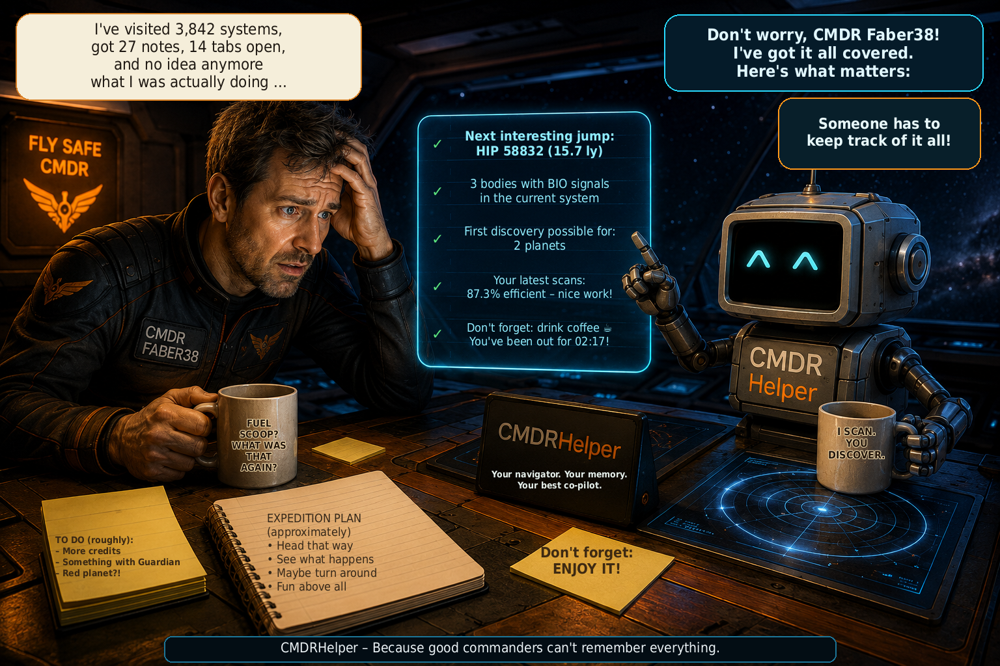

# CMDRHelper

[🇩🇪 Deutsch](README_DE.md) \| [🇬🇧 English](README.md) \| [🇫🇷
Français](README_FR.md) \| [🇮🇹 Italiano](README_IT.md) \| [🇳🇴
Norsk](README_NO.md) \| [🇸🇪 Svenska](README_SV.md) \| [🇫🇮
Suomi](README_FI.md) \| [🇵🇱 Polski](README_PL.md) \| [🇳🇱
Nederlands](README_NL.md) \| [🇪🇸 Español](README_ES.md) \| [🇹🇷
Türkçe](README_TR.md) \| [🇬🇷 Ελληνικά](README_EL.md)



**Personal companion for Elite Dangerous – exploration, navigation and commander data at a glance**

CMDRHelper is a standalone desktop application that processes the local Elite Dangerous journals and uses planetary position data from `Status.json`. It helps you identify interesting bodies, return to saved locations and review your travels and discoveries. Personal data persists across restarts and is kept separate for each commander.

## New in version 3.4 – Mining and inventory

- New Mining area with commodities, reference prices and value classes.
- Ship/SRV stock and manually confirmed carrier stock with automatic transfer tracking.
- Combined search and filters for planetary surface and asteroid/ring mining.
- ABBAU ×N opens the matching Mining overview directly.
- Correct cartography values across session changes.
- Improved help, table styling and usability.

One shared table contains 57 mining commodities with Surface, Asteroid or Both origins. Known reference prices and derived value classes remain fixed guidance values, not live market data.

Verified ship/SRV cargo; double-click to confirm, correct or reset carrier stock to unknown. Only unambiguous CargoTransfer events to/from your own carrier are tracked from a confirmed starting stock. Totals appear only when both amounts are known; unknown remains —.

Combine the in-stock, value-class and origin filters; their states, sorting and column widths are saved. ABBAU ×N automatically selects planetary surface mining. Manual cargo refresh includes status animation and preserves carrier values.

Refined Mining table styling, carrier tooltips and version-independent integrated Mining help. Hand cursors on existing interactive system-map bodies and controls. The A-6-a placeholder fix preserves correct cartography values across sessions.

## New in version 3.3.1 – Bug fixes

- Completed DSS mappings are now reliably detected live.
- Mapping is retained even when the corresponding scan appears later in the current journal.
- Your mapping status, mapping time and probe efficiency are reliably saved.
- Archive imports no longer replace existing scan and mapping values with invalid zeros.
- Affected bodies with complete body data regain correct displayed values when loaded or refreshed.
- Live mapping estimates now include the correct bonuses and truncate fractions of a credit only at the end.
- Sales-based adjustment factors no longer alter regular exploration values.
- Additional regression tests cover mapping across sessions and persistence of mapping data.

## New in version 3.3

- New system analysis based on your personal exploration experience.
- Open / Solo / Private Group game mode directly in the overview.
- Copy system names from Recent systems with one click.
- Clearer historical data and easier-to-understand analysis.
- More reliable journal archive imports when journal files grow later.

The former Jump tip is now Analysis, with System analysis and the existing Historical data. System analysis compares a target with your personal history: the mass code provides the baseline, while region and family refine it cautiously. Potential index 100 represents your personal historical average of damped exploration potential, not a percentage probability. Data basis and evidence strength remain separate from the rating; the final number has no score effect and BIO is currently informational only.

## New in v3.2 compared with v3.1

- Engineering material management: All 146 materials in Raw, Manufactured and Encoded, with grades, capacities and special cases. Commander-specific live stock, search, filters, five subtle row backgrounds and saved column widths/order make browsing easier. Unknown stock remains distinct from zero.

- Odyssey inventory: The fourth material tab contains 223 catalog identities for goods, components, data and consumables. Ship Locker, Backpack and reliable totals remain separate; mission stacks, mission status and engineering uses are visible. Positive stock numbers appear in gold. Missing name translations fall back to English.

- Material trader search (Find trader → Open route planner): On request, Spansh searches Raw, Manufactured and Encoded separately from the current commander system. Carriers are excluded and station details checked. Distance in ly is the direct system distance; community data cannot guarantee access. Sending a result to the route planner only sets the destination system and does not start a route. There is no Odyssey trader search.

- System overview: The new Elite-style view replaces the previous miniature overview and is available in Explorer and Chronicle. Stars and planets form the main structure, with moons branching below; multiple-star systems remain readable. Zoom, scrolling, fit to window and body clicks provide access to details.

- Compact asteroid belts: Belt clusters are grouped into clear belts in the overview and regular Explorer/Chronicle system maps. All individual cluster data is retained.

- Cartography corrected: A later scan after DSS mapping no longer resets unsold exploration values, mapping time or efficiency. Existing incorrect claims are repaired at startup from available journals with clear commander attribution. Missing sources leave the repair pending; deleting the database is unnecessary.

- Improved route planner: The current system follows your location automatically until you enter a manual start; clearing the start field restores automatic tracking. Ships and carriers use exactly validated ID64 system addresses instead of similar names. “Unable to find route” is explained as no route found; check destinations, range and route settings.

- Better update information: The Yes/No window shows installed and available versions plus up to six highlights when a summary is available. Long lists scroll while actions remain accessible. This display ships with v3.2; an unchanged v3.1 client does not show it yet.

## v3.1 (v3.0.3 → v3.1)

- BIO progress is compact: 1/3 yellow, 2/3 blue and 3/3 green; the completed state “Done” is also green. Under “auto show”, GEO has its own saved switch: BIO alone, GEO alone or both together are supported. Manually adjusted column widths in the shared Explorer BIO / GEO / ABBAU table survive reopening and application restarts. Saved popup column widths are restored more robustly; invalid values fall back to safe defaults.

- Discovery and mapping are separate and refer to your scan time: “Already discovered at your scan” and “Already mapped at your scan”. Missing information remains Unknown. First Discovery and First Mapping candidates refer only to scan time; historical No values do not prove that a body is still undiscovered or unmapped today. Your own mapping does not confirm an official first claim. Being known to EDSM remains separate.

- “EDSM status HUD” under “auto show” is OFF by default. After entering a system, a brief message appears over Elite for about 2.5 seconds. “EDSM: KNOWN” means a valid EDSM match for the system. “EDSM: UNKNOWN” means a valid EDSM response without a system match. “EDSM: NO RESPONSE” means a network, HTTP or timeout error, or an invalid response, never a confirmed absence of a match. Being known to EDSM is not the same as official discovery in Elite; no first discoverer or first reporter names are promised. The message works independently of the navigation and cargo HUDs.

- Visit history includes Location, FSDJump and CarrierJump during live journal updates. Multiple location events during one uninterrupted stay count as one visit: A → A → A counts once. A genuine return is preserved: A → B → C → A counts as four visits.

- Completing your own DSS mapping now reliably saves the mapping time, probes used and efficiency target. Later scan events no longer cause existing details to be lost.

- The cargo window automatically adjusts its height to its contents. With many entries, height is capped and the table scrolls; your chosen width and window position are preserved. The existing “Cargo HUD” switch is now under “auto show”, with no additional switch in the cargo window.

- For existing installations, the usual steps are simply: install the update → start CMDRHelper. Necessary historical corrections to BIO data, visit history and DSS metadata run automatically; a database backup is created before data repairs write changes. Repairs are versioned and idempotent: successful revisions are not fully rerun at every start. Reconstruction requires Elite journals that still exist, are readable and can be unambiguously assigned to a commander. Missing sources are not invented or treated as success; pending repairs are retried at the next start. Database deletion, manual scripts and reimport are normally unnecessary.

## Explorer

The Explorer presents the current system in three views:

- **System map:** a graphical display of known stars, planets and moons. Click a body to open its details. “Show all” opens the system overview.
- **Value list:** The value list shows estimates based on the stored scan state, not guaranteed outstanding payouts. First bonuses remain unconfirmed. Tooltips in the map and list and the body details use the same time-qualified states.
- **BIO / GEO / ABBAU:** biological and geological signals, planetary mining sites and confirmed personal finds.

The analysis distinguishes reported signals from actual personal finds. **BIO ×N** is the reported signal count, not confirmation of fully analysed species. **MINING ×N** counts planetary mining sites without revealing their individual commodity contents. Personally mined commodities, secondary materials collected while mining and a body's general material composition remain separate.

The Explorer also shows estimated BIO values, progress of personal analyses and unsold cartographic and BIO data. Values are based on available journal and body information; missing data is not presented as personal discoveries. Additional EDSM data must be distinguished from personal finds as external information.

Body details include available physical properties, atmosphere, rings, materials and discovery information. Body displays use suitable textures and animations for certain special astronomical objects. The Cargo area shows the known load and capacity of the currently used ship or SRV; for the Rhino, cargo and personal mining finds remain different figures.

At the top of the Explorer are **★ Favorites | Planet navigation | Show all**. Favorites and planetary navigation open their own windows; the three Explorer views remain available alongside them.

## Planetary navigation

The planetary navigator exclusively helps you fly to a specific **latitude/longitude on a planet or moon**. A separate route planner is available for travel between star systems.

### Enter a target and fly

Select the target body or use the current body, detected automatically where possible. Enter latitude and longitude and, optionally, a target name. You do not need to enter technical details such as BodyID or SystemAddress. **0.0** is also a valid coordinate.

As soon as Elite provides valid planetary position data for the matching body, the compass activates automatically. Without matching data, the navigator displays a waiting state. You can set a new coordinate target on the same body at any time; it replaces the previous target.

### Display during approach

| Target distance | Display |
| --- | --- |
| **More than 380 km** | Planetary globe with your position as a white circle and the target as a small dot. The target is orange on the visible side and red on the hidden far side. The player's position stays fixed in the display; planet and target are shown relative to it. |
| **Up to and including 380 km** | Automatic switch to a tilted perspective grid with **50-km distance spacing** and the target position plotted within it for the continued approach. |

The navigator window can be freely resized. The globe or perspective grid adapts proportionally to the available space; detailed values remain readable.

### Understanding navigation values

- **Target coordinates:** the target's saved latitude and longitude.
- **Current coordinates:** your most recent valid planetary position.
- **Target distance / Surface distance:** the calculated distance to the target over the spherical surface; the large target distance and detailed value show the same distance with different rounding.
- **Bearing:** the absolute direction from your current position to the target.
- **Heading:** your current orientation as reported by Elite.
- **Relative direction:** the difference between heading and bearing, such as “23° right”, “left” or “straight ahead”.
- **Target course:** the absolute course you can turn to in the Elite HUD. It equals the bearing and is not an additional relative turn angle.

Example: **Heading 051° → Target course 074° = 23° right**.

Navigation depends on the game's status data; updates may arrive with a delay depending on the game state. Surface distance is not a terrain or road route. Obstacles and terrain elevations along the route are not considered.

## Navigation HUD

On the left, under **auto show → Navigation HUD**, you can enable an optional additional display directly over Elite. During valid planetary navigation, it shows:

- relative direction,
- absolute target course,
- distance.

The HUD is transparent, click-through and focus-neutral: it takes neither your mouse clicks nor input focus away from the game. Without valid navigation, it automatically becomes invisible; the sidebar checkbox may remain enabled. The normal navigator works independently of the HUD.

The HUD has been tested in-game under **Linux/X11** and **Windows 11 with Elite**. On Windows, multiple monitors are matched using their geometry and the position of the Elite window, not matching monitor names.

## Favorites

**Explorer → ★ Favorites** opens a separate, reusable window. Favorites belong to the **active commander**. Switching commanders updates the view; the commander selection in the chronicle does not extend the favorites list.

### Save three types

The top action row offers:

| Action | Saved favorite |
| --- | --- |
| **★ Save current system** | The current system, without surface coordinates. |
| **★ Save planet / moon** | A selected known planet or moon in the current system, without surface coordinates. |
| **★ Save current location** | A surface location with the current system, body, latitude and longitude. |

The location button always remains visible and is available only with valid current planetary position data and an active commander. **Clicking freezes the commander, system, body and coordinates before the edit dialog appears.** Subsequent movement in the game does not change this position. The same save workflow is also available in the planetary navigator. Known internal IDs are carried over automatically; no coordinates are invented.

Choose a name and exactly one category: **Bio, Geo, Mining, View, Landing site, Interesting or Other**. A note and an image are optional.

### Find, view and edit

The scrollable list, sorted alphabetically by name, shows name, type, system, body and coordinates where applicable, category and a small image preview. **Free-text search, type and category filters** can be combined. The search covers name, system, body and note.

**Open / View** shows saved information, the note and a larger image preview. **Show in Explorer** uses the existing system overview or body detail view if the favorite belongs to the current Explorer system and matching data is available. For other systems, the saved favorite information remains available.

**Edit** changes name, category, note and image. System, body and saved coordinates are not replaced by live values. For a different position, create a new surface favorite.

**Delete** requires confirmation and removes only the favorite record and its internal image copy. Explorer, journal and body data are preserved.

### Favorite images and latest screenshot

Favorite images are **completely separate from the normal Images area**. CMDRHelper manages its own internal copy in the favorite image folder (`data/favorites/images/` in the standard data layout). The original is neither moved nor modified.

- **Choose image …** accepts PNG, JPEG or WebP and shows a preview. The internal copy is created only when saving.
- **Use latest screenshot** freshly scans the actual screenshot source folder on every click. It also considers matching converted Elite screenshots in the active commander's folder within the configured conversion destination. A new screenshot therefore remains available if automatic conversion has already deleted its BMP.
- Readable files with matching Elite or conversion names are offered, not arbitrary images from general image folders. Ordering uses an unambiguous capture time in the filename, otherwise the file time. For converted images, the capture time saved in the name is used, not the conversion time.
- Before accepting a found screenshot, you see its filename, capture time and a freshly loaded preview. Confirm with **Use this image**. If no suitable screenshot is found, manual image selection remains available. CMDRHelper does not trigger screenshots itself.

An image can later be replaced or removed. Internal copies no longer needed are removed when saving or deleting the favorite. **Favorite actions never delete the original screenshot or a selected original image.** If an internal image file is missing, the favorite remains usable without a preview.

### Surface favorite as a target

**▶ Go to target** passes the saved body, latitude, longitude and favorite name to the existing planetary navigator and replaces its previous target. Favorites have no navigation logic of their own. Matching valid planetary data starts navigation; otherwise the navigator waits as usual.

Other commanders' favorites cannot be used as your own targets. Switching commanders stops a target still managed as the previous commander's favorite target. System and body favorites display existing information; they do not provide their own route planning.

## Chronicle

The chronicle is your saved travel and discovery history. Its **3D travel map** shows visited systems and commander routes. System and body details help you find known BIO, GEO, material, Codex and mining information again.

### Combined filters

**Apply** or **Enter in the free-text field** runs all configured filters together:

- free text,
- optional **From** and **To**,
- **Planetary mining sites** and **At least**,
- **My mining finds** and **Commodity**.

A term from **Search help / Legend** is entered into the search field and executed together with the already configured period and mining filters.

### Period in UTC

From and To are each enabled with their checkbox. A single bound is also possible; without an enabled checkbox, there is no time restriction on that side. **From** includes the beginning of the selected UTC calendar day. **To** includes the entire selected UTC day. UTC is the shared time basis, not your local calendar time.

**Actual system visits** are decisive: at least one saved visit must fall within the period. A system merely becoming known for the first or last time does not replace a visit. With an active period, visit count, first visit and last visit in the map view refer to the filtered visits.

The period filters visits, not individual discovery, BIO, GEO or mining events. Known discovery information and personal mining quantities remain saved **totals**. **“Copper 56 t” with an active period does not automatically mean “56 t during this period”.** If From is later than To, an error message appears; no database query starts.

### Commander and refresh

The **map's commander selection** determines the displayed commander routes. Personal free-text and mining searches, however, refer to the viewed or active commander. Map checkboxes do not automatically extend personal searches to multiple commanders.

**Refresh Chronicle** reloads the data and reruns the active filters. **Current position** first applies the current filter state and centres on the current system only if it is included in the resulting map. Otherwise, a message appears; the filters remain active.

**Reset** clears free text, disables From/To and resets their visible date fields. Mining checkboxes are cleared, the minimum count becomes 0 and the commodity becomes All. Commander selection is preserved; the normal chronicle is then loaded.

With **no matches**, the map and routes are cleared, the results list is cleared and hidden, the detail display is reset and any open chronicle system detail window is closed. Old results do not remain visible.

### Map controls

- Drag with the left mouse button: rotate.
- Drag with the right mouse button: pan.
- Drag with the middle mouse button: draw a zoom rectangle.
- Mouse wheel: zoom.
- **Align:** reset orientation to the galactic top view; pan and zoom are preserved.

## Images and automatic screenshot conversion

In the **Images** area, configure the Elite screenshot source folder and conversion destination. Automatic conversion processes newly arriving BMP screenshots into **PNG or JPEG**. Adjustable brightening is available. BMPs already present at startup are not automatically converted retroactively simply by enabling monitoring; manual conversion is available for them.

Converted filenames include capture time, commander and system information, and files are stored by commander. Automatic assignment follows the active journal commander. A different gallery selection does not change this active commander.

The option to **delete the original BMP after successful conversion** belongs exclusively to this conversion and has its own setting. It is independent of favorite image management.

The gallery shows the matching converted images with previews. It is freshly scanned when shown again; refreshing also considers the current files. Selection and large preview are updated together. If the selected image disappears, another existing image is selected or the preview is cleared. The Images area also has its own image selection and deletion function with confirmation.

## Other views

- **Overview:** active commander, ship, location, journal detection, open missions and online status.
- **Missions:** persistently saved open missions with known targets, progress and completion state. Missing details are not filled in or invented.
- **CMDR:** wealth, ranks, statistics, MercCoins, ships/fleet and known Fleet Carrier location. MercCoins are shown as totals reported by Frontier, not as a self-calculated balance.
- **Route planner:** separate planning for ships and Fleet Carriers using Spansh. Calculated carrier routes can be exported as CSV for CTSVision. Calculation requires a connection to the external service.

## Commander, local data and online services

CMDRHelper identifies the active commander by the Frontier ID from the current journal session. Personal exploration, missions, wealth, favorites and online credentials are stored separately. Simply viewing another commander changes neither the live commander nor their upload assignment.

The local SQLite database preserves known systems, bodies and personal history across restarts. New complete journal entries are processed during play; saved read positions avoid unnecessary rereading. If location or commander is wrong, first check journal detection and the journal folder in settings.

**EDSM** can provide additional system data. Supported journal data can be uploaded to **EDSM and Inara** when the service is configured and enabled with the active commander's own credentials. One commander does not automatically use another's API key. Local storage works independently of an available online connection.

## Languages and contextual help

The interface supports **12 languages**: **DE, EN, FR, IT, NO, SV, FI, PL, NL, ES, TR, EL** – German, English, French, Italian, Norwegian, Swedish, Finnish, Polish, Dutch, Spanish, Turkish and Greek.

There are currently **937 UI-i18n keys per language**. **? Help** provides **10 detailed contextual help topics in all 12 languages**. Favorites are part of Explorer help; planetary navigation has its own topic, accessible directly from the navigator. Help uses the current interface language and retains German as a fallback for a missing catalog or entry.

## Requirements

| Platform | Python |
| --- | --- |
| **Windows** | **Python 3.10 or newer, x64 required.** No artificial upper limit for existing versions. Actual package and import checks are decisive afterwards. |
| **Linux** | **Python 3.10 or newer**, 64-bit recommended. The venv module matching the Python version must be available. |

The required packages are listed in `requirements.txt`:

```text
PySide6>=6.7,<7
numpy
Pillow>=10.0
```

Installation downloads these dependencies. The local Elite files must be accessible for journal processing and planetary navigation. On Linux, Elite can run through Steam/Proton; configure the actual journal and screenshot paths in CMDRHelper. The Linux HUD support described above refers to X11.

## Installation on Linux

Extract the complete project or release and run in the project folder:

```bash
./install.sh
./start.sh
```

The scripts use only this installation's local `venv`. They resolve symbolic script links, check Python and pip and can repair a damaged local environment without touching personal data or Elite journals. Missing system packages are not installed automatically; the installer reports a missing venv module. The existing Linux installation workflow remains unchanged.

## Installation on Windows

1. Extract the complete ZIP into its own folder.
2. Run **install.bat**. It calls the included **install-windows.ps1**.
3. After successful installation, start CMDRHelper with **start.bat**.

Existing **Python 3.10 or newer x64** is accepted without an artificial version ceiling. A future Python version is not rejected solely because of its version number. A suitable existing Python or usable local venv prevents unnecessary automatic Python installation.

If no suitable Python is available, the installer offers automatic installation through **winget** after consent. The fixed **Python 3.14 x64** version series is deliberately selected for this; this choice is separate from the open-ended rule for existing Python versions. If automatic installation is not possible, the installer reports the error.

The installer creates, checks or repairs only the **local venv of this CMDRHelper copy**, installs the requirements and runs **pip check** and import checks for **PySide6, PySide6.QtWidgets, numpy and PIL**. Only these actual checks determine whether the environment is usable. If they fail, installation stops with an understandable error message. Other virtual environments are not repaired or replaced.

## Diagnostics and release packages

If problems occur, journal and online status indicators and log files in the `logs` folder can help. Personal data is stored locally; backing up favorites requires their internal image copies as well as the database.

Use `./create_release.sh` to create your own release package. The application version is managed centrally in `cmdrhelper/version.py` and read by the release script. The package contains application code and assets, but no personal database, venv, Git or cache files.

## Image and video material / Media Credits

CMDRHelper uses visualizations from the **NASA Scientific Visualization
Studio (NASA SVS)** for selected special astronomical objects. The
respective media remain the property of their rights holders and are
credited according to the information provided on the NASA SVS pages.

### Neutron star

-   CMDRHelper file: `star_neutron.webm`
-   Source: NASA Scientific Visualization Studio, **Neutron Star
    Animations** (SVS ID 20267)
-   Credit: **NASA's Goddard Space Flight Center Conceptual Image Lab**
-   Animators: Walt Feimer (KBR Wyle Services, LLC) and Lisa Poje (USRA)
-   Source: https://svs.gsfc.nasa.gov/20267/

### Black hole

-   CMDRHelper file: `black_hole.mp4` or the video extension used in the
    project
-   Source: NASA Scientific Visualization Studio, **Black Hole Accretion
    Disk Visualization** (SVS ID 13326)
-   Credit: **NASA's Goddard Space Flight Center/Jeremy Schnittman**
-   Source: https://svs.gsfc.nasa.gov/13326/

### Supermassive black hole

-   CMDRHelper file: `black_hole_supermassive.mp4` or the video
    extension used in the project
-   Source: NASA Scientific Visualization Studio (SVS ID 14576)
-   Credit: **NASA's Goddard Space Flight Center/J. Schnittman and B.
    Powell**
-   Source: https://svs.gsfc.nasa.gov/14576/

### White dwarf

-   CMDRHelper file: `star_white_dwarf.webm`
-   NASA medium used: **White Dwarf establishing shot**
    (`WDStar_4k_60fps_ProRes.webm`)
-   Source: NASA Scientific Visualization Studio, **Type Ia Supernovae
    Animations** (SVS ID 20344)
-   Credit: **NASA's Goddard Space Flight Center Conceptual Image Lab**
-   Animator: Adriana Manrique Gutierrez (USRA)
-   Producer: Scott Wiessinger (USRA)
-   Source: https://svs.gsfc.nasa.gov/20344/

The naming of these sources and credits does not imply that CMDRHelper
is supported, certified, or published by NASA. Reuse of NASA media is
subject to the respective notices and reproduction guidelines of the
original sources.

## License

CMDRHelper is free software released under the **GNU General Public
License Version 3 (GPL-3.0)**.

The source code may be used, modified, and redistributed under the terms
of GPL-3.0. Distribution of derived versions is likewise subject to the
terms of GPL-3.0.

Copyright © 2026 **Holger Mangold (Faber38)**.

The complete license terms can be found in the `LICENSE` file.

## Note on Elite Dangerous

CMDRHelper is an independent community/hobby project and is not an
official Frontier Developments product.

**Elite Dangerous** and related names and content are the property of
their respective rights holders.
