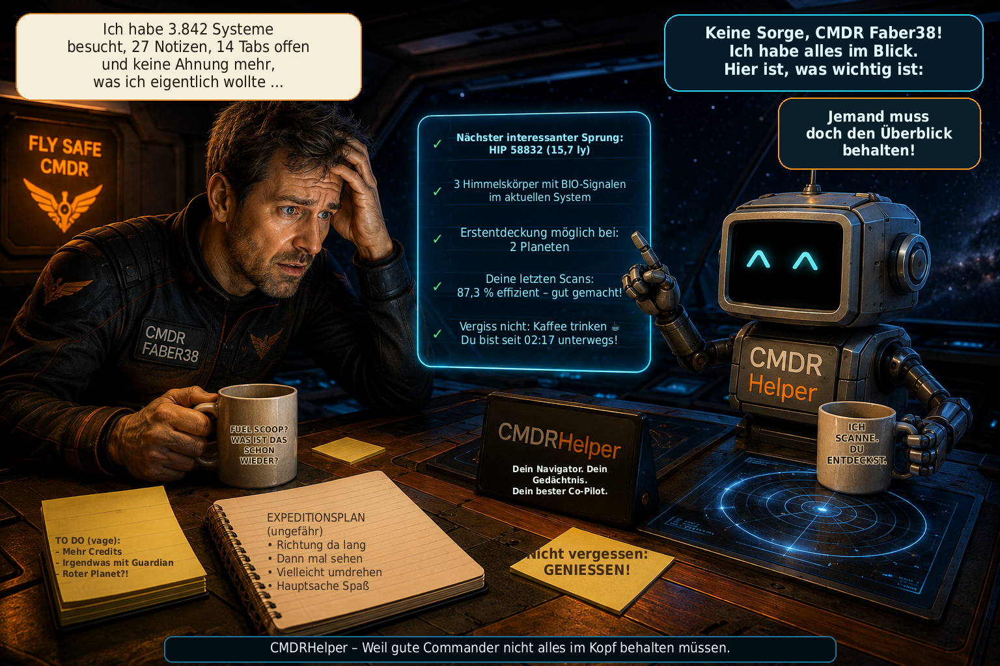

# CMDRHelper

[🇩🇪 Deutsch](README_DE.md) \| [🇬🇧 English](README.md) \| [🇫🇷
Français](README_FR.md) \| [🇮🇹 Italiano](README_IT.md) \| [🇳🇴
Norsk](README_NO.md) \| [🇸🇪 Svenska](README_SV.md) \| [🇫🇮
Suomi](README_FI.md) \| [🇵🇱 Polski](README_PL.md) \| [🇳🇱
Nederlands](README_NL.md) \| [🇪🇸 Español](README_ES.md) \| [🇹🇷
Türkçe](README_TR.md) \| [🇬🇷 Ελληνικά](README_EL.md)



**Persönlicher Begleiter für Elite Dangerous -- Exploration,
Systemanalyse und Commander-Daten auf einen Blick**

CMDRHelper ist ein eigenständiges Desktop-Programm für **Elite
Dangerous**, das Informationen aus den lokalen Journal-Dateien des
Spiels auswertet und übersichtlich darstellt. Ziel ist ein persönlicher
Helper, der beim Erkunden eines Systems schnell zeigt, was bereits
bekannt ist, welche Himmelskörper interessant sind und welche eigenen
Entdeckungen und Kartographierungen vorliegen.

Das Projekt befindet sich noch in aktiver Entwicklung.

## Funktionsübersicht

### Elite-Dangerous-Journale

CMDRHelper liest die lokalen Journal-Dateien und verarbeitet unter
anderem Sternsysteme, Sterne, Planeten, Monde, Belt Cluster, Scans,
Kartographierungen sowie biologische und geologische Signale. Eigene
Commander-Daten bleiben von ergänzenden externen Informationen
unterscheidbar.

### Missionen

CMDRHelper wertet Missionsereignisse aus den Elite-Dangerous-Journalen
aus und stellt aktive Missionen übersichtlich dar. Missionsstatus und
zugehörige Journalereignisse werden nachverfolgt.

Auch Missionsangebote, die während des Spiels über NPC-Nachrichten
(`ReceiveText`) eintreffen, können erkannt und für die weitere
Missionszuordnung berücksichtigt werden. Da Elite Dangerous nicht bei
jedem Missionstyp alle Informationen im selben Journalereignis
bereitstellt, wird die Zuordnung schrittweise aus den vorhandenen
Journaldaten aufgebaut.

### System- und Explorer-Ansicht

Die bekannten Körper eines Systems werden grafisch dargestellt und
können direkt ausgewählt werden. CMDRHelper kann unter anderem anzeigen:

-   Name und Art des Körpers
-   Entfernung im System
-   selbst gescannt oder nur extern bekannt
-   bereits entdeckt und kartographiert
-   mögliche Erstentdeckung und mögliches First Mapping
-   vom Commander kartographiert
-   effiziente Kartographierung
-   biologische und geologische Signale
-   Scan- und Kartographiewerte

BIO-Signale werden deutlich am betroffenen Körper hervorgehoben. Die
Zuordnung erfolgt systembezogen, damit BodyIDs verschiedener
Sternsysteme nicht verwechselt werden.

### Körper-Detailansicht

Beim Anklicken eines Körpers öffnet sich eine ausführliche Ansicht. Je
nach vorhandenen Daten erscheinen Körperart, Masse, Entfernung,
Schwerkraft, Atmosphäre, Vulkanismus, Landbarkeit, Terraforming-Status,
Materialien, BIO-/GEO-Signale, Scanwert, Kartographiewert und
Entdeckungsstatus.

Fehlende Informationen werden als unbekannt dargestellt und nicht als
sichere Daten ausgegeben.

## Grafische Körperdarstellung

CMDRHelper besitzt eigene Grafiken für zahlreiche Körpertypen, darunter
High Metal Content Worlds, Metal Rich Bodies, Rocky Bodies, Icy Bodies,
Rocky Ice Worlds, Earth-like Worlds, Water Worlds, Ammonia Worlds,
mehrere Gasriesenklassen, Gasriesen mit Wasser- oder Ammoniak-Leben,
heliumreiche Gasriesen, verschiedene Sternklassen und Belt Cluster.

Normale PNG-Bilder dienen den Übersichten. Für viele Körper gibt es
zusätzlich eine **2:1-equirectangulare `_texture.png`** für die
animierte Detailansicht.

### Rotierende 3D-Planeten

Passende 2:1-Texturen werden auf eine rotierende Kugel projiziert. Der
CPU-Renderer arbeitet mit **PySide6 und NumPy** ohne zusätzliche
OpenGL-/PyOpenGL-Abhängigkeit. Er beinhaltet Kugelprojektion, langsame
Rotation, Beleuchtung, Randabdunklung und atmosphärischen Rand.

### Animierte Lebensformen

Für Life-Gasriesen existieren unterschiedliche Animationen:

**Water Life:** cyan-/türkisfarbene schwebende Organismen mit Halo und
bewegten Schweifen.

**Ammonia Life:** eigene violett-/amberfarbene, halbtransparente
Organismen mit pulsierendem Kern, kurzen Fäden und langsamerer Bewegung.

### Animierte Belt Cluster

Belt Cluster werden nicht als Kugel dargestellt. Die Detailansicht
erzeugt ein prozedurales Asteroidenfeld mit einzelnen Asteroiden,
unterschiedlichen Größen und Tiefen, eigener Rotation, individueller
Drift, Parallax-Effekt, Kratern sowie dezenten Staub- und
Partikeleffekten.

## EDSM als ergänzende Datenquelle

CMDRHelper kann eigene Journal-Daten und EDSM-Informationen
unterscheiden. Die Quelle wird entsprechend als eigenes Journal, EDSM
oder eigenes Journal + EDSM gekennzeichnet. Eigene Journal-Daten sind
besonders wichtig, weil sie zeigen, was der jeweilige Commander
tatsächlich selbst gescannt oder kartographiert hat.

CMDRHelper kann neue Journal-Daten automatisch an EDSM übertragen. Dabei
wird die aktuelle dynamische EDSM-Discard-Liste berücksichtigt, sodass
nur von EDSM gewünschte Ereignisse gesendet werden. Der
Übertragungsfortschritt wird sicher pro Journaldatei gespeichert. Bei
der ersten Aktivierung werden bereits vorhandene alte Journale nicht
erneut vollständig übertragen.

Der EDSM-Status wird direkt oben in der Übersicht angezeigt. Eine grüne
Anzeige signalisiert eine funktionierende Übertragung; Fehler werden rot
dargestellt und zusätzlich im CMDRHelper-Log protokolliert.

## Lokale Datenbank

CMDRHelper verwendet SQLite. Dabei gilt:

-   `cmdrhelper/database.py` ist Programmcode und gehört zum Release.
-   `data/cmdrhelper.db` enthält persönliche Commander-Daten und wird
    **nicht** verteilt.
-   Bei einer frischen Installation wird die lokale Datenbank für den
    jeweiligen Benutzer neu aufgebaut.

So werden keine persönlichen Commander-Daten mit einem Release
ausgeliefert.

## Diagnose und Logdatei

CMDRHelper führt ein eigenes rotierendes Logfile für Diagnose und
Fehlersuche. Wichtige Programm-, Journal-, Datenbank- und
EDSM-Ereignisse werden protokolliert. Das EDSM-Logging wurde so
reduziert, dass reine, von EDSM verworfene Journalereignisse das normale
Log nicht unnötig füllen, während erfolgreiche Übertragungen sowie
Warnungen und Fehler sichtbar bleiben.

## Plattformen

CMDRHelper wird mit Python und PySide6 entwickelt und ist für **Linux
und Windows** vorgesehen. Die Entwicklung erfolgt hauptsächlich unter
Linux; Windows kann über die mitgelieferten Batch-Dateien eingerichtet
werden.

## Voraussetzungen

Python 3 sowie die Pakete aus `requirements.txt`:

``` text
PySide6>=6.7,<7
numpy
Pillow>=10.0
```

## Installation unter Linux

``` bash
python3 -m venv venv
source venv/bin/activate
python -m pip install --upgrade pip
pip install -r requirements.txt
python main.py
```

Vorhandene Linux-Startskripte können alternativ verwendet werden.

## Installation unter Windows

Für Windows sind `install.bat` und `start.bat` vorgesehen.

`install.bat` prüft Python 3, erstellt `venv`, aktualisiert pip und
installiert `requirements.txt`. Anschließend wird CMDRHelper über
`start.bat` gestartet.

## Release erstellen

``` bash
./create_release.sh
```

Die Release-Version wird direkt im Skript festgelegt. Das erzeugte ZIP
enthält Programmcode und Assets, aber keine persönliche Datenbank, keine
virtuelle Python-Umgebung sowie keine Git-, Cache- oder Editor-Dateien.

## Version 2.0

**Version 2.0** ergänzt echte Multi-CMDR-Unterstützung. Der mit Version 1.5
eingeführte Routenplaner sowie die bisherigen Explorer-, Missions-, System-
und Chronikfunktionen bleiben enthalten.

### Multi-CMDR und CMDR Ansicht

-   Commander werden automatisch über ihre Frontier-FID erkannt. Der
    Live-Commander wird ausschließlich durch das Journal bestimmt; die
    Auswahl eines anderen Profils zur Ansicht verändert weder die
    Journalzuordnung noch Live-Schreibvorgänge.
-   persönliche Besuche, Explorationsfortschritt, Missionen, Standorte,
    Schiffe, Fleet Carrier, Vermögen sowie offene Bio- und Kartographiedaten
    werden für jeden Commander getrennt gespeichert.
-   die **CMDR Ansicht** kann jeden bekannten Commander offline anzeigen. Die
    Übersicht umfasst Missionen, letzten Standort, letztes Schiff, Fleet
    Carrier samt Standort, Vermögen und geschätzte offene Bio- und
    Kartographiedaten.

### Multi-CMDR-Chronik

-   jeder Commander erhält eine stabile Darstellungsfarbe und kann einzeln
    oder gemeinsam gefiltert werden.
-   Routen bleiben chronologisch getrennt; Sprünge verschiedener Commander
    werden niemals miteinander verbunden.
-   von mehreren Commandern besuchte Systeme erscheinen als Mehrfachbesuche.

### Commander-Flotten

-   jeder Commander besitzt eine persistente Flotte aller bekannten Schiffe
    mit aufklappbaren Details zu Loadout, Reichweite, Tanks, Fracht und
    letztem Standort.
-   das Live-Schiff wird grün hervorgehoben. Andere Schiffe erhalten stabile
    Standortfarben; ein vertikaler Scrollbereich hält auch große Flotten
    vollständig erreichbar.
-   Anzüge, SRVs wie Scarab, Scorpion und Nomad, gestartete Jäger, Taxis und
    Dropships werden nicht als normale Commander-Schiffe geführt.

### Bestehende Datenbanken

Bestehende Datenbanken werden über die eingebaute Schema-Migration
weitergeführt. Persönliche Multi-CMDR-Daten werden anhand der Frontier-FID
getrennt. Können ältere Daten zu mehreren Commanderprofilen gehören, rät
CMDRHelper nicht blind und löscht nicht pauschal alles; eine uneindeutige
Zuordnung bleibt offen, statt dem falschen Commander zugewiesen zu werden.

CMDRHelper unterstützt weiterhin **Linux und Windows** und enthält den
Schiffs- und Fleet-Carrier-Routenplaner aus Version 1.5.

## Version 1.5

**Version 1.5** ist ein großes Funktionsupdate. Es ergänzt den neuen
Routenplaner für Schiffe und Fleet Carrier, verbindet den Routenfortschritt
enger mit dem Elite-Dangerous-Journal und verbessert insbesondere unter
Windows die Zuverlässigkeit und Performance der Journalverarbeitung.

### Routenplaner und Schiffsroute

-   der neue **Routenplaner** berechnet Schiffsrouten über den Spansh Galaxy
    Plotter und zeigt alle Zwischenziele direkt in CMDRHelper an.
-   CMDRHelper erkennt Schiff, FSD, FSD-Engineering und den aktiven Guardian
    FSD Booster aus dem Elite-Dangerous-Journal. Tank-, Cargo-, Masse- und
    verfügbare FSD-Werte werden automatisch übernommen.
-   automatisch erkannte technische Werte bleiben editierbar. Manuelle
    Überschreibungen bleiben bei späteren Loadout-, Cargo- und Fuel-Updates
    erhalten, bis die erkannten Schiffsdaten ausdrücklich erneut übernommen
    werden.
-   Loadout-, Cargo- und Fuel-Änderungen aktualisieren gezielt nur die
    betroffenen Routeneingaben. Unbekannte Werte bleiben sichtbar leer und
    werden nicht geschätzt.
-   Start- und Zielsystem werden vor der Routenberechnung auf einen exakten
    Spansh-Treffer geprüft. Unbekannte Systeme erhalten dadurch eine
    verständliche Meldung, ohne einen aussichtslosen Routingjob zu starten.
-   der Routenfortschritt folgt echten `FSDJump`-Ereignissen des vorhandenen
    Journalflusses. Nach einem erfolgreichen Sprung wird das nächste
    Routensystem automatisch in die Qt-Zwischenablage kopiert und kann über
    einen Button erneut kopiert werden.

### Fleet Carrier und CTSVision

-   der Routenplaner besitzt außerdem einen eigenen Modus **Fleet Carrier /
    CTSVision**, der den Spansh Fleet Carrier Router verwendet.
-   berechnete Fleet-Carrier-Routen enthalten Sprung- und Tritiumdaten und
    lassen sich als CTSVision-kompatible CSV-Datei exportieren.

### Journal-Zuverlässigkeit und Performance

-   temporäre Zugriffsfehler beim Lesen der aktiven Journaldatei bestätigen
    eine Änderung nicht mehr vorzeitig. Der normale Pollingzyklus versucht
    dieselbe Änderung erneut, ohne aggressives Busy-Waiting.
-   das BIO- und Kartographie-Lernen durchsucht bei gewöhnlichen,
    fachfremden Ereignissen nicht mehr das vollständige Journalarchiv.
    Komplettauswertungen sind auf relevante BIO- beziehungsweise
    Verkaufsereignisse und den vorgesehenen Archivimport begrenzt.
-   dadurch sinkt der unnötige Aufwand bei jedem Journalappend; insbesondere
    unter Windows verbessern sich Zuverlässigkeit und Reaktionsfähigkeit.

## Version 1.0.8

**Version 1.0.8** ergänzt eine persönliche Sprungempfehlung für die
Exploration, vervollständigt die Internationalisierung und verbessert
die Explorer-Livefenster sowie die Darstellung der Chronik-Karte.

### Sprungtipp und Sprungempfehlung

-   der neue Bereich **„Sprungtipp“** wertet die eigene lokale
    Explorationsdatenbank aus und zeigt, welche prozeduralen
    Systemcodes für ein ausgewähltes Explorationsziel besonders
    interessant sein können.
-   als Ziele können unter anderem BIO-Funde allgemein, bekannte
    BIO-Gattungen und -Arten, wertvolle Explorer-Körper,
    Terraforming-Kandidaten, Wasserwelten, erdähnliche Welten und
    Ammoniakwelten ausgewählt werden.
-   die Rangliste berücksichtigt die bisher mit einem Code untersuchten
    Systeme, Treffer, Trefferquote, gespeicherte Funde und die
    verfügbare Stichprobengröße. Eine einstellbare Mindestanzahl
    untersuchter Systeme verhindert, dass zu kleine Datenmengen in der
    Rangliste überbewertet werden.
-   CMDRHelper hebt bevorzugte Codes hervor, nach denen auf der
    Galaxiekarte gezielt Ausschau gehalten werden kann, beispielsweise
    Kombinationen wie `ZL-Z b` oder `NR-C d`.
-   die Empfehlung basiert ausschließlich auf dem **eigenen bisherigen
    Explorationsverlauf** und den darin gespeicherten Funden. Sie ist
    eine statistische Orientierung und **garantiert keinen Fund**.

### Internationalisierung

-   die Internationalisierung wurde weiter vervollständigt und erneut
    gegen die deutsche Referenz abgeglichen.
-   alle **12 unterstützten Oberflächensprachen** besitzen jetzt
    denselben vollständigen Bestand von **560 Übersetzungsschlüsseln**.
-   die neuen sowie bisher noch fehlenden Übersetzungen für
    **Sprungtipp und Sprungempfehlung** wurden in allen unterstützten
    Sprachen ergänzt.
-   Schlüsselbestand, Reihenfolge und Format-Platzhalter wurden für alle
    Sprachdateien abgeglichen.

### Explorer-Livefenster und Einstellungen

-   die Explorer-Einstellungen besitzen neue erklärende Tooltips für
    die automatische Einblendung der Fenster **„Wertvolle Körper“** und
    **„BIO-Funde“**.
-   die Tooltips erläutern, wann das jeweilige Fenster anhand des
    eingestellten Wert-Schwellenwerts beziehungsweise erkannter BIO-
    oder GEO-Signale automatisch erscheint.
-   bereits selbst kartierte wertvolle Körper werden im kleinen
    Livefenster nicht mehr als offene Ziele geführt.
-   vollständig analysierte BIO-Körper verschwinden aus dem
    BIO-Livefenster; ein noch nicht per DSS kartierter GEO-Anteil
    desselben Körpers bleibt weiterhin sichtbar.

### Chronik

-   die Darstellungsorientierung der Chronik-Karte wurde korrigiert,
    sodass die positive Z-Achse nach oben zeigt. Die gespeicherten
    Elite-`StarPos`-Koordinaten bleiben dabei unverändert.

## Version 1.0.5

**Version 1.0.5** erweitert vor allem die Explorer-Wertberechnung und
die Chronik und verbessert damit die praktische Nutzung während längerer
Explorationstouren.

### Kartographie und Wertliste

-   die Explorer-Wertliste berücksichtigt jetzt den **noch erreichbaren
    Kartographiewert** eines Körpers.
-   dabei wird unterschieden, ob ein Körper noch unentdeckt und
    unkartiert, bereits entdeckt aber noch nicht kartiert oder bereits
    kartiert ist.
-   die neue Spalte **„Möglicher Wert"** zeigt den noch erreichbaren
    Wert **mit und ohne Effizienzbonus**.
-   der in den Einstellungen festgelegte Schwellenwert für wertvolle
    Körper richtet sich jetzt ebenfalls nach dem **noch erreichbaren
    Wert**.
-   derselbe Wert steuert damit konsistent die Hervorhebung in der
    Wertliste, das Livefenster **„Wertvolle Körper"** und den Goldrahmen
    in der Systemkarte.
-   bereits selbst kartierte Körper werden anhand des tatsächlich
    erreichten und noch auszuzahlenden Kartographiewerts bewertet.
-   die bestehende Kartographieformel bleibt als sichere Basisberechnung
    erhalten.

### Lernende Kartographie-Auswertung

-   Verkäufe bei **Universal Cartographics** können aus den
    Elite-Dangerous-Journalen als Lerndaten erfasst werden.
-   `SellExplorationData` und `MultiSellExplorationData` werden mit den
    verfügbaren Verkaufswerten und den zugehörigen rekonstruierten
    Körperdaten in der lokalen SQLite-Datenbank gespeichert.
-   bei Sammelverkäufen werden keine künstlichen Einzel-Auszahlungen für
    Planeten erzeugt; der tatsächliche Verkauf bleibt als gemeinsamer
    Verkaufs-Batch erhalten.
-   die normale Wertformel bleibt weiterhin als Fallback verfügbar,
    falls noch keine geeigneten Lerndaten vorhanden sind.
-   bereits ausgewertete Journaldateien werden gespeichert, damit die
    Verkaufsdaten nicht bei jedem Programmstart unnötig neu verarbeitet
    werden.

### Chronik

-   das aktuell besuchte Sternsystem kann in der Chronik besonders
    hervorgehoben werden.
-   über **„Aktuelle Position"** kann die Chronik direkt auf das
    derzeitige System zentriert werden.

### EDSM

-   die bestehende automatische EDSM-Übertragung wurde im praktischen
    Betrieb mit neuen Systembesuchen und Körper-/Scandaten erfolgreich
    überprüft.

## Version 1.0

Mit **Version 1.0** erreicht CMDRHelper den ersten vollständigen
Entwicklungsstand des geplanten Grundumfangs.

Wichtige Änderungen und Erweiterungen bis Version 1.0:

### Vervollständigte Körper- und Sterndarstellung

-   das Bildmaterial für die unterstützten Planeten-, Stern- und
    Sonderobjekttypen wurde weiter vervollständigt.
-   zusätzliche Sternklassen und besondere Sterntypen werden mit eigenen
    Grafiken dargestellt, statt auf die allgemeine Standarddarstellung
    zurückzufallen.
-   für geeignete Körper stehen weiterhin rotierende
    2:1-equirectangulare Texturen in der Detailansicht zur Verfügung.
-   besondere astronomische Objekte können in der Detailansicht
    zusätzlich über passende Videos dargestellt werden.
-   Neutronensterne, Weiße Zwerge, Schwarze Löcher und supermassive
    Schwarze Löcher erhalten dadurch eine deutlich individuellere
    Darstellung.
-   verwendetes externes Bild- und Videomaterial wird mit Quelle und
    Credit im Abschnitt **„Bild- und Videomaterial / Media Credits"**
    dokumentiert.

### Vervollständigte Mehrsprachigkeit

-   die Übersetzungen der Benutzeroberfläche wurden für die
    unterstützten Sprachen vervollständigt und auf einen gemeinsamen
    Schlüsselbestand abgeglichen.
-   alle **12 Oberflächensprachen** verwenden denselben vollständigen
    Übersetzungsschlüsselbestand.
-   die automatische Übersetzungsprüfung kontrolliert fehlende,
    zusätzliche und doppelte Schlüssel sowie abweichende
    Format-Platzhalter.
-   Deutsch dient als vollständig gepflegte Referenz für die
    Benutzeroberfläche und die weitere Dokumentation.

### Änderungen aus Version 0.9.9

### Mehrsprachigkeit und Übersetzungsprüfung

-   die Benutzeroberfläche wurde auf ein zentrales
    Mehrsprachigkeitssystem umgestellt.
-   CMDRHelper unterstützt jetzt **12 Oberflächensprachen**: **Deutsch,
    Englisch, Französisch, Italienisch, Norwegisch (Bokmål), Schwedisch,
    Finnisch, Polnisch, Niederländisch, Spanisch, Türkisch und
    Griechisch**.
-   die Sprache kann in den Einstellungen gewählt und gespeichert
    werden; die Sprachbezeichnungen werden im Auswahlfeld jeweils in
    ihrer eigenen Sprache angezeigt.
-   fehlende Übersetzungen verwenden eine definierte
    Fallback-Reihenfolge: **gewählte Sprache → Englisch → Deutsch →
    Übersetzungsschlüssel**.
-   die Übersetzungen liegen zentral in den Sprachdateien unter
    `cmdrhelper/i18n/`.
-   das neue Entwicklerwerkzeug `tools/check_i18n.py` prüft automatisch:
    -   im Programm verwendete `tr("...")`-Schlüssel,
    -   fehlende oder zusätzliche Übersetzungsschlüssel,
    -   doppelte Schlüssel,
    -   abweichende Format-Platzhalter wie `{system}` oder `{count}`.
-   unter Linux wird die i18n-Prüfung beim Start über `start.sh`
    automatisch ausgeführt. Gefundene Übersetzungsprobleme werden
    deutlich gemeldet, blockieren den Programmstart aber nicht.
-   Missions- und Journalverarbeitung wird weiterhin von der gewählten
    CMDRHelper-Oberflächensprache getrennt behandelt, damit interne
    Elite-Dangerous-Daten nicht von lokalisierten Anzeigetexten abhängig
    werden.

### Explorer und Systemkarte

-   Parent-/Child-Struktur der Systemkarte überarbeitet: Sterne,
    Planeten, Monde und Belt Cluster werden entsprechend ihrer
    Journal-Hierarchie angeordnet.
-   neue Funktion **„Alles anzeigen"** mit kompakter Miniaturübersicht
    des gesamten Systems
-   Körper können in der Miniaturübersicht angeklickt werden; die
    Hauptkarte springt anschließend direkt zum gewählten Körper.
-   verbesserte Navigation in großen Systemkarten:
    -   Mausrad verschiebt die Karte horizontal.
    -   rechte Maustaste gedrückt halten und nach oben/unten ziehen
        verschiebt die Karte vertikal.
-   optische Körpergrößen werden stärker anhand des realen Radius
    skaliert.
-   Darstellung und Markierung von BIO, GEO, Terraforming,
    Erstentdeckung und First Mapping weiter verbessert.
-   neue **Wertliste** im Explorer: Planeten und Monde werden
    zeilenweise nach ihrem aktuellen geschätzten Kartographiewert
    sortiert.
-   die Wertliste unterscheidet jetzt deutlich zwischen **First Mapping
    möglich**, **bereits kartiert** und **selbst kartiert**.
-   der aktuell erreichte Kartographiewert wird in der Wertliste gezielt
    hervorgehoben, während Status- und Metadaten bewusst ruhiger
    dargestellt werden.
-   neue Anzeige **„Noch nicht abgegeben"** für offene Kartographie- und
    BIO-Werte über alle Systeme seit dem letzten Verkauf; Kartographie
    und BIO werden getrennt zurückgesetzt.
-   die offenen Explorer-Werte werden im Hauptfenster gelb
    hervorgehoben, damit noch nicht verkaufte Daten sofort erkennbar
    sind.

### Explorer-Livefenster

-   neue frei positionierbare **Livefenster für wertvolle Körper und
    BIO-Funde**, die während der Exploration automatisch erscheinen.
-   Position und Größe der Livefenster werden gespeichert und beim
    nächsten Auftauchen wiederverwendet.
-   beim Wechsel in ein anderes Sternsystem werden die Livefenster
    automatisch geschlossen und geleert; sie erscheinen erst wieder,
    wenn im neuen System passende Daten erkannt werden.
-   das Fenster **„Wertvolle Körper"** übernimmt automatisch alle
    Planeten und Monde, deren aktuell erreichter Kartographiewert den in
    den Einstellungen gewählten Schwellenwert erreicht.
-   derselbe einstellbare Schwellenwert steuert jetzt die gelbe
    Hervorhebung der Wertliste, das Livefenster für wertvolle Körper und
    den **Goldrahmen in der Systemkarte**.
-   das **BIO-Livefenster** zeigt Körper, erkannte Gattungen bzw. Arten,
    Scanfortschritt und bekannte Vista-Genomics-Werte kompakt während
    des Spielens an.
-   BIO-Funde verwenden dieselbe Farblogik wie im Hauptfenster: grau =
    DSS/FSS erkannt, weiß = erste Probe, gelb = zweite Probe, grün =
    Analyse vollständig.
-   bei teilweise bestimmten BIO-Signalen klappt ein Planet automatisch
    auf und zeigt die einzelnen Funde in eigenen Zeilen; noch unbekannte
    Signale bleiben sichtbar.
-   sobald alle BIO-Arten eines Körpers vollständig analysiert wurden,
    wird der Planet wieder zu einer kompakten grünen
    Zusammenfassungszeile zusammengeklappt.
-   allgemeine DSS/FSS-Gattungsnamen werden automatisch durch die
    konkrete BIO-Art ersetzt, sobald diese durch `ScanOrganic` bekannt
    ist.
-   bekannte Einzelwerte werden direkt beim jeweiligen BIO-Fund
    angezeigt; vollständig bekannte Körper zeigen zusätzlich den
    Gesamtwert.
-   die Livefenster besitzen einen dezent rötlich-braunen Hintergrund,
    damit sie sich beim Spielen klar vom CMDRHelper-Hauptfenster
    unterscheiden.

### BIO-Auswertung

-   biologische Daten werden getrennt von den normalen
    Kartographie-Werten ausgewertet und angezeigt.
-   eigene **BIO-Planeten-Liste** mit allen Körpern, auf denen
    biologische Signale erkannt wurden.
-   BIO-Gattungen aus `SAASignalsFound` bzw. `FSSBodySignals` werden
    auch rückwirkend aus vorhandenen Journalen übernommen.
-   konkrete BIO-Arten und Varianten aus `ScanOrganic` werden direkt in
    der Liste angezeigt.
-   Scanfortschritt je BIO-Fund wird farblich dargestellt:
    -   grau = nur durch DSS/FSS bekannt
    -   weiß = erste Probe
    -   gelb = zweite Probe
    -   grün = dritte Probe / Analyse vollständig
-   der bekannte Vista-Genomics-Basiswert wird bereits angezeigt, sobald
    eine BIO-Art eindeutig bestimmt ist.
-   Anzeige des Basiswertes vollständig analysierter BIO-Proben
-   Anzeige des möglichen **First-Logged-Gesamtwertes ×5**
-   bekannte BIO-Werte können aus vorhandenen Verkaufsdaten ergänzt
    werden.
-   Arten ohne bekannten Wert werden in der Auswertung kenntlich
    gemacht.
-   BIO-Status unterscheidet zwischen offen, besucht und vollständig
    analysiert.

### Missionen

-   Verarbeitung von `MissionRedirected` verbessert.
-   umgeleitete Missionen können Namen, neues Zielsystem bzw. neue
    Zielstation und Informationen zum vorherigen Ziel übernehmen.
-   Missionen können in bestimmten Fällen auch rekonstruiert werden,
    wenn zuvor kein vollständiger `MissionAccepted`-Eintrag vorlag.
-   Missionsspalten sind frei in der Breite einstellbar; die gewählten
    Breiten werden gespeichert.
-   Anzeige der **Gesamtbelohnung aller aktuell offenen Missionen**.

### Bilder und Screenshots

-   eigener Screenshot-Bereich mit Galerie und Vorschau
-   automatische Konvertierung neuer Elite-Dangerous-BMP-Screenshots
-   Ausgabe als PNG oder JPG
-   optionales Löschen der BMP-Datei nach erfolgreicher Konvertierung
-   einstellbare Helligkeitskorrektur von 0 bis 50 %
-   komfortablere Verwendung des Elite-Screenshotordners unter
    Steam/Proton
-   Galerie wird auch nach extern gelöschten Dateien aktualisiert.
-   verbesserte Sichtbarkeit der Optionen für automatische Konvertierung
    und Löschen

### Online-Dienste

-   automatische EDSM-Journalübertragung weiter integriert und über den
    Statusbereich im Hauptfenster sichtbar
-   Status für Übertragung, Warten, Fehler und deaktiviertes EDSM
-   Inara-Statusanzeige als Vorbereitung für die spätere automatische
    Übertragung

### Bedienung und Stabilität

-   Schriftart und Schriftgröße der Oberfläche können in den
    Einstellungen gewählt und nach einem Neustart auf die gesamte
    Oberfläche angewendet werden.
-   die Einstellungsseite ist scrollbar, damit alle Optionen auch bei
    kleineren Fenstergrößen erreichbar bleiben.
-   sichtbarer **„Beenden"**-Schalter in der linken Seitenleiste
-   Single-Instance-Sperre verhindert einen versehentlichen zweiten
    gleichzeitigen Programmstart.
-   sichere Miniatur-Systemübersicht ohne direktes Rendern des bereits
    sichtbaren Explorer-Widgets
-   verschiedene Verbesserungen an Oberfläche, Journalverarbeitung,
    Datenbank und Updateablauf

## Projektstatus

CMDRHelper befindet sich in Entwicklung. Benutzeroberfläche, Datenmodell
und Darstellung können sich noch ändern. Weitere Körpertypen,
Journal-Funktionen, Explorer-Funktionen, Datenquellen und Berechnungen
sind vorgesehen. Linux und Windows werden weiter getestet.

CMDRHelper entstand als persönliches Werkzeug und wird schrittweise zu
einem umfangreicheren Elite-Dangerous-Helper ausgebaut.

## Bild- und Videomaterial / Media Credits

CMDRHelper verwendet für einzelne astronomische Sonderobjekte
Visualisierungen der **NASA Scientific Visualization Studio (NASA
SVS)**. Die jeweiligen Medien bleiben Eigentum ihrer Rechteinhaber und
werden entsprechend den auf den NASA-SVS-Seiten angegebenen Credits
genannt.

### Neutronenstern

-   CMDRHelper-Datei: `star_neutron.webm`
-   Quelle: NASA Scientific Visualization Studio, **Neutron Star
    Animations** (SVS ID 20267)
-   Credit: **NASA's Goddard Space Flight Center Conceptual Image Lab**
-   Animatoren: Walt Feimer (KBR Wyle Services, LLC) und Lisa Poje
    (USRA)
-   Quelle: https://svs.gsfc.nasa.gov/20267/

### Schwarzes Loch

-   CMDRHelper-Datei: `black_hole.mp4` bzw. die im Projekt verwendete
    Video-Endung
-   Quelle: NASA Scientific Visualization Studio, **Black Hole Accretion
    Disk Visualization** (SVS ID 13326)
-   Credit: **NASA's Goddard Space Flight Center/Jeremy Schnittman**
-   Quelle: https://svs.gsfc.nasa.gov/13326/

### Supermassives Schwarzes Loch

-   CMDRHelper-Datei: `black_hole_supermassive.mp4` bzw. die im Projekt
    verwendete Video-Endung
-   Quelle: NASA Scientific Visualization Studio (SVS ID 14576)
-   Credit: **NASA's Goddard Space Flight Center/J. Schnittman and B.
    Powell**
-   Quelle: https://svs.gsfc.nasa.gov/14576/

### Weißer Zwerg

-   CMDRHelper-Datei: `star_white_dwarf.webm`
-   verwendetes NASA-Medium: **White Dwarf establishing shot**
    (`WDStar_4k_60fps_ProRes.webm`)
-   Quelle: NASA Scientific Visualization Studio, **Type Ia Supernovae
    Animations** (SVS ID 20344)
-   Credit: **NASA's Goddard Space Flight Center Conceptual Image Lab**
-   Animatorin: Adriana Manrique Gutierrez (USRA)
-   Producer: Scott Wiessinger (USRA)
-   Quelle: https://svs.gsfc.nasa.gov/20344/

Die Nennung dieser Quellen und Credits bedeutet nicht, dass CMDRHelper
von NASA unterstützt, zertifiziert oder herausgegeben wird. Für die
Weiterverwendung der NASA-Medien gelten die jeweiligen Hinweise und
Reproduktionsrichtlinien der Originalquellen.

## Lizenz

CMDRHelper ist freie Software und wird unter der **GNU General Public
License Version 3 (GPL-3.0)** veröffentlicht.

Der Quellcode darf unter den Bedingungen der GPL-3.0 verwendet,
verändert und weitergegeben werden. Bei der Weitergabe abgeleiteter
Versionen gelten ebenfalls die Bedingungen der GPL-3.0.

Copyright © 2026 **Holger Mangold (Faber38)**.

Die vollständigen Lizenzbedingungen befinden sich in der Datei
`LICENSE`.

## Hinweis zu Elite Dangerous

CMDRHelper ist ein unabhängiges Community-/Hobbyprojekt und kein
offizielles Produkt von Frontier Developments.

**Elite Dangerous** und zugehörige Namen und Inhalte sind Eigentum ihrer
jeweiligen Rechteinhaber.
