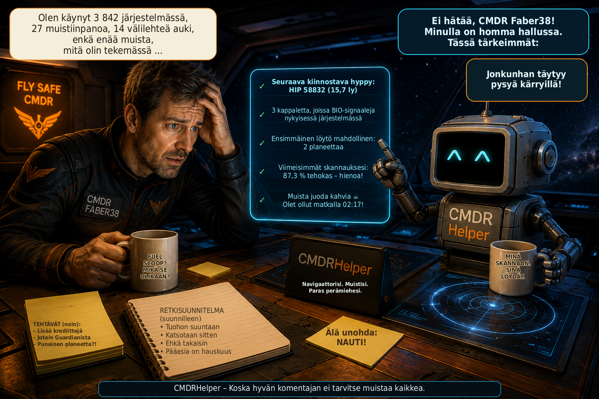

# CMDRHelper

[🇩🇪 Deutsch](README_DE.md) \| [🇬🇧 English](README.md) \| [🇫🇷
Français](README_FR.md) \| [🇮🇹 Italiano](README_IT.md) \| [🇳🇴
Norsk](README_NO.md) \| [🇸🇪 Svenska](README_SV.md) \| [🇫🇮
Suomi](README_FI.md) \| [🇵🇱 Polski](README_PL.md) \| [🇳🇱
Nederlands](README_NL.md) \| [🇪🇸 Español](README_ES.md) \| [🇹🇷
Türkçe](README_TR.md) \| [🇬🇷 Ελληνικά](README_EL.md)



**Henkilökohtainen kumppani Elite Dangerousiin – tutkimus, navigointi ja komentajan tiedot yhdellä silmäyksellä**

CMDRHelper on itsenäinen työpöytäsovellus, joka analysoi Elite Dangerousin paikallisia lokeja ja käyttää `Status.json`-tiedoston planetaarisia sijaintitietoja. Se auttaa tunnistamaan kiinnostavia taivaankappaleita, palaamaan tallennettuihin paikkoihin ja tarkastelemaan matkoja ja löytöjä. Henkilökohtaiset tiedot säilyvät uudelleenkäynnistyksessä ja pidetään erillään komentajittain.

## Uutta versiossa v3.2 verrattuna versioon v3.1

- Engineering-materiaalien hallinta: kaikki 146 Raw-, Manufactured- ja Encoded-materiaalia tasoineen, enimmäismäärineen ja poikkeuksineen. Komentajakohtaiset ajantasaiset määrät, haku, suodattimet, viisi hillittyä rivitaustaa sekä tallennetut sarakeleveydet ja järjestys helpottavat selaamista. Tuntematon määrä erotetaan nollasta.

- Odyssey-varasto: neljäs materiaalivälilehti sisältää 223 luetteloidentiteettiä tavaroille, komponenteille, datalle ja kulutustavaroille. Aluksen varasto, reppu ja luotettava yhteismäärä pidetään erillään; tehtäväpinot, tehtävän tila ja engineering-käyttö näkyvät. Positiiviset määrät näytetään kullanvärisinä. Puuttuvat nimikäännökset korvataan englannilla.

- Materiaalikauppiaiden haku (Etsi materiaalikauppias → Avaa reittisuunnittelija): Spansh hakee pyynnöstä Raw-, Manufactured- ja Encoded-kauppiaat erikseen komentajan nykyisestä järjestelmästä. Carrierit jätetään pois ja asematiedot tarkistetaan. Etäisyys ly-yksiköissä on suora järjestelmien välinen etäisyys; yhteisötiedot eivät takaa pääsyä. Siirto reittisuunnittelijaan asettaa vain kohdejärjestelmän eikä käynnistä reittiä. Odyssey-kauppiaita ei haeta.

- Järjestelmän yleiskuva: uusi Elite-tyylinen näkymä korvaa pienoisyleiskuvan Explorerissa ja Kronikassa. Tähdet ja planeetat muodostavat päärakenteen, kuut haarautuvat alapuolelle; monitähtijärjestelmät pysyvät selkeinä. Zoomaus, vieritys, ikkunaan sovitus ja taivaankappaleen napsautus avaavat yksityiskohtia.

- Tiiviit asteroidivyöhykkeet: ryhmät yhdistetään vyöhykkeiksi yleiskuvassa sekä Explorerin ja Kronikan tavallisissa järjestelmäkartoissa. Kaikki yksittäisten ryhmien tiedot säilytetään.

- Kartografia korjattu: DSS-kartoituksen jälkeinen skannaus ei enää nollaa myymättömiä tutkimusarvoja, kartoitusaikaa tai tehokkuutta. Virheelliset kirjaukset korjataan käynnistyksessä saatavilla olevista yksiselitteisesti komentajaan liitetyistä lokeista. Ilman lähteitä korjaus jää odottamaan; tietokantaa ei tarvitse poistaa.

- Parannettu reittisuunnittelija: lähtö seuraa nykyistä järjestelmää, kunnes annat sen käsin; kentän tyhjentäminen palauttaa automatiikan. Alukset ja carrierit käyttävät tarkasti varmennettuja ID64-osoitteita samankaltaisten nimien sijaan. ”Unable to find route” kertoo, ettei reittiä löytynyt; tarkista kohteet, kantama ja reittiasetukset.

- Paremmat päivitystiedot: Kyllä/Ei-ikkuna näyttää asennetun ja saatavilla olevan version sekä enintään kuusi muutosta, jos yhteenveto on saatavilla. Pitkiä listoja voi vierittää ja toiminnot pysyvät käytettävissä. Näkymä tulee version v3.2 mukana; muuttamaton v3.1-asiakas ei vielä näytä sitä.

## v3.1 (v3.0.3 → v3.1)

- BIO-edistyminen näkyy tiiviisti: 1/3 keltaisena, 2/3 sinisenä ja 3/3 vihreänä; valmis tila ”Valmis” on myös vihreä. Kohdassa ”näytä automaattisesti” GEO:lla on oma tallennettava kytkin: vain BIO, vain GEO tai molemmat yhdessä. Explorerin yhteisen BIO / GEO / ABBAU -taulukon käsin muutetut sarakeleveydet säilyvät uudelleen avattaessa ja ohjelman käynnistyessä uudelleen. Ponnahdusikkunoiden sarakeleveydet palautetaan luotettavammin; virheelliset arvot korvataan turvallisilla oletusleveyksillä.

- Löytö ja kartoitus erotetaan ja sidotaan skannaushetkeesi: ”Jo löydetty skannauksesi aikaan” ja ”Jo kartoitettu skannauksesi aikaan”. Puuttuvat tiedot pysyvät Tuntemattomina. First Discovery- ja First Mapping -ehdokkuudet koskevat vain skannaushetkeä; historiallinen Ei ei todista kappaleen olevan edelleen löytämätön tai kartoittamaton tänään. Oma kartoituksesi ei vahvista virallista ensisijaisuutta. EDSM-tunnettuus pidetään erillään.

- ”EDSM-tila-HUD” kohdassa ”näytä automaattisesti” on oletuksena POIS. Järjestelmään saapumisen jälkeen Eliten päällä näkyy viesti noin 2,5 sekuntia. ”EDSM: TUNNETTU” tarkoittaa kelvollista EDSM-osumaa järjestelmälle. ”EDSM: TUNTEMATON” tarkoittaa kelvollista EDSM-vastausta ilman järjestelmäosumaa. ”EDSM: EI VASTAUSTA” tarkoittaa verkko- tai HTTP-virhettä, aikakatkaisua tai virheellistä vastausta, ei koskaan vahvistettua osuman puuttumista. Tunnettuus EDSM:ssä ei ole sama kuin virallinen löytö Elitessä; ensilöytäjien tai ensimmäisten ilmoittajien nimiä ei luvata. Viesti toimii navigointi- ja rahti-HUDista riippumatta.

- Vierailuhistoria huomioi Location-, FSDJump- ja CarrierJump-tapahtumat myös reaaliaikaisessa päiväkirjaseurannassa. Useat sijaintitapahtumat saman keskeytymättömän oleskelun aikana ovat yksi vierailu: A → A → A lasketaan kerran. Todellinen paluu säilyy: A → B → C → A lasketaan neljäksi vierailuksi.

- Oman DSS-kartoituksen valmistuminen tallentaa nyt luotettavasti kartoitusajan, käytetyt luotaimet ja tehokkuustavoitteen. Myöhemmät skannaukset eivät enää hävitä olemassa olevia tietoja.

- Rahti-ikkuna sovittaa korkeutensa automaattisesti sisältöön. Monilla riveillä korkeus rajataan ja taulukkoa voi vierittää; valittu leveys ja ikkunan sijainti säilyvät. Nykyinen ”Rahtitilan HUD”-kytkin on nyt kohdassa ”näytä automaattisesti”, ilman toista kytkintä rahti-ikkunassa.

- Olemassa oleville asennuksille riittää yleensä: asenna päivitys → käynnistä CMDRHelper. Tarvittavat historialliset BIO-tietojen, vierailujen ja DSS-metatietojen korjaukset suoritetaan automaattisesti; tietokanta varmuuskopioidaan ennen tietoja kirjoittavia korjauksia. Korjaukset ovat versioituja ja idempotentteja: onnistuneita korjausversioita ei ajeta kokonaan uudelleen joka käynnistyksessä. Palautus vaatii Elite-päiväkirjat, jotka ovat yhä olemassa, luettavissa ja yksiselitteisesti yhdistettävissä komentajaan. Puuttuvia lähteitä ei keksitä eikä tulkita onnistumiseksi; avoimia korjauksia yritetään uudelleen seuraavassa käynnistyksessä. Tietokannan poistoa, käsin ajettavia skriptejä tai uudelleentuontia ei yleensä tarvita.

## Explorer

Explorer esittää nykyisen järjestelmän kolmessa näkymässä:

- **Järjestelmäkartta:** tunnettujen tähtien, planeettojen ja kuiden graafinen esitys. Taivaankappaleen napsautus avaa sen tiedot. ”Näytä kaikki” avaa järjestelmän yleiskuvan.
- **Arvoluettelo:** Arvoluettelo näyttää tallennettuun skannaukseen perustuvia arvioita, ei taattuja maksamatta olevia palkkioita. Ensibonukset pysyvät vahvistamattomina. Kartan ja luettelon vihjetekstit sekä kappaleen tiedot käyttävät samoja ajallisesti rajattuja tiloja.
- **BIO / GEO / LOUHINTA:** biologiset ja geologiset signaalit, planetaariset louhintapaikat ja todennetut henkilökohtaiset löydöt.

Analyysit erottavat ilmoitetut signaalit todellisista omista löydöistä. **BIO ×N** on ilmoitettu signaalimäärä, ei vahvistus kokonaan analysoiduista lajeista. **LOUHINTA ×N** laskee planetaariset louhintapaikat paljastamatta niiden yksittäisiä raaka-aineita. Itse louhitut kauppatavarat, louhinnassa kerätyt sivumateriaalit ja taivaankappaleen yleinen materiaalikoostumus pidetään erillään.

Explorer näyttää myös arvioidut BIO-arvot, omien analyysien edistymisen ja myymättömät kartoitus- ja BIO-tiedot. Arvot perustuvat saatavilla oleviin loki- ja taivaankappaletietoihin; puuttuvia tietoja ei esitetä omina löytöinä. Täydentävät EDSM-tiedot ovat ulkoista tietoa, joka on erotettava omista löydöistä.

Taivaankappaleen tiedot sisältävät saatavilla olevat fysikaaliset ominaisuudet, ilmakehän, renkaat, materiaalit ja löytötiedot. Esitykset käyttävät sopivia tekstuureja ja tiettyjen erityisten tähtitieteellisten kohteiden animaatioita. Cargo-alue näyttää käytössä olevan aluksen tai SRV:n tunnetun lastin ja kapasiteetin; Rhinon lasti ja henkilökohtaiset louhintalöydöt ovat edelleen eri tietoja.

Explorerin yläosassa ovat **★ Suosikit | Planeettanavigointi | Näytä kaikki**. Suosikit ja planeettanavigointi avaavat omat ikkunansa; Explorerin kolme näkymää pysyvät käytettävissä.

## Planeettanavigointi

Planeettanavigaattori auttaa ainoastaan lentämään tiettyyn **leveys-/pituusasteeseen planeetalla tai kuulla**. Tähtijärjestelmien välisiin matkoihin on erillinen reittisuunnittelija.

### Anna kohde ja lähde lentoon

Valitse kohteen taivaankappale tai käytä nykyistä, joka tunnistetaan mahdollisuuksien mukaan automaattisesti. Anna leveysaste, pituusaste ja halutessasi kohteen nimi. Teknisiä tietoja, kuten BodyID tai SystemAddress, ei tarvitse syöttää. Myös **0,0** on kelvollinen koordinaatti.

Kun Elite antaa kelvolliset planetaariset sijaintitiedot vastaavalle taivaankappaleelle, kompassi aktivoituu automaattisesti. Ilman vastaavia tietoja navigaattori näyttää odotustilan. Voit milloin tahansa asettaa samalle taivaankappaleelle uuden koordinaattikohteen; se korvaa aiemman kohteen.

### Näyttö lähestymisen aikana

| Etäisyys kohteeseen | Näyttö |
| --- | --- |
| **Yli 380 km** | Planeettapallo, jossa oma sijainti on valkoinen ympyrä ja kohde pieni piste. Kohde on oranssi näkyvällä puolella ja punainen piilossa olevalla takapuolella. Pelaajan sijainti pysyy näytössä paikallaan; planeetta ja kohde esitetään siihen nähden. |
| **Enintään 380 km** | Automaattinen vaihto kallistettuun perspektiiviruudukkoon, jossa on **50 km:n etäisyysvälit** ja kohteen merkitty sijainti lähestymisen jatkamiseksi. |

Navigaattori-ikkunan kokoa voi muuttaa vapaasti. Pallo tai perspektiiviruudukko mukautuu suhteellisesti käytettävissä olevaan tilaan; yksityiskohtaiset arvot pysyvät luettavina.

### Navigointiarvojen ymmärtäminen

- **Kohdekoordinaatit:** kohteen tallennettu leveysaste ja pituusaste.
- **Nykyiset koordinaatit:** viimeisin kelvollinen oma planetaarinen sijainti.
- **Kohde-etäisyys / Etäisyys pintaa pitkin:** laskettu etäisyys kohteeseen pallopintaa pitkin; suuri kohde-etäisyys ja yksityiskohtainen arvo näyttävät saman etäisyyden eri pyöristyksellä.
- **Suuntima:** absoluuttinen suunta nykyisestä sijainnista kohteeseen.
- **Heading:** Eliten ilmoittama oma nykyinen suunta.
- **Suhteellinen suunta:** headingin ja suuntiman ero, esimerkiksi ”23° oikealle”, ”vasemmalle” tai ”suoraan”.
- **Kohdesuunta:** absoluuttinen suunta, johon voit kääntyä Eliten HUD:ssa. Se vastaa suuntimaa eikä ole ylimääräinen suhteellinen kääntökulma.

Esimerkki: **Heading 051° → Kohdesuunta 074° = 23° oikealle**.

Navigointi riippuu pelin tilatiedoista; päivitykset voivat viivästyä pelitilan mukaan. Pintaetäisyys ei ole maasto- tai tiereitti. Reitin esteitä ja maaston korkeuksia ei huomioida.

## Navigointi-HUD

Vasemmalla kohdassa **näytä automaattisesti → Navigointi-HUD** voit ottaa käyttöön valinnaisen lisänäytön suoraan Eliten päälle. Kelvollisen planeettanavigoinnin aikana se näyttää:

- suhteellisen suunnan,
- absoluuttisen tavoitesuunnan,
- etäisyyden.

HUD on läpinäkyvä, päästää napsautukset läpi eikä vie kohdistusta: se ei vie peliltä hiiren napsautuksia tai syötteen kohdistusta. Ilman kelvollista navigointia se muuttuu automaattisesti näkymättömäksi; sivupalkin valinta voi jäädä päälle. Tavallinen navigaattori toimii HUD:sta riippumatta.

HUD on testattu pelissä **Linux/X11:llä** sekä **Windows 11:llä Eliten kanssa**. Windowsissa useat näytöt yhdistetään niiden geometrian ja Elite-ikkunan sijainnin perusteella, ei vastaavien näyttönimien perusteella.

## Suosikit

**Explorer → ★ Suosikit** avaa erillisen, uudelleenkäytettävän ikkunan. Suosikit kuuluvat **aktiiviselle komentajalle**. Komentajan vaihtaminen päivittää näkymän; kronikan komentajavalinta ei laajenna suosikkiluetteloa.

### Kolmen tyypin tallentaminen

Yläosan toimintorivi tarjoaa:

| Toiminto | Tallennettu suosikki |
| --- | --- |
| **★ Tallenna nykyinen järjestelmä** | Nykyinen järjestelmä ilman pintakoordinaatteja. |
| **★ Tallenna planeetta / kuu** | Nykyisestä järjestelmästä valittu tunnettu planeetta tai kuu ilman pintakoordinaatteja. |
| **★ Tallenna nykyinen sijainti** | Pintasijainti nykyisine järjestelmineen, taivaankappaleineen, leveysasteineen ja pituusasteineen. |

Sijaintipainike pysyy aina näkyvissä ja on käytettävissä vain kelvollisilla ajantasaisilla planetaarisilla sijaintitiedoilla ja aktiivisella komentajalla. **Napsautus lukitsee komentajan, järjestelmän, taivaankappaleen ja koordinaatit ennen muokkausikkunan avaamista.** Myöhemmät liikkeet pelissä eivät muuta sijaintia. Sama tallennusmenettely on käytettävissä planeettanavigaattorissa. Tunnetut sisäiset tunnisteet siirtyvät automaattisesti; koordinaatteja ei keksitä.

Anna nimi ja valitse täsmälleen yksi luokka: **Bio, Geo, Louhinta, Maisema, Laskeutumispaikka, Kiinnostava tai Muu**. Muistiinpano ja kuva ovat valinnaisia.

### Etsiminen, katselu ja muokkaaminen

Nimen mukaan aakkostettu, vieritettävä luettelo näyttää nimen, tyypin, järjestelmän, tarvittaessa taivaankappaleen ja koordinaatit, luokan ja pienen kuvan esikatselun. **Vapaatekstihakua sekä tyyppi- ja luokkasuodattimia** voi yhdistää. Haku kattaa nimen, järjestelmän, taivaankappaleen ja muistiinpanon.

**Avaa / Näytä** näyttää tallennetut tiedot, muistiinpanon ja suuremman kuvan esikatselun. **Näytä Explorerissa** käyttää olemassa olevaa järjestelmän yleiskuvaa tai taivaankappaleen tietonäkymää, jos suosikki kuuluu Explorerin nykyiseen järjestelmään ja vastaavat tiedot ovat saatavilla. Muiden järjestelmien tallennetut suosikkitiedot pysyvät saatavilla.

**Muokkaa** muuttaa nimeä, luokkaa, muistiinpanoa ja kuvaa. Järjestelmää, taivaankappaletta ja tallennettuja koordinaatteja ei korvata reaaliaikaisilla arvoilla. Luo eri sijainnille uusi pintasuosikki.

**Poista** edellyttää vahvistusta ja poistaa vain suosikkitietueen ja sen sisäisen kuvakopion. Explorerin, lokien ja taivaankappaleiden tiedot säilyvät.

### Suosikkikuvat ja viimeisin kuvakaappaus

Suosikkikuvat ovat **täysin erillään tavallisesta Kuvat-osiosta**. CMDRHelper hallitsee omaa sisäistä kopiota suosikkikuvakansiossa (`data/favorites/images/` tavallisessa tietojen sijoittelussa). Alkuperäistä ei siirretä eikä muuteta.

- **Valitse kuva …** hyväksyy PNG:n, JPEG:n tai WebP:n ja näyttää esikatselun. Sisäinen kopio syntyy vasta tallennettaessa.
- **Käytä uusinta kuvakaappausta** lukee todellisen kuvakaappausten lähdekansion uudelleen jokaisella napsautuksella. Se huomioi myös vastaavat muunnetut Elite-kuvakaappaukset aktiivisen komentajan kansiossa määritetyn muunnoskohteen sisällä. Uusi kuvakaappaus on siten saatavilla, vaikka automaattinen muunnos olisi jo poistanut sen BMP:n.
- Tarjotaan luettavia tiedostoja, joilla on vastaavat Elite- tai muunnosnimet, ei mielivaltaisia kuvia yleisistä kuvakansioista. Järjestyksen määrää tiedostonimen yksiselitteinen kuvausaika, muuten tiedostoaika. Muunnetuissa kuvissa käytetään nimeen tallennettua kuvausaikaa, ei muunnosaikaa.
- Ennen löydetyn kuvakaappauksen hyväksymistä näet tiedostonimen, kuvausajan ja juuri ladatun esikatselun. Vahvista painamalla **Käytä tätä kuvaa**. Jos sopivaa kuvakaappausta ei löydy, manuaalinen kuvanvalinta pysyy käytettävissä. CMDRHelper ei ota itse kuvakaappauksia.

Kuvan voi myöhemmin korvata tai poistaa. Tarpeettomat sisäiset kopiot poistetaan suosikkia tallennettaessa tai poistettaessa. **Suosikkitoiminnot eivät koskaan poista alkuperäistä kuvakaappausta tai valittua alkuperäistä kuvaa.** Jos sisäinen kuvatiedosto puuttuu, suosikki toimii ilman esikatselua.

### Pintasuosikki kohteena

**▶ Kohteeseen** välittää tallennetun taivaankappaleen, leveysasteen, pituusasteen ja suosikin nimen olemassa olevalle planeettanavigaattorille ja korvaa sen aiemman kohteen. Suosikeilla ei ole omaa navigointilogiikkaa. Vastaavat kelvolliset planetaariset tiedot käynnistävät navigoinnin; muuten navigaattori odottaa tavalliseen tapaan.

Muiden komentajien suosikkeja ei voi käyttää omina kohteina. Komentajan vaihto lopettaa kohteen, jota käsitellään edelleen edellisen komentajan suosikkikohteena. Järjestelmä- ja taivaankappalesuosikit näyttävät olemassa olevia tietoja ilman omaa reittisuunnittelua.

## Kronikka

Kronikka on tallennettu matka- ja löytöhistoriasi. Sen **3D-matkakartta** näyttää vieraillut järjestelmät ja komentajien reitit. Järjestelmien ja taivaankappaleiden tiedot auttavat löytämään tunnetut BIO-, GEO-, materiaali-, Codex- ja louhintatiedot uudelleen.

### Yhdistetyt suodattimet

**Käytä** tai **Enter vapaatekstikentässä** suorittaa kaikki asetetut suodattimet yhdessä:

- vapaateksti,
- valinnaiset **Alkaen** ja **Asti**,
- **Planeettojen kaivoskohteet** ja **Vähintään**,
- **Omat kaivoslöydöt** ja **Hyödyke**.

**Hakuohjeen / Selitteen** termi siirtyy hakukenttään ja suoritetaan yhdessä jo asetettujen aikaväli- ja louhintasuodattimien kanssa.

### Aikaväli UTC-ajassa

Alkaen ja Asti otetaan käyttöön omilla valintaruuduillaan. Myös yksi raja on mahdollinen; ilman valintaa kyseisellä puolella ei ole aikarajoitusta. **Alkaen** sisältää valitun UTC-kalenteripäivän alun. **Asti** sisältää koko valitun UTC-päivän. UTC on yhteinen aikaperusta, ei paikallinen kalenteriaikasi.

**Todelliset järjestelmävierailut** ratkaisevat: vähintään yhden tallennetun vierailun on oltava aikavälillä. Pelkkä järjestelmän ensimmäinen tai viimeinen tunnetuksi tuleminen ei korvaa vierailua. Kun aikaväli on aktiivinen, karttanäkymän vierailumäärä sekä ensimmäinen ja viimeinen vierailu koskevat suodatettuja vierailuja.

Aikaväli suodattaa vierailuja, ei yksittäisiä löytö-, BIO-, GEO- tai louhintatapahtumia. Tunnetut löytötiedot ja henkilökohtaiset louhintamäärät säilyvät tallennettuina **kokonaisarvoina**. **”Kupari 56 t” ei aktiivisella aikavälillä tarkoita automaattisesti ”56 t tällä aikavälillä”.** Jos Alkaen on Asti-päivän jälkeen, näytetään virhe eikä tietokantakyselyä käynnistetä.

### Komentaja ja päivitys

**Kartan komentajavalinta** määrää näytettävät komentajareitit. Henkilökohtaiset vapaateksti- ja louhintahaut taas koskevat tarkasteltavaa tai aktiivista komentajaa. Kartan valintaruudut eivät automaattisesti laajenna henkilökohtaisia hakuja useaan komentajaan.

**Päivitä kronikka** lataa tiedot uudelleen ja suorittaa aktiiviset suodattimet uudestaan. **Nykyinen sijainti** käyttää ensin nykyisiä suodattimia ja keskittää nykyiseen järjestelmään vain, jos se on tuloskartassa. Muuten näytetään ilmoitus; suodattimet säilyvät.

**Palauta** tyhjentää vapaatekstin, poistaa Alkaen/Asti-valinnat ja palauttaa näkyvät päivämääräkentät. Louhintaruudut tyhjennetään, vähimmäismääräksi tulee 0 ja kauppatavaraksi Kaikki. Komentajavalinta säilyy; sitten tavallinen kronikka ladataan.

Kun **osumia ei ole**, kartta ja reitit tyhjennetään, tulosluettelo tyhjennetään ja piilotetaan, tietonäyttö palautetaan ja avoin kronikan järjestelmätietoikkuna suljetaan. Vanhat tulokset eivät jää näkyviin.

### Kartan käyttö

- Vedä vasemmalla hiiren painikkeella: kierrä.
- Vedä oikealla painikkeella: siirrä.
- Vedä keskipainikkeella: piirrä zoomausruutu.
- Hiiren rulla: zoomaa.
- **Kohdista:** palauta suunta galaktiseen ylänäkymään; siirtymä ja zoomaus säilyvät.

## Kuvat ja automaattinen kuvakaappausmuunnos

**Kuvat**-osiossa asetat Elite-kuvakaappausten lähdekansion ja muunnoskohteen. Automaattinen muunnos käsittelee uudet BMP-kuvakaappaukset **PNG- tai JPEG-muotoon**. Säädettävä kirkastus on käytettävissä. Käynnistettäessä jo olemassa olevia BMP-tiedostoja ei muunneta jälkikäteen vain valvonnan käyttöönotolla; niitä varten on manuaalinen muunnos.

Muunnettujen tiedostojen nimissä ovat kuvausaika, komentaja ja järjestelmä, ja ne tallennetaan komentajittain. Automaattinen kohdistus seuraa aktiivisen lokin komentajaa. Gallerian toinen valinta ei muuta tätä aktiivista komentajaa.

Valinta **alkuperäisen BMP:n poistamiseen onnistuneen muunnoksen jälkeen** kuuluu vain tähän muunnokseen ja sillä on oma asetus. Se on riippumaton suosikkikuvien hallinnasta.

Galleria näyttää vastaavat muunnetut kuvat esikatseluineen. Se luetaan uudelleen sitä taas näytettäessä; myös päivitys huomioi nykyiset tiedostot. Valinta ja suuri esikatselu päivittyvät yhdessä. Jos valittu kuva katoaa, valitaan olemassa oleva kuva tai esikatselu tyhjennetään. Kuvat-osiossa on myös oma kuvanvalinta ja vahvistettava poistotoiminto.

## Muut näkymät

- **Yleiskuva:** aktiivinen komentaja, alus, sijainti, lokin tunnistus, avoimet tehtävät ja verkkotila.
- **Tehtävät:** pysyvästi tallennetut avoimet tehtävät, joiden kohteet, eteneminen ja valmistumistila ovat tiedossa. Puuttuvia tietoja ei täydennetä eikä keksitä.
- **CMDR:** varallisuus, arvoasteet, tilastot, MercCoins, alukset/laivasto ja tunnettu Fleet Carrierin sijainti. MercCoins esitetään Frontierin ilmoittamina kokonaisarvoina, ei itse laskettuna saldona.
- **Reittisuunnittelija:** erillinen suunnittelu alukselle ja Fleet Carrierille Spanshin avulla. Lasketut carrier-reitit voidaan viedä CSV-muodossa CTSVisionille. Laskenta vaatii yhteyden ulkoiseen palveluun.

## Komentaja, paikalliset tiedot ja verkkopalvelut

CMDRHelper tunnistaa aktiivisen komentajan nykyisen loki-istunnon Frontier-tunnuksesta. Henkilökohtainen tutkimus, tehtävät, varallisuus, suosikit ja verkkotunnukset tallennetaan erikseen. Toisen komentajan pelkkä tarkastelu ei muuta reaaliaikaista komentajaa eikä lähetysten kohdistusta.

Paikallinen SQLite-tietokanta säilyttää tunnetut järjestelmät, taivaankappaleet ja henkilökohtaisen historian uudelleenkäynnistyksissä. Uudet täydelliset lokimerkinnät käsitellään pelaamisen aikana; tallennetut lukukohdat välttävät tarpeetonta uudelleenlukua. Jos sijainti tai komentaja ei täsmää, tarkista ensin lokin tunnistus ja lokikansio asetuksista.

**EDSM** voi tarjota täydentäviä järjestelmätietoja. Tuettuja lokitietoja voidaan lähettää **EDSM:ään ja Inaraan**, kun palvelu on määritetty ja otettu käyttöön aktiivisen komentajan omilla tunnuksilla. Komentaja ei käytä automaattisesti toisen API-avainta. Paikallinen tallennus toimii verkkoyhteyden saatavuudesta riippumatta.

## Kielet ja kontekstiohje

Käyttöliittymä tukee **12 kieltä**: **DE, EN, FR, IT, NO, SV, FI, PL, NL, ES, TR, EL** – saksa, englanti, ranska, italia, norja, ruotsi, suomi, puola, hollanti, espanja, turkki ja kreikka.

Tällä hetkellä on **937 UI-i18n-avainta kieltä kohden**. **? Ohje** tarjoaa **10 laajaa kontekstiohjeaihetta kaikilla 12 kielellä**. Suosikit kuuluvat Explorerin ohjeeseen; planeettanavigoinnilla on oma aiheensa suoraan navigaattorista. Ohje käyttää nykyistä käyttöliittymäkieltä ja säilyttää saksan varakielenä, jos luettelo tai merkintä puuttuu.

## Vaatimukset

| Alusta | Python |
| --- | --- |
| **Windows** | **Python 3.10 tai uudempi, x64 vaaditaan.** Ei keinotekoista ylärajaa olemassa oleville versioille. Todelliset paketti- ja tuontitarkistukset ratkaisevat tämän jälkeen. |
| **Linux** | **Python 3.10 tai uudempi**, 64-bittistä suositellaan. Python-versiota vastaavan venv-moduulin on oltava käytettävissä. |

Tarvittavat paketit ovat tiedostossa `requirements.txt`:

```text
PySide6>=6.7,<7
numpy
Pillow>=10.0
```

Asennus lataa nämä riippuvuudet. Paikallisten Elite-tiedostojen on oltava käytettävissä lokianalyysiin ja planeettanavigointiin. Linuxissa Elite voi toimia Steam/Protonin kautta; todelliset loki- ja kuvakaappauspolut asetetaan CMDRHelperissä. Yllä kuvattu Linux-HUD-tuki koskee X11:tä.

## Asennus Linuxissa

Pura koko projekti tai julkaisu ja suorita projektikansiossa:

```bash
./install.sh
./start.sh
```

Skriptit käyttävät vain tämän asennuksen paikallista `venv`-ympäristöä. Ne ratkaisevat skriptien symboliset linkit, tarkistavat Pythonin ja pipin ja voivat korjata vioittuneen paikallisen ympäristön koskematta henkilökohtaisiin tietoihin tai Elite-lokeihin. Puuttuvia järjestelmäpaketteja ei asenneta automaattisesti; asennus ilmoittaa puuttuvasta venv-moduulista. Nykyinen Linux-asennustapa pysyy ennallaan.

## Asennus Windowsissa

1. Pura koko ZIP omaan kansioonsa.
2. Käynnistä **install.bat**, joka kutsuu mukana toimitettua **install-windows.ps1**-tiedostoa.
3. Onnistuneen asennuksen jälkeen käynnistä CMDRHelper tiedostolla **start.bat**.

Olemassa oleva **Python 3.10 tai uudempi x64** hyväksytään ilman keinotekoista versiorajaa. Tulevaa Python-versiota ei hylätä pelkän versionumeron perusteella. Sopiva olemassa oleva Python tai käyttökelpoinen paikallinen venv estää tarpeettoman automaattisen Python-asennuksen.

Jos sopivaa Pythonia ei ole, asennus tarjoaa suostumuksen jälkeen automaattista asennusta **wingetin** kautta. Tätä varten on tarkoituksella valittu kiinteä **Python 3.14 x64** -versiosarja; valinta on erillinen olemassa olevien versioiden avoimesta säännöstä. Jos automaattinen asennus ei onnistu, asennusohjelma ilmoittaa virheen.

Asennusohjelma luo, tarkistaa tai korjaa vain **tämän CMDRHelper-kopion paikallisen venv-ympäristön**, asentaa riippuvuudet ja suorittaa **pip check** -tarkistuksen sekä **PySide6-, PySide6.QtWidgets-, numpy- ja PIL**-tuontitarkistukset. Vain nämä todelliset tarkistukset ratkaisevat ympäristön käyttökelpoisuuden. Epäonnistuessaan asennus keskeytyy ymmärrettävään virheilmoitukseen. Muita virtuaaliympäristöjä ei korjata eikä korvata.

## Diagnostiikka ja julkaisupaketit

Ongelmatilanteissa auttavat lokin ja verkkotilan ilmaisimet sekä `logs`-kansion lokitiedostot. Henkilökohtaiset tiedot tallennetaan paikallisesti; suosikkien varmuuskopiointiin tarvitaan tietokannan lisäksi niiden sisäiset kuvakopiot.

Oman julkaisupaketin voi luoda komennolla `./create_release.sh`. Ohjelmaversiota hallitaan keskitetysti tiedostossa `cmdrhelper/version.py`, jonka julkaisuskripti lukee. Paketti sisältää ohjelmakoodin ja resurssit, mutta ei henkilökohtaista tietokantaa, venv-ympäristöä, Git- tai välimuistitiedostoja.

## Kuva- ja videomateriaali / Media Credits

CMDRHelper käyttää joidenkin erityisten astronomisten kohteiden
visualisointiin **NASA Scientific Visualization Studion (NASA SVS)**
materiaalia. Kyseiset mediat säilyvät oikeudenhaltijoidensa omaisuutena,
ja niiden credit-tiedot ilmoitetaan NASA SVS -sivuilla annettujen
tietojen mukaisesti.

### Neutronitähti

-   CMDRHelper-tiedosto: `star_neutron.webm`
-   Lähde: NASA Scientific Visualization Studio, **Neutron Star
    Animations** (SVS ID 20267)
-   Credit: **NASA's Goddard Space Flight Center Conceptual Image Lab**
-   Animaattorit: Walt Feimer (KBR Wyle Services, LLC) ja Lisa Poje
    (USRA)
-   Lähde: https://svs.gsfc.nasa.gov/20267/

### Musta aukko

-   CMDRHelper-tiedosto: `black_hole.mp4` tai projektissa käytetty
    videotiedostopääte
-   Lähde: NASA Scientific Visualization Studio, **Black Hole Accretion
    Disk Visualization** (SVS ID 13326)
-   Credit: **NASA's Goddard Space Flight Center/Jeremy Schnittman**
-   Lähde: https://svs.gsfc.nasa.gov/13326/

### Supermassiivinen musta aukko

-   CMDRHelper-tiedosto: `black_hole_supermassive.mp4` tai projektissa
    käytetty videotiedostopääte
-   Lähde: NASA Scientific Visualization Studio (SVS ID 14576)
-   Credit: **NASA's Goddard Space Flight Center/J. Schnittman and B.
    Powell**
-   Lähde: https://svs.gsfc.nasa.gov/14576/

### Valkoinen kääpiö

-   CMDRHelper-tiedosto: `star_white_dwarf.webm`
-   käytetty NASA-media: **White Dwarf establishing shot**
    (`WDStar_4k_60fps_ProRes.webm`)
-   Lähde: NASA Scientific Visualization Studio, **Type Ia Supernovae
    Animations** (SVS ID 20344)
-   Credit: **NASA's Goddard Space Flight Center Conceptual Image Lab**
-   Animaattori: Adriana Manrique Gutierrez (USRA)
-   Producer: Scott Wiessinger (USRA)
-   Lähde: https://svs.gsfc.nasa.gov/20344/

Näiden lähteiden ja credit-tietojen mainitseminen ei tarkoita, että NASA
tukisi, sertifioisi tai julkaisisi CMDRHelperia. NASA-median
jatkokäytössä sovelletaan alkuperäislähteiden omia ohjeita ja
jäljentämiskäytäntöjä.

## Lisenssi

CMDRHelper on vapaa ohjelmisto ja se julkaistaan **GNU General Public
License Version 3 (GPL-3.0)** -lisenssillä.

Lähdekoodia saa käyttää, muuttaa ja jakaa edelleen GPL-3.0:n ehtojen
mukaisesti. Myös johdettujen versioiden jakelussa sovelletaan GPL-3.0:n
ehtoja.

Copyright © 2026 **Holger Mangold (Faber38)**.

Täydelliset lisenssiehdot löytyvät tiedostosta `LICENSE`.

## Huomautus Elite Dangerousista

CMDRHelper on itsenäinen community-/harrasteprojekti eikä Frontier
Developmentsin virallinen tuote.

**Elite Dangerous** sekä siihen liittyvät nimet ja sisällöt kuuluvat
niiden oikeudenhaltijoille.
