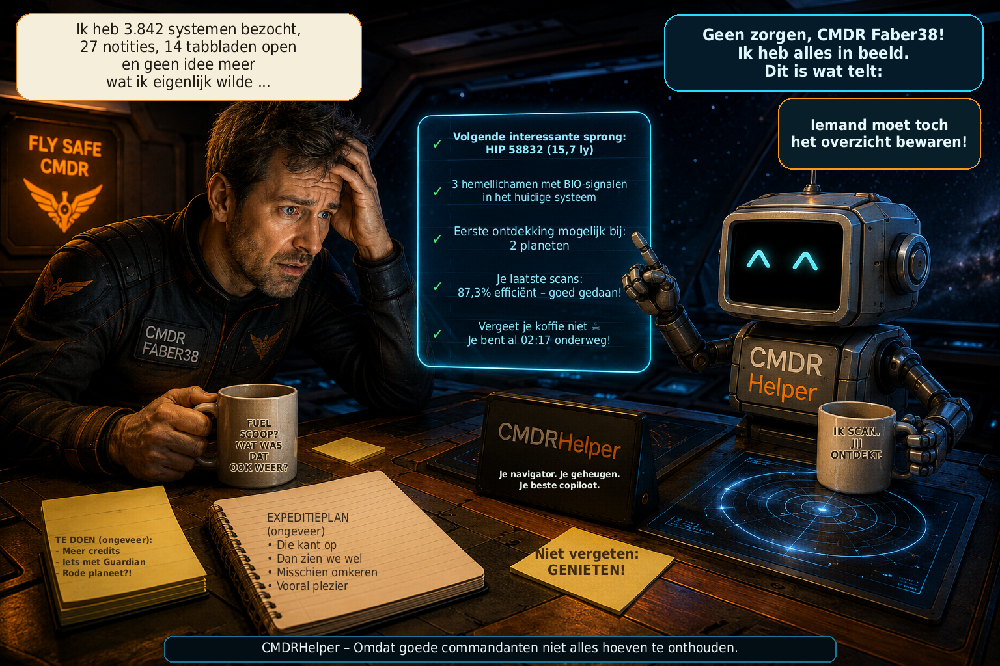

# CMDRHelper

[🇩🇪 Deutsch](README_DE.md) \| [🇬🇧 English](README.md) \| [🇫🇷
Français](README_FR.md) \| [🇮🇹 Italiano](README_IT.md) \| [🇳🇴
Norsk](README_NO.md) \| [🇸🇪 Svenska](README_SV.md) \| [🇫🇮
Suomi](README_FI.md) \| [🇵🇱 Polski](README_PL.md) \| [🇳🇱
Nederlands](README_NL.md) \| [🇪🇸 Español](README_ES.md) \| [🇹🇷
Türkçe](README_TR.md) \| [🇬🇷 Ελληνικά](README_EL.md)



**Persoonlijke metgezel voor Elite Dangerous – verkenning, navigatie en commandergegevens in één oogopslag**

CMDRHelper is een zelfstandig desktopprogramma dat de lokale journals van Elite Dangerous analyseert en planetaire positiegegevens uit `Status.json` gebruikt. Het helpt je interessante hemellichamen te herkennen, opgeslagen plaatsen terug te vinden en je reizen en ontdekkingen te bekijken. Persoonlijke gegevens blijven na een herstart behouden en worden per commander gescheiden.

## Nieuw in versie 3.3.1 – Foutcorrecties

- Voltooide DSS-karteringen worden nu betrouwbaar live herkend.
- De kartering blijft behouden, ook als de bijbehorende scan pas later in het huidige journaal verschijnt.
- Je eigen karteringsstatus, karteringstijd en sonde-efficiëntie worden betrouwbaar opgeslagen.
- Archiefimport vervangt bestaande scan- en karteringswaarden niet meer door onjuiste nulwaarden.
- Getroffen hemellichamen met volledige gegevens krijgen bij het laden of vernieuwen weer correcte weergavewaarden.
- Kaartschattingen voor Live bevatten nu de juiste bonussen; fracties van credits worden pas aan het einde afgekapt.
- Correctiefactoren uit verkopen veranderen de normale verkenningswaarden niet meer.
- Extra regressietests controleren kartering over meerdere sessies en het bewaren van karteringsgegevens.

## Nieuw in versie 3.3

- Nieuwe systeemanalyse op basis van je persoonlijke verkenningservaring.
- Spelmodus Open / Solo / Privégroep direct in het overzicht.
- Kopieer systeemnamen uit recente systemen met één klik.
- Duidelijkere ervaringsgegevens en begrijpelijkere analyse.
- Betrouwbaardere import van journaalarchieven als bestanden later worden uitgebreid.

De vroegere sprongtip heet nu Analyse, met Systeemanalyse en de bestaande ervaringsgegevens. Systeemanalyse vergelijkt een doel met je persoonlijke geschiedenis: de massacode geeft de basisschatting, die regio en familie voorzichtig verfijnen. Potentieelindex 100 staat voor je persoonlijke historische gemiddelde van gedempt verkenningspotentieel, niet voor een procentuele kans. Gegevensbasis en bewijskracht blijven gescheiden van de beoordeling; het eindnummer beïnvloedt de score niet en BIO is momenteel alleen informatief.

## Nieuw in v3.2 ten opzichte van v3.1

- Engineering-materiaalbeheer: alle 146 materialen in Raw, Manufactured en Encoded, met graden, capaciteiten en uitzonderingen. Actuele voorraad per commander, zoeken, filters, vijf subtiele rijachtergronden en opgeslagen kolombreedtes en volgorde bieden overzicht. Onbekende voorraad blijft onderscheiden van nul.

- Odyssey-inventaris: het vierde tabblad bevat 223 catalogusidentiteiten voor goederen, componenten, gegevens en verbruiksartikelen. Scheepskluis, rugzak en betrouwbaar totaal blijven gescheiden; missiestapels, missiestatus en engineeringgebruik zijn zichtbaar. Positieve aantallen zijn goudkleurig. Ontbrekende naamvertalingen vallen terug op Engels.

- Materiaalhandelaren zoeken (Handelaar zoeken → Open routeplanner): op verzoek zoekt Spansh afzonderlijk naar Raw, Manufactured en Encoded vanuit het huidige commandersysteem. Carriers worden uitgesloten en stationdetails gecontroleerd. De afstand in ly is rechtstreeks tussen systemen; gemeenschapsgegevens garanderen geen toegang. Doorsturen naar de routeplanner stelt alleen het doelsysteem in en start geen route. Er is geen zoekfunctie voor Odyssey-handelaren.

- Systeemoverzicht: de nieuwe Elite-achtige weergave vervangt het miniatuuroverzicht in Explorer en Kroniek. Sterren en planeten vormen de hoofdstructuur met manen daaronder; meervoudige sterrenstelsels blijven leesbaar. Zoomen, scrollen, passend maken en klikken op hemellichamen geven toegang tot details.

- Compacte asteroïdengordels: clusters worden gegroepeerd tot gordels in het overzicht en de gewone systeemkaarten van Explorer en Kroniek. Alle afzonderlijke clustergegevens blijven bewaard.

- Cartografie hersteld: een scan na DSS-kartering zet onverkochte verkenningswaarden, karteringstijd en efficiëntie niet meer terug. Onjuiste registraties worden bij het starten hersteld uit beschikbare journals met eenduidige toewijzing. Zonder die bronnen blijft herstel openstaan; de database hoeft niet verwijderd te worden.

- Verbeterde routeplanner: het vertrek volgt automatisch het huidige systeem totdat je handmatig een vertrek invult; leegmaken herstelt de automatische werking. Schepen en carriers gebruiken exact gecontroleerde ID64-adressen, zonder vergelijkbare namen te kiezen. ‘Unable to find route’ betekent dat geen route is gevonden; controleer doelen, bereik en route-instellingen.

- Betere update-informatie: het Ja/Nee-venster toont geïnstalleerde en beschikbare versie plus maximaal zes wijzigingen als een samenvatting bestaat. Lange lijsten scrollen en acties blijven bereikbaar. Deze weergave wordt met v3.2 geïnstalleerd; een ongewijzigde v3.1-client toont haar nog niet.

## v3.1 (v3.0.3 → v3.1)

- BIO-voortgang is compact: 1/3 geel, 2/3 blauw en 3/3 groen; de voltooide toestand ‘Voltooid’ is eveneens groen. Onder ‘automatisch tonen’ heeft GEO een eigen opgeslagen schakelaar: alleen BIO, alleen GEO of beide samen. Handmatig aangepaste kolombreedtes van de gezamenlijke Explorer-tabel BIO / GEO / ABBAU blijven na heropenen en herstarten behouden. Opgeslagen popupkolommen worden robuuster hersteld; ongeldige waarden vallen terug op veilige standaardbreedtes.

- Ontdekking en kartering zijn gescheiden en verwijzen naar je scantijdstip: ‘Al ontdekt tijdens jouw scan’ en ‘Al in kaart gebracht tijdens jouw scan’. Ontbrekende gegevens blijven Onbekend. First Discovery- en First Mapping-kandidaten gelden alleen op het scantijdstip; een historisch Nee bewijst niet dat het hemellichaam vandaag nog onontdekt of ongekarteerd is. Je eigen kartering bevestigt geen officiële eerste claim. EDSM-bekendheid blijft afzonderlijk.

- ‘EDSM-status-HUD’ onder ‘automatisch tonen’ staat standaard UIT. Na binnenkomst in een systeem verschijnt ongeveer 2,5 seconden een melding boven Elite. ‘EDSM: BEKEND’ betekent een geldige EDSM-treffer voor het systeem. ‘EDSM: NIET BEKEND’ betekent een geldig EDSM-antwoord zonder systeemtreffer. ‘EDSM: GEEN ANTWOORD’ betekent een netwerk-, HTTP- of timeoutfout of ongeldig antwoord, nooit een bevestigde afwezigheid van een treffer. EDSM-bekendheid is geen officiële ontdekking in Elite; namen van eerste ontdekkers of melders worden niet beloofd. De melding werkt onafhankelijk van navigatie- en vracht-HUD.

- De bezoekgeschiedenis verwerkt Location, FSDJump en CarrierJump ook tijdens live journalupdates. Meerdere locatiegebeurtenissen tijdens één ononderbroken verblijf tellen als één bezoek: A → A → A telt eenmaal. Een echte terugkeer blijft behouden: A → B → C → A telt vier bezoeken.

- Na je eigen voltooide DSS-kartering worden het karteringstijdstip, gebruikte sondes en efficiëntiedoel betrouwbaar opgeslagen. Latere scans laten bestaande gegevens niet meer verloren gaan.

- Het vrachtvenster past zijn hoogte automatisch aan de inhoud aan. Bij veel regels blijft de hoogte begrensd en kan de tabel scrollen; je gekozen breedte en vensterpositie blijven behouden. De bestaande schakelaar ‘Vracht-HUD’ staat nu onder ‘automatisch tonen’, zonder extra schakelaar in het vrachtvenster.

- Voor bestaande installaties volstaat normaal: update installeren → CMDRHelper starten. Noodzakelijke historische correcties voor BIO-gegevens, bezoeken en DSS-metadata lopen automatisch; vóór gegevensherstel met schrijfacties wordt een databaseback-up gemaakt. Reparaties hebben versies en zijn idempotent: geslaagde revisies worden niet bij elke start opnieuw volledig uitgevoerd. Reconstructie vereist Elite-journals die nog bestaan, leesbaar zijn en eenduidig aan een commander kunnen worden gekoppeld. Ontbrekende bronnen worden niet verzonnen of als succes behandeld; open reparaties worden bij de volgende start opnieuw geprobeerd. De database wissen, handmatige scripts en herimport zijn normaal niet nodig.

## Explorer

De Explorer toont het huidige systeem in drie weergaven:

- **Systeemkaart:** grafische weergave van bekende sterren, planeten en manen. Klik op een hemellichaam om de details te openen. ‘Alles tonen’ opent het systeemoverzicht.
- **Waardelijst:** De waardelijst toont schattingen op basis van de opgeslagen scan, geen gegarandeerde openstaande uitbetalingen. Eerste bonussen blijven onbevestigd. Tooltips in kaart en lijst en de lichaamsdetails gebruiken dezelfde tijdgebonden toestanden.
- **BIO / GEO / ABBAU:** biologische en geologische signalen, planetaire mijnbouwlocaties en aangetoonde persoonlijke vondsten.

De analyses onderscheiden gemelde signalen van daadwerkelijke eigen vondsten. **BIO ×N** is het gemelde aantal signalen, geen bevestiging van volledig geanalyseerde soorten. **MIJNBOUW ×N** telt planetaire mijnbouwlocaties zonder hun afzonderlijke grondstoffen te onthullen. Zelf gewonnen handelswaren, tijdens mijnbouw verzamelde bijmaterialen en de algemene materiaalsamenstelling van een hemellichaam blijven gescheiden.

De Explorer toont ook geschatte BIO-waarden, de voortgang van eigen analyses en onverkochte cartografie- en BIO-data. Waarden zijn gebaseerd op beschikbare journal- en hemellichaamgegevens; ontbrekende gegevens worden niet als eigen ontdekkingen gepresenteerd. Aanvullende EDSM-data zijn externe informatie die van eigen vondsten moet worden onderscheiden.

Hemellichaamdetails bevatten beschikbare fysieke eigenschappen, atmosfeer, ringen, materialen en ontdekkingsinformatie. Afbeeldingen gebruiken passende texturen en animaties voor bepaalde bijzondere astronomische objecten. Het Cargo-gedeelte toont de bekende lading en capaciteit van het momenteel gebruikte schip of de SRV; bij de Rhino blijven lading en persoonlijke mijnbouwvondsten verschillende gegevens.

Bovenaan de Explorer staan **★ Favorieten | Planeetnavigatie | Alles tonen**. Favorieten en planeetnavigatie openen eigen vensters; de drie Explorer-weergaven blijven daarnaast beschikbaar.

## Planeetnavigatie

De planeetnavigator helpt uitsluitend om naar een bepaalde **breedtegraad/lengtegraad op een planeet of maan** te vliegen. Voor reizen tussen sterrenstelsels is er de aparte routeplanner.

### Een doel invoeren en vliegen

Kies het doelhemellichaam of gebruik het huidige, dat waar mogelijk automatisch wordt herkend. Voer breedtegraad, lengtegraad en eventueel een doelnaam in. Technische gegevens zoals BodyID of SystemAddress hoef je niet in te voeren. Ook **0,0** is een geldige coördinaat.

Zodra Elite geldige planetaire positiegegevens voor het bijpassende hemellichaam levert, wordt het kompas automatisch actief. Zonder bijpassende gegevens toont de navigator een wachtstatus. Je kunt op hetzelfde hemellichaam altijd een nieuw coördinatendoel instellen; dit vervangt het vorige doel.

### Weergave tijdens de nadering

| Doelafstand | Weergave |
| --- | --- |
| **Meer dan 380 km** | Planeetbol met je positie als witte cirkel en het doel als klein punt. Het doel is oranje op de zichtbare kant en rood op de verborgen achterkant. De spelerpositie blijft in de weergave vast; planeet en doel worden relatief daaraan getoond. |
| **Tot en met 380 km** | Automatische omschakeling naar een gekanteld perspectiefraster met **50-km-afstandsintervallen** en de daarin getekende doelpositie voor de verdere nadering. |

Het navigatorvenster is vrij schaalbaar. Bol of perspectiefraster past zich proportioneel aan de beschikbare ruimte aan; detailwaarden blijven leesbaar.

### Navigatiewaarden begrijpen

- **Doelcoördinaten:** opgeslagen breedtegraad en lengtegraad van het doel.
- **Huidige coördinaten:** je laatst geldige planetaire positie.
- **Doelafstand / Afstand over het oppervlak:** berekende afstand tot het doel over het boloppervlak; de grote doelafstand en de detailwaarde tonen dezelfde afstand met verschillende afronding.
- **Peiling:** absolute richting van je huidige positie naar het doel.
- **Heading:** je huidige oriëntatie zoals Elite die meldt.
- **Relatieve richting:** het verschil tussen heading en peiling, bijvoorbeeld ‘23° rechts’, ‘links’ of ‘rechtdoor’.
- **Doelkoers:** de absolute koers waarheen je in de Elite-HUD kunt draaien. Deze is gelijk aan de peiling en is geen extra relatieve draaihoek.

Voorbeeld: **Heading 051° → Doelkoers 074° = 23° rechts**.

Navigatie is afhankelijk van de statusgegevens van het spel; updates kunnen afhankelijk van de speltoestand vertraagd binnenkomen. De oppervlakteafstand is geen terrein- of wegroute. Obstakels en terreinhoogten onderweg worden niet meegenomen.

## Navigatie-HUD

Links onder **automatisch tonen → Navigatie-HUD** kun je een optionele extra weergave direct boven Elite inschakelen. Bij geldige planeetnavigatie toont deze:

- relatieve richting,
- absolute doelkoers,
- afstand.

De HUD is transparant, laat klikken door en neemt geen focus: hij ontneemt het spel geen muisklikken of invoerfocus. Zonder geldige navigatie wordt hij automatisch onzichtbaar; het vinkje in de zijbalk kan actief blijven. De gewone navigator werkt onafhankelijk van de HUD.

De HUD is in het spel getest onder **Linux/X11** en **Windows 11 met Elite**. Onder Windows worden meerdere monitoren gekoppeld op basis van hun geometrie en de positie van het Elite-venster, niet op overeenkomende monitornamen.

## Favorieten

**Explorer → ★ Favorieten** opent een eigen, herbruikbaar venster. Favorieten horen bij de **actieve commander**. Een commanderwissel werkt de weergave bij; de commanderselectie van de kroniek breidt de favorietenlijst niet uit.

### Drie typen opslaan

De bovenste actierij biedt:

| Actie | Opgeslagen favoriet |
| --- | --- |
| **★ Huidig systeem opslaan** | Het huidige systeem zonder oppervlaktecoördinaten. |
| **★ Planeet / maan opslaan** | Een gekozen bekende planeet of maan van het huidige systeem zonder oppervlaktecoördinaten. |
| **★ Huidige locatie opslaan** | Een oppervlaktelocatie met huidig systeem, hemellichaam, breedtegraad en lengtegraad. |

De locatieknop blijft altijd zichtbaar en is alleen beschikbaar met geldige actuele planetaire positiegegevens en een actieve commander. **Bij het klikken worden commander, systeem, hemellichaam en coördinaten vastgelegd voordat het bewerkingsvenster verschijnt.** Latere bewegingen in het spel veranderen die positie niet. Dezelfde opslagprocedure is beschikbaar in de planeetnavigator. Bekende interne ID’s worden automatisch overgenomen; er worden geen coördinaten verzonnen.

Geef een naam en precies één categorie op: **Bio, Geo, Mijnbouw, Uitzicht, Landingsplaats, Interessant of Overig**. Een notitie en afbeelding zijn optioneel.

### Zoeken, bekijken en bewerken

De schuifbare lijst, alfabetisch gesorteerd op naam, toont naam, type, systeem, waar van toepassing hemellichaam en coördinaten, categorie en een kleine afbeeldingsvoorvertoning. **Vrij zoeken, type- en categoriefilters** kunnen worden gecombineerd. De zoekopdracht doorzoekt naam, systeem, hemellichaam en notitie.

**Openen / Tonen** toont opgeslagen gegevens, de notitie en een grotere afbeeldingsvoorvertoning. **In Explorer tonen** gebruikt het bestaande systeemoverzicht of de hemellichaamdetails als de favoriet bij het huidige Explorer-systeem hoort en bijpassende gegevens beschikbaar zijn. Voor andere systemen blijven de opgeslagen favorietgegevens beschikbaar.

**Bewerken** verandert naam, categorie, notitie en afbeelding. Systeem, hemellichaam en opgeslagen coördinaten worden niet door livewaarden vervangen. Voor een andere positie maak je een nieuwe oppervlaktefavoriet.

**Verwijderen** vraagt bevestiging en verwijdert uitsluitend het favorietrecord en de interne afbeeldingskopie. Explorer-, journal- en hemellichaamgegevens blijven behouden.

### Favorietafbeeldingen en laatste screenshot

Favorietafbeeldingen staan **volledig los van het gewone onderdeel Afbeeldingen**. CMDRHelper beheert een eigen interne kopie in de favorietafbeeldingsmap (`data/favorites/images/` bij de standaard gegevensindeling). Het origineel wordt niet verplaatst of veranderd.

- **Afbeelding kiezen …** accepteert PNG, JPEG of WebP en toont een voorvertoning. De interne kopie ontstaat pas bij het opslaan.
- **Laatste screenshot gebruiken** scant bij iedere klik de daadwerkelijke screenshotbronmap opnieuw. Ook bijpassende geconverteerde Elite-screenshots in de map van de actieve commander binnen de ingestelde conversiebestemming worden meegenomen. Zo blijft een nieuw screenshot beschikbaar als automatische conversie de BMP al heeft verwijderd.
- Leesbare bestanden met bijpassende Elite- of conversienamen worden aangeboden, geen willekeurige afbeeldingen uit algemene afbeeldingsmappen. De volgorde gebruikt een ondubbelzinnige opnametijd in de bestandsnaam, anders de bestandstijd. Voor geconverteerde afbeeldingen wordt de opnametijd uit de naam gebruikt, niet het conversietijdstip.
- Voordat je een gevonden screenshot overneemt, zie je bestandsnaam, opnametijd en een vers geladen voorvertoning. Bevestig met **Deze afbeelding gebruiken**. Als geen geschikt screenshot wordt gevonden, blijft handmatige selectie beschikbaar. CMDRHelper maakt zelf geen screenshots.

Een afbeelding kan later worden vervangen of verwijderd. Overbodige interne kopieën worden bij het opslaan of verwijderen van de favoriet opgeruimd. **Favorietacties verwijderen nooit het oorspronkelijke screenshot of een gekozen originele afbeelding.** Als een intern afbeeldingsbestand ontbreekt, blijft de favoriet bruikbaar zonder voorvertoning.

### Oppervlaktefavoriet als doel

**▶ Naar doel** geeft het opgeslagen hemellichaam, breedtegraad, lengtegraad en favorietnaam door aan de bestaande planeetnavigator en vervangt diens vorige doel. Favorieten hebben geen eigen navigatielogica. Bijpassende geldige planetaire gegevens starten de navigatie; anders wacht de navigator zoals gebruikelijk.

Favorieten van andere commanders kunnen niet als eigen doelen worden gebruikt. Een commanderwissel beëindigt een doel dat nog als favorietdoel van de vorige commander wordt beheerd. Systeem- en hemellichaamfavorieten tonen bestaande informatie zonder eigen routeplanning.

## Kroniek

De kroniek is je opgeslagen reis- en vondsthistorie. De **3D-reiskaart** toont bezochte systemen en commanderroutes. Systeem- en hemellichaamdetails helpen bekende BIO-, GEO-, materiaal-, Codex- en mijnbouwinformatie terug te vinden.

### Gecombineerde filters

**Toepassen** of **Enter in het vrije tekstveld** voert alle ingestelde filters samen uit:

- vrije tekst,
- optioneel **Van** en **Tot**,
- **Planetaire mijnbouwlocaties** en **Minstens**,
- **Mijn mijnbouwvondsten** en **Handelswaar**.

Een term uit **Zoekhulp / Legenda** wordt in het zoekveld gezet en samen met de reeds ingestelde periode- en mijnbouwfilters uitgevoerd.

### Periode in UTC

Van en Tot worden elk met hun vinkje geactiveerd. Eén grens is ook mogelijk; zonder actief vinkje geldt aan die kant geen tijdsbeperking. **Van** omvat het begin van de gekozen UTC-kalenderdag. **Tot** omvat de volledige gekozen UTC-dag. UTC is de gemeenschappelijke tijdbasis, niet je lokale kalendertijd.

**Werkelijke systeembezoeken** zijn bepalend: minstens één opgeslagen bezoek moet in de periode vallen. Het enkele feit dat een systeem voor het eerst of laatst bekend werd, vervangt geen bezoek. Bij een actieve periode verwijzen het bezoekaantal, eerste en laatste bezoek op de kaart naar de gefilterde bezoeken.

De periode filtert bezoeken, geen afzonderlijke ontdekkings-, BIO-, GEO- of mijnbouwgebeurtenissen. Bekende vondstgegevens en persoonlijke mijnbouwhoeveelheden blijven opgeslagen **totalen**. **‘Koper 56 t’ betekent bij een actieve periode niet automatisch ‘56 t in deze periode’.** Als Van na Tot ligt, verschijnt een foutmelding; er wordt geen databasequery gestart.

### Commander en vernieuwen

De **commanderselectie van de kaart** bepaalt de getoonde commanderroutes. Persoonlijke tekst- en mijnbouwzoekopdrachten gelden daarentegen voor de bekeken of actieve commander. De kaartvinkjes breiden persoonlijke zoekopdrachten niet automatisch uit naar meerdere commanders.

**Kroniek vernieuwen** laadt de gegevens opnieuw en voert de actieve filters opnieuw uit. **Huidige positie** past eerst de huidige filterinstellingen toe en centreert alleen op het huidige systeem als dit op de resulterende kaart staat. Anders verschijnt een melding; de filters blijven behouden.

**Resetten** leegt vrije tekst, schakelt Van/Tot uit en zet de zichtbare datumvelden terug. Mijnbouwvinkjes worden gewist, minimumaantal wordt 0 en handelswaar wordt Alle. De commanderselectie blijft behouden; daarna wordt de normale kroniek geladen.

Bij **geen resultaten** worden kaart en routes geleegd, de resultatenlijst geleegd en verborgen, de detailweergave gereset en een geopend kronieksysteemdetailvenster gesloten. Oude resultaten blijven niet staan.

### Kaartbediening

- Slepen met de linkermuisknop: draaien.
- Slepen met de rechtermuisknop: verplaatsen.
- Slepen met de middelste muisknop: een zoomvenster trekken.
- Muiswiel: zoomen.
- **Uitlijnen:** de oriëntatie terugzetten naar het galactische bovenaanzicht; verplaatsing en zoom blijven behouden.

## Afbeeldingen en automatische screenshotconversie

In **Afbeeldingen** stel je de Elite-screenshotbronmap en conversiebestemming in. Automatische conversie verwerkt nieuwe BMP-screenshots tot **PNG of JPEG**. Instelbaar oplichten is beschikbaar. BMP’s die bij het starten al aanwezig zijn, worden niet achteraf automatisch geconverteerd door alleen bewaking in te schakelen; daarvoor is handmatige conversie beschikbaar.

Geconverteerde bestandsnamen bevatten opnametijd, commander en systeem en worden per commander opgeslagen. Automatische toewijzing volgt de actieve journalcommander. Een andere galerijkeuze verandert deze actieve commander niet.

De optie **oorspronkelijke BMP verwijderen na geslaagde conversie** hoort uitsluitend bij deze conversie en heeft een eigen instelling. Zij staat los van het beheer van favorietafbeeldingen.

De galerij toont bijpassende geconverteerde afbeeldingen met voorvertoning. Bij het opnieuw tonen wordt zij opnieuw ingelezen; vernieuwen houdt ook rekening met de huidige bestanden. Selectie en grote voorvertoning worden samen bijgewerkt. Verdwijnt de geselecteerde afbeelding, dan wordt een bestaande afbeelding gekozen of de voorvertoning geleegd. Afbeeldingen biedt daarnaast een eigen afbeeldingsselectie en verwijderfunctie met bevestiging.

## Andere weergaven

- **Overzicht:** actieve commander, schip, locatie, journalherkenning, open missies en onlinestatus.
- **Missies:** blijvend opgeslagen open missies met bekende doelen, voortgang en voltooiingsstatus. Ontbrekende gegevens worden niet aangevuld of verzonnen.
- **CMDR:** vermogen, rangen, statistieken, MercCoins, schepen/vloot en bekende Fleet Carrier-locatie. MercCoins worden getoond als door Frontier gemelde totalen, niet als zelf berekend saldo.
- **Routeplanner:** aparte planning voor schip en Fleet Carrier met Spansh. Berekende carrierroutes kunnen als CSV voor CTSVision worden geëxporteerd. De berekening vereist verbinding met de externe dienst.

## Commander, lokale gegevens en onlinediensten

CMDRHelper herkent de actieve commander aan de Frontier-ID uit de huidige journalsessie. Persoonlijke verkenning, missies, vermogen, favorieten en onlinetoegang worden afzonderlijk opgeslagen. Alleen een andere commander bekijken verandert noch de livecommander noch de uploadtoewijzing.

De lokale SQLite-database bewaart bekende systemen, hemellichamen en persoonlijke historie over herstarts heen. Nieuwe volledige journalregels worden tijdens het spelen verwerkt; opgeslagen leesposities vermijden onnodig opnieuw inlezen. Klopt de locatie of commander niet, controleer dan eerst de journalherkenning en journalmap in de instellingen.

**EDSM** kan aanvullende systeemgegevens leveren. Ondersteunde journalgegevens kunnen naar **EDSM en Inara** worden gestuurd als de dienst voor de actieve commander met eigen toegangsgegevens is ingesteld en ingeschakeld. Een commander gebruikt niet automatisch de API-sleutel van een ander. Lokale opslag werkt onafhankelijk van een beschikbare onlineverbinding.

## Talen en contextuele hulp

De interface ondersteunt **12 talen**: **DE, EN, FR, IT, NO, SV, FI, PL, NL, ES, TR, EL** – Duits, Engels, Frans, Italiaans, Noors, Zweeds, Fins, Pools, Nederlands, Spaans, Turks en Grieks.

Er zijn momenteel **937 UI-i18n-keys per taal**. **? Hulp** biedt **10 uitvoerige contextuele hulponderwerpen in alle 12 talen**. Favorieten horen bij de Explorer-hulp; planeetnavigatie heeft een eigen onderwerp, direct bereikbaar vanuit de navigator. Hulp gebruikt de huidige interfacetaal en houdt Duits als terugval bij een ontbrekende catalogus of vermelding.

## Vereisten

| Platform | Python |
| --- | --- |
| **Windows** | **Python 3.10 of nieuwer, x64 vereist.** Geen kunstmatige bovengrens voor bestaande versies. De daadwerkelijke pakket- en importcontroles zijn daarna bepalend. |
| **Linux** | **Python 3.10 of nieuwer**, 64-bit aanbevolen. De venv-module die bij de Python-versie hoort moet beschikbaar zijn. |

De benodigde pakketten staan in `requirements.txt`:

```text
PySide6>=6.7,<7
numpy
Pillow>=10.0
```

De installatie downloadt deze afhankelijkheden. De lokale Elite-bestanden moeten bereikbaar zijn voor journalanalyse en planeetnavigatie. Onder Linux kan Elite via Steam/Proton draaien; stel de daadwerkelijke journal- en screenshotpaden in CMDRHelper in. De hierboven beschreven Linux-HUD-ondersteuning betreft X11.

## Installatie onder Linux

Pak het volledige project of de release uit en voer in de projectmap uit:

```bash
./install.sh
./start.sh
```

De scripts gebruiken alleen het lokale `venv` van deze installatie. Ze volgen symbolische scriptlinks, controleren Python en pip en kunnen een beschadigde lokale omgeving repareren zonder persoonlijke gegevens of Elite-journals aan te raken. Ontbrekende systeempakketten worden niet automatisch geïnstalleerd; een ontbrekende venv-module wordt gemeld. De bestaande Linux-installatiewijze blijft ongewijzigd.

## Installatie onder Windows

1. Pak de volledige ZIP uit in een eigen map.
2. Start **install.bat**. Dit roept de meegeleverde **install-windows.ps1** aan.
3. Na geslaagde installatie start je CMDRHelper met **start.bat**.

Bestaande **Python vanaf 3.10 x64** wordt zonder kunstmatige bovengrens geaccepteerd. Een toekomstige Python-versie wordt niet alleen vanwege haar versienummer geweigerd. Een geschikte bestaande Python of bruikbaar lokaal venv voorkomt onnodige automatische Python-installatie.

Als geen geschikte Python aanwezig is, biedt de installer na toestemming automatische installatie via **winget** aan. Daarvoor is bewust de vaste versiereeks **Python 3.14 x64** gekozen; die keuze staat los van de open regel voor bestaande Python-versies. Als automatische installatie niet mogelijk is, meldt de installer de fout.

De installer maakt, controleert of repareert alleen het **lokale venv van deze CMDRHelper-kopie**, installeert de vereisten en voert **pip check** en importcontroles voor **PySide6, PySide6.QtWidgets, numpy en PIL** uit. Alleen deze daadwerkelijke controles bepalen de bruikbaarheid van de omgeving. Bij mislukking stopt de installatie met een begrijpelijke foutmelding. Andere virtuele omgevingen worden niet gerepareerd of vervangen.

## Diagnostiek en releasepakketten

Bij problemen helpen de journal- en onlinestatusindicatoren en de logbestanden in de map `logs`. Persoonlijke gegevens worden lokaal opgeslagen; een back-up van favorieten omvat naast de database ook hun interne afbeeldingskopieën.

Gebruik `./create_release.sh` om zelf een releasepakket te maken. De programmaversie wordt centraal beheerd in `cmdrhelper/version.py` en door het releasescript gelezen. Het pakket bevat programmacode en assets, maar geen persoonlijke database, venv, Git- of cachebestanden.

## Beeld- en videomateriaal / Media Credits

CMDRHelper gebruikt voor enkele bijzondere astronomische objecten
visualisaties van de **NASA Scientific Visualization Studio (NASA
SVS)**. De betreffende media blijven eigendom van hun rechthebbenden en
worden vermeld volgens de credits op de NASA SVS-pagina's.

### Neutronenster

-   CMDRHelper-bestand: `star_neutron.webm`
-   Bron: NASA Scientific Visualization Studio, **Neutron Star
    Animations** (SVS ID 20267)
-   Credit: **NASA's Goddard Space Flight Center Conceptual Image Lab**
-   Animators: Walt Feimer (KBR Wyle Services, LLC) en Lisa Poje (USRA)
-   Bron: https://svs.gsfc.nasa.gov/20267/

### Zwart gat

-   CMDRHelper-bestand: `black_hole.mp4` of de video-extensie die in het
    project wordt gebruikt
-   Bron: NASA Scientific Visualization Studio, **Black Hole Accretion
    Disk Visualization** (SVS ID 13326)
-   Credit: **NASA's Goddard Space Flight Center/Jeremy Schnittman**
-   Bron: https://svs.gsfc.nasa.gov/13326/

### Superzwaar zwart gat

-   CMDRHelper-bestand: `black_hole_supermassive.mp4` of de
    video-extensie die in het project wordt gebruikt
-   Bron: NASA Scientific Visualization Studio (SVS ID 14576)
-   Credit: **NASA's Goddard Space Flight Center/J. Schnittman and B.
    Powell**
-   Bron: https://svs.gsfc.nasa.gov/14576/

### Witte dwerg

-   CMDRHelper-bestand: `star_white_dwarf.webm`
-   gebruikt NASA-medium: **White Dwarf establishing shot**
    (`WDStar_4k_60fps_ProRes.webm`)
-   Bron: NASA Scientific Visualization Studio, **Type Ia Supernovae
    Animations** (SVS ID 20344)
-   Credit: **NASA's Goddard Space Flight Center Conceptual Image Lab**
-   Animator: Adriana Manrique Gutierrez (USRA)
-   Producer: Scott Wiessinger (USRA)
-   Bron: https://svs.gsfc.nasa.gov/20344/

Het vermelden van deze bronnen en credits betekent niet dat CMDRHelper
door NASA wordt ondersteund, gecertificeerd of uitgegeven. Voor verder
gebruik van NASA-media gelden de betreffende aanwijzingen en
reproductierichtlijnen van de oorspronkelijke bronnen.

## Licentie

CMDRHelper is vrije software en wordt gepubliceerd onder de **GNU
General Public License Version 3 (GPL-3.0)**.

De broncode mag volgens de voorwaarden van de GPL-3.0 worden gebruikt,
gewijzigd en verder verspreid. Ook bij de verspreiding van afgeleide
versies gelden de voorwaarden van de GPL-3.0.

Copyright © 2026 **Holger Mangold (Faber38)**.

De volledige licentievoorwaarden staan in het bestand `LICENSE`.

## Opmerking over Elite Dangerous

CMDRHelper is een onafhankelijk community-/hobbyproject en geen
officieel product van Frontier Developments.

**Elite Dangerous** en de bijbehorende namen en inhoud zijn eigendom van
de respectieve rechthebbenden.
