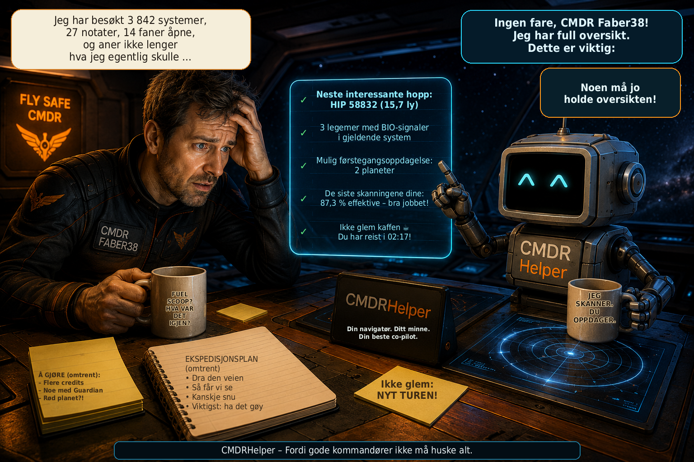

# CMDRHelper

[🇩🇪 Deutsch](README_DE.md) \| [🇬🇧 English](README.md) \| [🇫🇷
Français](README_FR.md) \| [🇮🇹 Italiano](README_IT.md) \| [🇳🇴
Norsk](README_NO.md) \| [🇸🇪 Svenska](README_SV.md) \| [🇫🇮
Suomi](README_FI.md) \| [🇵🇱 Polski](README_PL.md) \| [🇳🇱
Nederlands](README_NL.md) \| [🇪🇸 Español](README_ES.md) \| [🇹🇷
Türkçe](README_TR.md) \| [🇬🇷 Ελληνικά](README_EL.md)



**Personlig følgesvenn for Elite Dangerous -- utforskning, systemanalyse
og Commander-data på et øyeblikk**

CMDRHelper er et frittstående skrivebordsprogram for **Elite Dangerous**
som analyserer informasjon fra spillets lokale Journal-filer og
presenterer den på en oversiktlig måte. Målet er en personlig helper som
under utforskningen av et system raskt viser hva som allerede er kjent,
hvilke himmellegemer som er interessante, og hvilke egne oppdagelser og
kartlegginger som foreligger.

Prosjektet er fortsatt under aktiv utvikling.

## Funksjonsoversikt

### Elite Dangerous-Journaler

CMDRHelper leser de lokale Journal-filene og behandler blant annet
stjernesystemer, stjerner, planeter, måner, Belt Cluster, skanninger,
kartlegginger samt biologiske og geologiske signaler. Commanderens egne
data kan fortsatt skilles fra supplerende ekstern informasjon.

### Oppdrag

CMDRHelper analyserer oppdragshendelser fra Elite Dangerous-Journalene
og viser aktive oppdrag på en oversiktlig måte. Oppdragsstatus og
tilhørende Journal-hendelser følges opp.

Også oppdragstilbud som kommer inn under spillet via NPC-meldinger
(`ReceiveText`), kan gjenkjennes og tas med i den videre tilordningen av
oppdrag. Siden Elite Dangerous ikke gir all informasjon for alle
oppdragstyper i den samme Journal-hendelsen, bygges tilordningen
trinnvis opp fra tilgjengelige Journal-data.

### System- og Explorer-visning

De kjente legemene i et system vises grafisk og kan velges direkte.
CMDRHelper kan blant annet vise:

-   navn og type på legemet
-   avstand i systemet
-   skannet av Commanderen selv eller bare kjent eksternt
-   allerede oppdaget og kartlagt
-   mulig førsteoppdagelse og mulig First Mapping
-   kartlagt av Commanderen
-   effektiv kartlegging
-   biologiske og geologiske signaler
-   skanne- og kartleggingsverdier

BIO-signaler fremheves tydelig på det aktuelle legemet. Tilordningen
gjøres systemspesifikt slik at BodyID-er fra forskjellige
stjernesystemer ikke forveksles.

### Detaljvisning av legemer

Når du klikker på et legeme, åpnes en detaljert visning. Avhengig av
tilgjengelige data vises legemstype, masse, avstand, gravitasjon,
atmosfære, vulkanisme, mulighet for landing, terraforming-status,
materialer, BIO-/GEO-signaler, skanneverdi, kartleggingsverdi og
oppdagelsesstatus.

Manglende informasjon vises som ukjent og presenteres ikke som sikre
data.

## Grafisk fremstilling av legemer

CMDRHelper har egne grafikker for en rekke legemstyper, blant annet High
Metal Content Worlds, Metal Rich Bodies, Rocky Bodies, Icy Bodies, Rocky
Ice Worlds, Earth-like Worlds, Water Worlds, Ammonia Worlds, flere
klasser av gasskjemper, gasskjemper med vann- eller ammoniakkbasert liv,
heliumrike gasskjemper, forskjellige stjerneklasser og Belt Cluster.

Vanlige PNG-bilder brukes i oversiktene. For mange legemer finnes det i
tillegg en **2:1-ekvirektangulær `_texture.png`** for den animerte
detaljvisningen.

### Roterende 3D-planeter

Passende 2:1-teksturer projiseres på en roterende kule. CPU-rendereren
arbeider med **PySide6 og NumPy** uten ekstra
OpenGL-/PyOpenGL-avhengighet. Den omfatter kuleprojeksjon, langsom
rotasjon, belysning, kantformørking og atmosfærisk kant.

### Animerte livsformer

For gasskjemper med liv finnes forskjellige animasjoner:

**Water Life:** cyan-/turkisfargede svevende organismer med glorie og
bevegelige haler.

**Ammonia Life:** egne fiolett-/ravfargede, halvtransparente organismer
med pulserende kjerne, korte tråder og langsommere bevegelse.

### Animerte Belt Cluster

Belt Cluster vises ikke som kuler. Detaljvisningen genererer et
proseduralt asteroidefelt med individuelle asteroider, forskjellige
størrelser og dybder, egen rotasjon, individuell drift,
parallakseeffekt, kratere samt diskrete støv- og partikkeleffekter.

## EDSM som supplerende datakilde

CMDRHelper kan skille mellom egne Journal-data og EDSM-informasjon.
Kilden merkes tilsvarende som eget Journal, EDSM eller eget Journal +
EDSM. Egne Journal-data er spesielt viktige fordi de viser hva den
aktuelle Commanderen faktisk selv har skannet eller kartlagt.

CMDRHelper kan automatisk overføre nye Journal-data til EDSM. Den
gjeldende dynamiske EDSM Discard-listen tas hensyn til, slik at bare
hendelser som EDSM ønsker, blir sendt. Overføringsfremdriften lagres
sikkert for hver Journal-fil. Ved første aktivering blir allerede
eksisterende gamle Journaler ikke overført på nytt i sin helhet.

EDSM-statusen vises direkte øverst i oversikten. En grønn indikator
signaliserer at overføringen fungerer; feil vises i rødt og logges i
tillegg i CMDRHelper-loggen.

## Lokal database

CMDRHelper bruker SQLite. Følgende gjelder:

-   `cmdrhelper/database.py` er programkode og inngår i releasen.
-   `data/cmdrhelper.db` inneholder personlige Commander-data og blir
    **ikke** distribuert.
-   Ved en ny installasjon bygges den lokale databasen opp på nytt for
    den aktuelle brukeren.

Dermed følger ingen personlige Commander-data med en release.

## Diagnostikk og loggfil

CMDRHelper fører en egen roterende loggfil for diagnostikk og
feilsøking. Viktige program-, Journal-, database- og EDSM-hendelser
logges. EDSM-loggingen er redusert slik at Journal-hendelser som bare
forkastes av EDSM, ikke fyller den vanlige loggen unødvendig, mens
vellykkede overføringer, advarsler og feil fortsatt er synlige.

## Plattformer

CMDRHelper utvikles med Python og PySide6 og er beregnet for **Linux og
Windows**. Utviklingen foregår hovedsakelig under Linux; Windows kan
settes opp ved hjelp av de medfølgende batch-filene.

## Forutsetninger

Python **3.10 til 3.13** samt pakkene fra `requirements.txt`:

``` text
PySide6>=6.7,<7
numpy
Pillow>=10.0
```

## Installasjon under Linux

``` bash
./install.sh
./start.sh
```

Skriptene bruker bare installasjonens lokale `venv` og kan reparere det
forsiktig uten å berøre personlige data.

## Installasjon under Windows

For Windows er `install.bat` og `start.bat` beregnet brukt.

`install.bat` kontrollerer Python 3.10–3.13, oppretter eller reparerer lokal `venv` og
installerer `requirements.txt`. Deretter startes CMDRHelper via
`start.bat`.

## Opprette release

``` bash
./create_release.sh
```

Release-versjonen angis direkte i skriptet. ZIP-filen som opprettes,
inneholder programkode og assets, men ingen personlig database, intet
virtuelt Python-miljø og ingen Git-, cache- eller editorfiler.

## Versjon 2.1

**Versjon 2.1** forbedrer biologi, flåtevisning og ytelse for store
Journal-arkiver, og styrker installasjon, oppstart, oppdatering og tilbakerulling
på Windows og Linux.

### Bio-prognoser og habitat

-   den nye prognosen viser konkrete mulige arter, ikke bare slekt, når
    datagrunnlaget er godt nok. Flere arter kan vises med **HØY**, **MIDDELS**
    eller **LAV** sikkerhet; små utvalg behandles konservativt.
-   funne eller identifiserte arter erstatter prognoser. Når alle BIO-signaler
    er kjent, forsvinner resten av prognosene.
-   den kompakte BIO-ruten viser estimerte kandidatverdier og mulig totalverdi
    for planeten. Oransje/gull er estimert, grønt er bekreftet; spekulative
    First Footfall-bonuser tas ikke med.
-   temperatur, trykk, atmosfæresammensetning, radius og stjerne-/parentkontekst
    lagres som habitatdata. Generell variant- eller fargeprognose finnes ikke.

### CMDR-flåte

-   flåten kan sorteres stigende eller synkende etter sist brukt, navn, type,
    hopperekkevidde, lastekapasitet, tommasse, sted eller tidspunkt.
-   filtre viser alle skip, skip med kjøretøyhangar eller fighterhangar.
    Hangarer oppdages fra faktiske Loadout-moduler; SRV-er og fightere forblir
    utstyr på moderskipet.

-   hangarfilteret kjenner `int_buggybay_*` og den nye store
    `int_mkiilargebuggybay_*`, uten å finne på innholdet. `mev_rhino` behandles
    som SRV/bakkekjøretøy, ikke eget skip, uten påstand om alltid kjent hangar.

### Vedvarende Commander-tilstand og omstart

-   oppdrag, åpne bio-/kartografidata, siste posisjon, skip og loadouts, egen
    Fleet Carrier og formue lagres i SQLite gjennom omstart av CMDRHelper/Elite.
-   en tilstand beholdes til en reell Journal-hendelse endrer den; manglende
    informasjon i en ny økt sletter ikke kjent informasjon.
-   etter avbrudd fortsetter behandlingen fra siste sikre punkt; en ufullstendig
    siste linje regnes ikke som behandlet.
-   v2.1 kan kontrollert rekonstruere berørte tilstander én gang fra eksisterende
    Journaler og fortsetter deretter inkrementelt.

### Planetariske gruvesteder og overflatematerialer

-   `FSSBodySignals`/`SAASignalsFound` melder **planetariske gruvesteder**, vist
    med BIO/GEO som lokalisert **GRUVE ×N**. N er Frontiers antall, ikke en indeks.
-   `Scan.Materials` lagres per legeme; navn og prosent vises som **legemets
    overflatematerialer**, også i verktøytipset.
-   antall steder og generell materialsammensetning holdes adskilt; materialene
    tilskrives ikke et bestemt gruvested.

### Journaler, arkivimport og ytelse

-   både `Journal.YYMMDDHHMMSS.PART.log` og
    `Journal.YYYY-MM-DDTHHMMSS.PART.log` håndteres i riktig kronologi, slik at
    eldre filer ikke overskriver nåværende CMDR eller tilstand.
-   signal- og mappinghendelser kan importeres fra ufullstendige arkiver uten
    tidligere full Body Scan; senere skann fullfører dataene. Multi-CMDR-
    skillet beholdes.
-   en vedvarende Journal-indeks hopper over kjente, uendrede filer. Aktiv fil
    leses trinnvis fra siste sikre byteposisjon; metadata og SHA-256 sikrer
    identiteten, mens FID-tilordningen er uendret.
-   første store indeksbygg viser reelle tall, prosent og små animerte romskip
    i et responsivt vindu. Senere raske starter viser det normalt ikke.

-   etter indeksbygging behandles bare nye komplette linjer. Endringer og sikker
    posisjon lagres sammen; ved feil flyttes ikke posisjonen, og en dellinje venter.
-   rask start finner live-CMDR fra nyeste entydige indekserte økt, laster
    tilstanden straks og henter Journal-antallet fra indeksen.

### Installasjon og oppgradering

-   herdede Windows- og Linux-skript støtter Python 3.10–3.13, bruker bare
    lokal `venv` og kan reparere et sikkert identifisert lokalt miljø. Linux-
    symlenker behandles forsiktig; fremmede miljøer brukes aldri.
-   oppdatering og tilbakerulling melder feil tydelig og beskytter persondata
    og Elite-Journaler.
-   normal oppdatering fra v2.0 til v2.1 støttes. For installasjoner langt eldre
    enn v2.0 bør innstillinger sikkerhetskopieres; ved problemer kan en ren
    installasjon hjelpe. Slett aldri Elite-Journaler eller gamle Helper-data
    som en generell løsning.
-   første v2.1-start med et svært stort arkiv kan bruke litt tid på indeksen;
    senere starter blir betydelig raskere.

## Versjon 2.0

**Versjon 2.0** gir ekte Multi-CMDR-støtte og beholder ruteplanleggeren fra
versjon 1.5 og alle eksisterende funksjoner.

### Multi-CMDR og CMDR-visning

-   Commandere identifiseres automatisk med Frontier-FID. Bare Journalen
    bestemmer live-Commanderen; valg av en annen profil for visning endrer
    verken tilordning eller live-skriving.
-   besøk, utforsking, oppdrag, posisjoner, skip, Fleet Carrier, formue og
    usolgte biologi- og kartografidata lagres separat per Commander.
-   **CMDR-visningen** viser alle kjente Commandere frakoblet, med oppdrag,
    siste posisjon og skip, Fleet Carrier og posisjon, formue og estimerte
    usolgte data.

### Multi-CMDR-kronikk

-   hver Commander har en stabil farge og individuelle eller felles filtre.
-   kronologiske ruter holdes adskilt og kobler aldri hopp fra ulike
    Commandere.
-   systemer besøkt av flere Commandere vises som flere besøk.

### Commander-flåter

-   hver Commander har en varig flåte med alle kjente skip og utvidbare
    detaljer om utrustning, rekkevidde, tanker, last og siste posisjon.
-   live-skipet er grønt; andre skip får stabile posisjonsfarger, og listen
    har vertikal rulling for store flåter.
-   drakter, SRV-er som Scarab, Scorpion og Nomad, skipsbaserte jagere, taxier
    og landingsfartøy lagres ikke som vanlige Commander-skip.

### Eksisterende databaser

Innebygde skjemamigreringer viderefører eksisterende databaser. Multi-CMDR-
data skilles med Frontier-FID. Hvis eldre data kan tilhøre flere profiler,
gjetter ikke CMDRHelper og sletter ikke alt; en tvetydig tilordning forblir
uløst.

CMDRHelper støtter fortsatt **Linux og Windows** og inkluderer ruteplanleggeren
for skip og Fleet Carrier fra versjon 1.5.

## Versjon 1.5

**Versjon 1.5** er en stor funksjonsoppdatering. Den legger til den nye
ruteplanleggeren for skip og Fleet Carriers, knytter rutefremdriften tettere
til Elite Dangerous-Journalen og forbedrer pålitelighet og ytelse, særlig
under Windows.

### Ruteplanlegger og skipsruter

-   den nye **Ruteplanleggeren** beregner skipsruter via Spansh Galaxy Plotter
    og viser alle mellomliggende systemer i CMDRHelper.
-   CMDRHelper finner skip, FSD, FSD-engineering og aktiv Guardian FSD Booster
    i Journalen. Tilgjengelige tank-, last-, masse- og FSD-verdier overføres
    automatisk.
-   automatisk oppdagede verdier kan fortsatt redigeres. Manuelle
    overstyringer bevares ved senere Loadout-, last- og drivstoffoppdateringer
    til skipsdataene uttrykkelig tas i bruk på nytt.
-   endringer i Loadout, last og drivstoff oppdaterer bare de berørte
    ruteverdiene. Ukjente verdier forblir synlig tomme og blir ikke gjettet.
-   start og mål kontrolleres mot et eksakt Spansh-treff før beregningen.
    Ukjente systemer gir en forståelig melding uten å starte en rutejobb som
    ikke kan lykkes.
-   fremdriften følger ekte `FSDJump`-hendelser fra den eksisterende
    Journalflyten. Etter et vellykket hopp kopieres neste system automatisk
    til Qt-utklippstavlen og kan også kopieres på nytt manuelt.

### Fleet Carrier og CTSVision

-   en egen modus for **Fleet Carrier / CTSVision** bruker Spansh Fleet
    Carrier Router.
-   beregnede Fleet Carrier-ruter inneholder hopp- og Tritiumdata og kan
    eksporteres som en CTSVision-kompatibel CSV-fil.

### Journalpålitelighet og ytelse

-   en midlertidig tilgangsfeil ved lesing av den aktive Journalfilen
    bekrefter ikke lenger endringen for tidlig. Den normale pollingsyklusen
    prøver igjen uten aggressiv busy-waiting.
-   BIO- og kartografilæring skanner ikke lenger hele Journalarkivet ved
    vanlige, irrelevante hendelser. Full analyse begrenses til relevante BIO-
    eller salgshendelser og den planlagte arkivimporten.
-   dette reduserer unødvendig arbeid ved hvert Journaltillegg og forbedrer
    pålitelighet og respons, særlig under Windows.

## Versjon 1.0.8

**Versjon 1.0.8** legger til en personlig hoppanbefaling for utforsking,
fullfører internasjonaliseringen ytterligere og forbedrer Utforskerens
livevinduer og visningen av Krønike-kartet.

### Hopptips og hoppanbefaling

-   den nye delen **«Hopptips»** analyserer din egen lokale
    utforskingsdatabase og viser hvilke prosedyregenererte systemkoder som
    kan være spesielt interessante for et valgt utforskingsmål.
-   tilgjengelige mål omfatter blant annet BIO-funn generelt, kjente
    BIO-slekter og -arter, verdifulle utforskingslegemer,
    terraformingskandidater, Vannverdener, Jordlignende verdener og
    Ammoniakkverdener.
-   rangeringen tar hensyn til systemer som tidligere er undersøkt med en
    kode, treff, treffprosent, lagrede funn og tilgjengelig utvalgsstørrelse.
    Et justerbart minimumsantall undersøkte systemer hindrer at for små
    datamengder overvurderes.
-   CMDRHelper fremhever foretrukne koder å se etter på galaksekartet, for
    eksempel kombinasjoner som `ZL-Z b` eller `NR-C d`.
-   anbefalingen bygger utelukkende på **din egen tidligere
    utforskingshistorikk** og funnene som er lagret der. Den er en statistisk
    veiledning og **garanterer ikke et funn**.

### Internasjonalisering

-   internasjonaliseringen er ytterligere fullført og kontrollert på nytt
    mot den tyske referansen.
-   alle de **12 støttede grensesnittspråkene** har nå det samme komplette
    settet med **560 oversettelsesnøkler**.
-   nye og tidligere manglende oversettelser for **hopptips og
    hoppanbefaling** er lagt til på alle støttede språk.
-   nøkkelsett, rekkefølge og formateringsplassholdere er samordnet i alle
    språkfilene.

### Utforsker-livevinduer og innstillinger

-   Utforsker-innstillingene har nye forklarende verktøytips for automatisk
    visning av vinduene **«Verdifulle legemer»** og **«BIO-funn»**.
-   verktøytipsene forklarer når hvert vindu vises automatisk ut fra den
    valgte verdigrensen eller registrerte BIO- eller GEO-signaler.
-   verdifulle legemer som allerede er kartlagt av Commanderen, vises ikke
    lenger som åpne mål i det lille livevinduet.
-   ferdig analyserte BIO-legemer forsvinner fra BIO-livevinduet; en
    GEO-del på samme legeme som ennå ikke er kartlagt med DSS, forblir
    synlig.

### Krønike

-   orienteringen av Krønike-kartet er korrigert slik at den positive
    Z-aksen peker oppover. Lagrede Elite-`StarPos`-koordinater forblir
    uendret.

## Versjon 1.0

Med **Versjon 1.0** når CMDRHelper det første komplette
utviklingsstadiet for det planlagte grunnomfanget.

Viktige endringer og utvidelser frem til Versjon 1.0:

### Fullført fremstilling av legemer og stjerner

-   bildematerialet for støttede planet-, stjerne- og spesialobjekttyper
    er ytterligere komplettert.
-   flere stjerneklasser og spesielle stjernetyper vises med egne
    grafikker i stedet for å falle tilbake på den generelle
    standardvisningen.
-   for egnede legemer er roterende 2:1-ekvirektangulære teksturer
    fortsatt tilgjengelige i detaljvisningen.
-   spesielle astronomiske objekter kan i detaljvisningen i tillegg
    fremstilles ved hjelp av passende videoer.
-   nøytronstjerner, hvite dverger, sorte hull og supermassive sorte
    hull får dermed en betydelig mer individuell fremstilling.
-   eksternt bilde- og videomateriale som brukes, dokumenteres med kilde
    og credit i avsnittet **«Bilde- og videomateriale / Media
    Credits»**.

### Fullført flerspråklighet

-   oversettelsene av brukergrensesnittet er fullført for de støttede
    språkene og samordnet mot et felles sett med nøkler.
-   alle **12 grensesnittspråk** bruker det samme komplette settet med
    oversettelsesnøkler.
-   den automatiske oversettelseskontrollen sjekker manglende, ekstra og
    dupliserte nøkler samt avvikende format-placeholdere.
-   tysk fungerer som den fullstendig vedlikeholdte referansen for
    brukergrensesnittet og videre dokumentasjon.

### Endringer fra Versjon 0.9.9

### Flerspråklighet og oversettelseskontroll

-   brukergrensesnittet er lagt om til et sentralt flerspråklig system.
-   CMDRHelper støtter nå **12 grensesnittspråk**: **tysk, engelsk,
    fransk, italiensk, norsk (Bokmål), svensk, finsk, polsk,
    nederlandsk, spansk, tyrkisk og gresk**.
-   språket kan velges og lagres i innstillingene; språkbetegnelsene
    vises i valgfeltet på sitt eget språk.
-   manglende oversettelser bruker en definert fallback-rekkefølge:
    **valgt språk → engelsk → tysk → oversettelsesnøkkel**.
-   oversettelsene ligger sentralt i språkfilene under
    `cmdrhelper/i18n/`.
-   det nye utviklerverktøyet `tools/check_i18n.py` kontrollerer
    automatisk:
    -   `tr("...")`-nøkler som brukes i programmet,
    -   manglende eller ekstra oversettelsesnøkler,
    -   dupliserte nøkler,
    -   avvikende format-placeholdere som `{system}` eller `{count}`.
-   under Linux kjøres i18n-kontrollen automatisk ved oppstart via
    `start.sh`. Oversettelsesproblemer som blir funnet, rapporteres
    tydelig, men blokkerer ikke programstarten.
-   behandling av oppdrag og Journal holdes fortsatt adskilt fra valgt
    CMDRHelper-grensesnittspråk, slik at interne Elite Dangerous-data
    ikke blir avhengige av lokaliserte visningstekster.

### Explorer og systemkart

-   Parent-/Child-strukturen i systemkartet er omarbeidet: stjerner,
    planeter, måner og Belt Cluster plasseres i henhold til
    Journal-hierarkiet.
-   ny funksjon **«Vis alt»** med en kompakt miniatyroversikt over hele
    systemet.
-   legemer kan klikkes i miniatyroversikten; hovedkartet hopper
    deretter direkte til det valgte legemet.
-   forbedret navigasjon i store systemkart:
    -   musehjulet flytter kartet horisontalt.
    -   hold høyre museknapp inne og dra opp/ned for å flytte kartet
        vertikalt.
-   visuelle størrelser på legemer skaleres sterkere etter den reelle
    radiusen.
-   visning og markering av BIO, GEO, Terraforming, førsteoppdagelse og
    First Mapping er ytterligere forbedret.
-   ny **verdiliste** i Explorer: planeter og måner sorteres linjevis
    etter sin nåværende estimerte kartleggingsverdi.
-   verdilisten skiller nå tydelig mellom **First Mapping mulig**,
    **allerede kartlagt** og **kartlagt av Commanderen selv**.
-   den kartleggingsverdien som faktisk er oppnådd, fremheves målrettet
    i verdilisten, mens status- og metadata bevisst vises mer dempet.
-   ny visning **«Ikke levert ennå»** for åpne kartleggings- og
    BIO-verdier på tvers av alle systemer siden siste salg; kartlegging
    og BIO nullstilles separat.
-   åpne Explorer-verdier fremheves i gult i hovedvinduet, slik at data
    som ennå ikke er solgt, er umiddelbart synlige.

### Explorer-livevinduer

-   nye fritt plasserbare **livevinduer for verdifulle legemer og
    BIO-funn**, som automatisk vises under utforskning.
-   posisjon og størrelse på livevinduene lagres og brukes igjen neste
    gang de vises.
-   ved overgang til et annet stjernesystem lukkes og tømmes
    livevinduene automatisk; de vises først igjen når passende data
    oppdages i det nye systemet.
-   vinduet **«Verdifulle legemer»** tar automatisk med alle planeter og
    måner der den nå oppnåelige kartleggingsverdien når terskelen som er
    valgt i innstillingene.
-   den samme justerbare terskelen styrer nå den gule fremhevingen i
    verdilisten, livevinduet for verdifulle legemer og **gullrammen i
    systemkartet**.
-   **BIO-livevinduet** viser kompakt under spillingen legemer,
    gjenkjente slekter eller arter, skannefremdrift og kjente Vista
    Genomics-verdier.
-   BIO-funn bruker samme fargelogikk som i hovedvinduet: grå = oppdaget
    med DSS/FSS, hvit = første prøve, gul = andre prøve, grønn =
    analysen fullført.
-   ved delvis bestemte BIO-signaler utvides en planet automatisk og
    viser de enkelte funnene i egne linjer; fortsatt ukjente signaler
    forblir synlige.
-   så snart alle BIO-artene på et legeme er fullstendig analysert,
    trekkes planeten igjen sammen til en kompakt grønn sammendragslinje.
-   generelle DSS/FSS-slektsnavn erstattes automatisk av den konkrete
    BIO-arten så snart den er kjent gjennom `ScanOrganic`.
-   kjente enkeltverdier vises direkte ved det aktuelle BIO-funnet;
    fullstendig kjente legemer viser i tillegg totalverdien.
-   livevinduene har en diskret rødbrun bakgrunn, slik at de under
    spillingen skiller seg tydelig fra CMDRHelpers hovedvindu.

### BIO-analyse

-   biologiske data analyseres og vises separat fra de vanlige
    kartleggingsverdiene.
-   egen **BIO-planetliste** med alle legemer der biologiske signaler er
    registrert.
-   BIO-slekter fra `SAASignalsFound` eller `FSSBodySignals` hentes også
    retrospektivt fra eksisterende Journaler.
-   konkrete BIO-arter og varianter fra `ScanOrganic` vises direkte i
    listen.
-   skannefremdriften for hvert BIO-funn vises med farger:
    -   grå = bare kjent gjennom DSS/FSS
    -   hvit = første prøve
    -   gul = andre prøve
    -   grønn = tredje prøve / analysen fullført
-   den kjente Vista Genomics-grunnverdien vises så snart en BIO-art er
    entydig bestemt.
-   visning av grunnverdien for fullstendig analyserte BIO-prøver.
-   visning av mulig **First Logged-totalverdi ×5**.
-   kjente BIO-verdier kan suppleres fra eksisterende salgsdata.
-   arter uten kjent verdi merkes i analysen.
-   BIO-status skiller mellom åpen, besøkt og fullstendig analysert.

### Oppdrag

-   behandlingen av `MissionRedirected` er forbedret.
-   omdirigerte oppdrag kan overta navn, nytt målsystem eller ny
    målstasjon og informasjon om det tidligere målet.
-   oppdrag kan i enkelte tilfeller også rekonstrueres dersom det ikke
    tidligere fantes en fullstendig `MissionAccepted`-oppføring.
-   bredden på oppdragskolonnene kan justeres fritt; valgte bredder
    lagres.
-   visning av **samlet belønning for alle oppdrag som for øyeblikket er
    åpne**.

### Bilder og skjermbilder

-   eget skjermbildeområde med galleri og forhåndsvisning.
-   automatisk konvertering av nye Elite Dangerous-BMP-skjermbilder.
-   lagring som PNG eller JPG.
-   valgfri sletting av BMP-filen etter vellykket konvertering.
-   justerbar lysstyrkekorreksjon fra 0 til 50 %.
-   enklere bruk av Elite-skjermbildemappen under Steam/Proton.
-   galleriet oppdateres også etter at filer er slettet eksternt.
-   forbedret synlighet for valgene for automatisk konvertering og
    sletting.

### Nettjenester

-   automatisk EDSM-Journal-overføring er ytterligere integrert og
    synlig via statusområdet i hovedvinduet.
-   status for overføring, venting, feil og deaktivert EDSM.
-   Inara-statusvisning som forberedelse til senere automatisk
    overføring.

### Bruk og stabilitet

-   skrifttype og skriftstørrelse for grensesnittet kan velges i
    innstillingene og brukes på hele grensesnittet etter en omstart.
-   innstillingssiden kan rulles, slik at alle alternativer også er
    tilgjengelige ved mindre vindusstørrelser.
-   synlig **«Avslutt»**-knapp i venstre sidefelt.
-   Single Instance-sperre forhindrer utilsiktet samtidig oppstart av en
    andre programinstans.
-   sikker miniatyroversikt over systemet uten direkte rendering av det
    allerede synlige Explorer-widgetet.
-   forskjellige forbedringer av grensesnitt, Journal-behandling,
    database og oppdateringsprosess.

## Prosjektstatus

CMDRHelper er under utvikling. Brukergrensesnitt, datamodell og
fremstilling kan fortsatt endres. Flere legemstyper, Journal-funksjoner,
Explorer-funksjoner, datakilder og beregninger er planlagt. Linux og
Windows testes videre.

CMDRHelper startet som et personlig verktøy og bygges trinnvis ut til en
mer omfattende Elite Dangerous-helper.

## Bilde- og videomateriale / Media Credits

CMDRHelper bruker visualiseringer fra **NASA Scientific Visualization
Studio (NASA SVS)** for enkelte spesielle astronomiske objekter. De
respektive mediene forblir rettighetshavernes eiendom og krediteres i
henhold til opplysningene på NASA SVS-sidene.

### Nøytronstjerne

-   CMDRHelper-fil: `star_neutron.webm`
-   Kilde: NASA Scientific Visualization Studio, **Neutron Star
    Animations** (SVS ID 20267)
-   Credit: **NASA's Goddard Space Flight Center Conceptual Image Lab**
-   Animatører: Walt Feimer (KBR Wyle Services, LLC) og Lisa Poje (USRA)
-   Kilde: https://svs.gsfc.nasa.gov/20267/

### Sort hull

-   CMDRHelper-fil: `black_hole.mp4` eller videofilendelsen som brukes i
    prosjektet
-   Kilde: NASA Scientific Visualization Studio, **Black Hole Accretion
    Disk Visualization** (SVS ID 13326)
-   Credit: **NASA's Goddard Space Flight Center/Jeremy Schnittman**
-   Kilde: https://svs.gsfc.nasa.gov/13326/

### Supermassivt sort hull

-   CMDRHelper-fil: `black_hole_supermassive.mp4` eller videofilendelsen
    som brukes i prosjektet
-   Kilde: NASA Scientific Visualization Studio (SVS ID 14576)
-   Credit: **NASA's Goddard Space Flight Center/J. Schnittman and B.
    Powell**
-   Kilde: https://svs.gsfc.nasa.gov/14576/

### Hvit dverg

-   CMDRHelper-fil: `star_white_dwarf.webm`
-   brukt NASA-medium: **White Dwarf establishing shot**
    (`WDStar_4k_60fps_ProRes.webm`)
-   Kilde: NASA Scientific Visualization Studio, **Type Ia Supernovae
    Animations** (SVS ID 20344)
-   Credit: **NASA's Goddard Space Flight Center Conceptual Image Lab**
-   Animatør: Adriana Manrique Gutierrez (USRA)
-   Producer: Scott Wiessinger (USRA)
-   Kilde: https://svs.gsfc.nasa.gov/20344/

Oppføringen av disse kildene og creditene betyr ikke at CMDRHelper
støttes, sertifiseres eller utgis av NASA. Ved videre bruk av
NASA-mediene gjelder de respektive merknadene og retningslinjene for
reproduksjon fra originalkildene.

## Lisens

CMDRHelper er fri programvare og publiseres under **GNU General Public
License Version 3 (GPL-3.0)**.

Kildekoden kan brukes, endres og distribueres videre i henhold til
vilkårene i GPL-3.0. Ved distribusjon av avledede versjoner gjelder også
vilkårene i GPL-3.0.

Copyright © 2026 **Holger Mangold (Faber38)**.

De fullstendige lisensvilkårene finnes i filen `LICENSE`.

## Merknad om Elite Dangerous

CMDRHelper er et uavhengig community-/hobbyprosjekt og ikke et offisielt
produkt fra Frontier Developments.

**Elite Dangerous** og tilhørende navn og innhold tilhører sine
respektive rettighetshavere.
