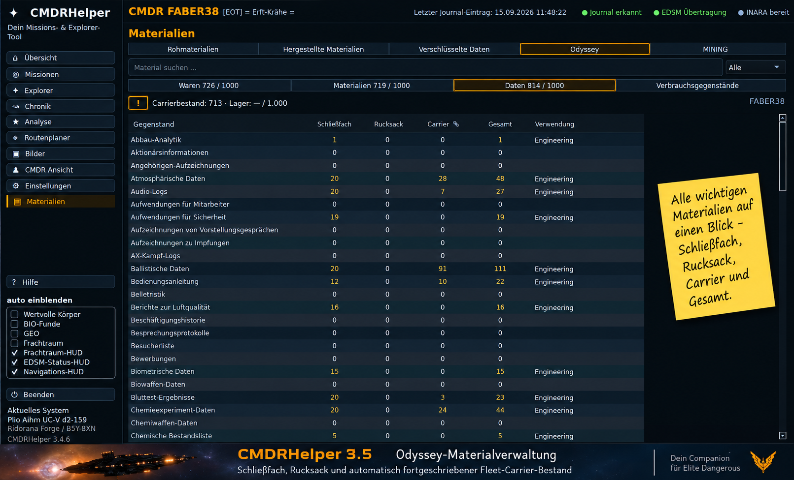

# CMDRHelper 3.5 – Performance, Odyssey und sichere Bestände

Version 3.5 konsolidiert die vorhandenen Performance-, Bestands- und
Stabilitätsarbeiten. Neue Funktionen während der Releasevorbereitung sind nicht
Teil dieses Releases. Die bestehenden Datenbank- und Einstellungsnamensräume
bleiben erhalten; es gibt keine neue DB-Schemamigration.

## Performance und Live-Verarbeitung

- Die Chronik verwendet Kameratransformationen und Projektionen für denselben
  Kamera-/Datenstand erneut. Hover zeichnet ohne erneute Projektion aller Systeme.
- BIO- und Kartographie-Lernen laufen außerhalb des GUI-Threads. Ergebnisse
  werden vor der Anzeige an Commander, Sitzung und aktuellen Zustand gebunden.
- Der Live-Journalleser hält geparste vollständige Ereignisse vor und verarbeitet
  bei Dateiwachstum nur neue vollständige Zeilen. Änderungen, Kürzungen und
  Ersetzungen werden berücksichtigt; Ergebnisse werden nicht über Identitäten geteilt.
- Gezielte Inventarsignale und Revisionsprüfungen vermeiden unnötige Inventarjobs.
  Verdeckte Commander-, Missions-, Explorer- und Favoritenansichten verursachen
  weniger unnötige Aufbauten und Abfragen. Unveränderte Explorer-Liveanzeigen
  werden nicht vollständig neu aufgebaut.
- Commanderzusammenfassungen werden innerhalb eines Refreshs wiederverwendet;
  offene Missionen gezielt abgefragt und bestehende DB-Verbindungen bei der
  Körper-/Mining-Zusammenstellung weiterverwendet.
- Die bestehende Import-/Journal-Nachholung bleibt erhalten. Es gibt keine
  erneute globale Refreshkaskade allein für Odyssey-Sidecaränderungen.

Diese Aussagen sind durch Code und Regressionen belegt. Es werden keine
unbelegten Laufzeitfaktoren oder Benchmarkzahlen als Releaseversprechen genannt.

## Odyssey: persönliche Bestände und Carrier

ShipLocker und Backpack werden als vollständige validierte persönliche
Snapshots verarbeitet. Journaltrigger, Identität, Reihenfolge und stabile
Dateilesung sichern die Zuordnung. Die Erfassung funktioniert unabhängig davon,
ob der Odyssey-Tab bereits geöffnet wurde.

Die Kategorien heißen Waren, Materialien, Daten und Verbrauchsgegenstände.
Waren, Materialien und Daten zeigen jeweils ihre persönliche Schließfachbelegung
mit eigener Kapazität 1000. Diese Kapazitäten sind vom Carrier getrennt.

Die Tabelle zeigt Gegenstand, Schließfach, Rucksack, Carrier, Gesamt und
Verwendung. Carrierwerte werden pro Commander, numerischem eigenen Carrier,
Kategorie und Material gespeichert. Bei mehreren Missions-/Owner-/Stolen-Stapeln
geht der Carrierwert einmal in die Materialsumme ein. Unbekannte benötigte
Teilbestände ergeben Gesamt —; bestätigte 0 ist ein bekannter leerer Bestand.
Verbrauchsgegenstände behalten ihren persönlichen Gesamtbestand ohne Carrierwert.

### Ersteinrichtung und automatische Fortschreibung

Das hervorgehobene anklickbare **!** öffnet die Ersteinrichtungsanleitung.
Benutzer bestätigen per Doppelklick auf die Carrier-Zelle die Ausgangswerte,
einschließlich aller leeren Positionen mit 0. Nicht bestätigte Positionen bleiben —.
Bekannte Positionen können anschließend automatisch fortgeschrieben werden.

Nur während eines eindeutig belegten Aufenthalts auf dem eigenen Carrier werden
Änderungen zwischen sicheren Schließfachsnapshots gegengebucht. Explizite
persönliche Käufe, Verkäufe und Tauschvorgänge werden berücksichtigt. Persönliche
Änderungen außerhalb des eigenen Carriers buchen nicht gegen den Carrier.

Informationslose Embark-/Disembark-Ereignisse löschen den belegten Ort nicht.
Nach Helper-/Sessionneustart wird der aktuelle Ort aus der Journalfolge
rekonstruiert und eine neue persönliche Basis gesetzt. Nicht rekonstruierbare
Odyssey-Transfers während der Auszeit werden nicht rückwirkend erfunden.
Manuelle Neubestätigung bleibt jederzeit möglich und setzt einen neuen Anker.

### Bestand, Reservierung und Lagerbelegung

Das private Odyssey-Carrierlager teilt gemeinsam 1000 Plätze über Waren,
Materialien und Daten. Offene Barkeeper-Kaufangebote reservieren zusätzlich
Kapazität; sie sind keine vorhandenen Materialien.

**Praxisbeispiel, keine festen Programmdaten:**

| Größe | Einheiten |
|---|---:|
| Vorhandener Carrierbestand | 713 |
| Für Kaufangebote reserviert | 121 |
| Ingame-Lagerbelegung | 834 / 1000 |

Die Anzeige trennt Carrierbestand und Lagerbelegung. FCMaterials liefert dafür
nur die offenen Demand-Mengen eines passenden numerischen MarketID-Snapshots.
Stock, Preise und Handelsaufträge werden nicht zum privaten Bestand addiert.
Passende Marktdaten erscheinen mit Zeitangabe als Momentaufnahme; ältere oder
unsichere Daten erzeugen keine vermeintlich aktuelle Lagerbelegung. Eine ältere
Reservierung kann mit Zeitangabe im Tooltip stehen. Reservierungen ändern weder
Material-Gesamtsummen noch manuelle Bestätigungen oder die Carrierprojektion.

## Mining: explizite Transfers und Kontinuität

Mining bleibt fachlich eigenständig. Schiff, SRV und Carrier sind getrennte
Bestände. `CargoTransfer` mit Typ, Menge und Richtung ist die Quelle für die
Carrierfortschreibung; Mining verwendet keine Odyssey-Restdifferenzlogik.

- Verpasste belegbare Transfers werden ab gespeichertem Bytecursor über eine
  geprüfte Journalfolge nachgeholt. Prefixhash, FID-Zuordnung und Wiederaufnahme
  schützen vor Doppelbuchung und unbelegtem Überbrücken von Lücken.
- Eine neue Session mit sicher gleicher Schiffidentität erhält unabhängige
  Schiff-/SRV-Basen. Ein neuer Schiffssnapshot 0 löscht keinen bestätigten SRV-
  oder Carrierbestand.
- Cargo.json prüft Mengen, Namen, exakte Triggerzeit, Vessel und Gesamtmenge vor
  Normalisierung. Negative Mengen, bool-Werte, ungültige Einträge und doppelte
  JSON-Felder werden nicht zu bestätigter Leere umgedeutet.
- Der Reader prüft eindeutige Trigger und Dateistabilität. Fehlende passende
  Snapshots bleiben ausstehend; maximal drei verzögerte Wiederholungen folgen.
- Ledger und Cargo-Checkpoints werden erst nach geprüftem QSettings-Schreibstatus
  veröffentlicht. Bei Fehlern wird der vorherige Zustand bestmöglich erhalten.
- Gleiche FID und fehlende neue Ortsinformationen löschen den belegten
  Carrierkontext nicht. Echte Ortswechsel und widersprechende Identität bleiben streng.

0 bleibt ein bekannter leerer Bestand, — bleibt unbekannt. Gesamt erscheint nur,
wenn Schiff, SRV und Carrier für den betreffenden Rohstoff bekannt sind.

## Fresh Install und historische Parent-Migration

Eine tatsächlich neu angelegte Datenbank erhält nach erfolgreicher
Schemainitialisierung den vorhandenen Parent-Hierarchy-Abschlussmarker. Der
Erstimport historischer Journale macht sie beim nächsten Start nicht mehr
fälschlich migrationsbedürftig.

Bestehende Datenbanken werden nicht allein wegen Schemaversion oder vorhandener
Parentfelder freigestellt. Alte Datenbanken ohne Abschlussmarker bleiben im
historischen Migrationspfad. Die Aufforderung, Elite für diese tatsächlich
notwendige Migration zu beenden, bleibt bestehen.

## Bedienung und weitere Stabilität

- Chronik-Systemnamen lassen sich über Namen oder **⧉** kopieren; **✓** bestätigt
  die Aktion kurz, ohne Popup.
- Die Missionsansicht wird bei unverändertem oder verborgenem Inhalt nicht
  unnötig neu aufgebaut; die Abfrage offener Missionen ist gezielter.
- Odyssey-Kategorien und lange Reiternamen bleiben in Hell/Dunkel lesbar;
  bei Platzmangel verwendet die Tab-Leiste Scrollpfeile. Tabellenlayout und
  benutzerdefinierte Spaltenreihenfolgen bleiben erhalten.
- Die bestehenden Windows-Tab-, Missions-ID-, Import- und Journal-Catch-up-Fixes
  bleiben Bestandteil des konsolidierten Stands. Kein neuer Missions-Splitter
  wird als Feature behauptet: Eine solche Änderung ist im aktuellen Diff nicht belegt.
- Hilfe, Ersteinrichtungsdialog und Updatehinweise stehen in zwölf Sprachen bereit.

## Bekannte Einschränkungen

- Odyssey-Carrierwerte sind Projektionen ab bestätigtem Ausgangsbestand, keine
  garantierten Live-Carrier-Snapshots. Barkeeperhandel, insbesondere anderer
  Spieler, kann tatsächliche Bestände ändern. Bei Bedarf manuell neu bestätigen.
- Mining kann Fremdhandel ohne vollständige Eigentümerereigniskette ebenfalls
  nicht zuverlässig nachführen. Marktangebote sind kein vollständiger Lager-Snapshot.
- Überschriebene persönliche Sidecar-Zwischenstände lassen sich nicht erfinden.
  Mehrdeutige Zuordnungen bleiben unbekannt; nach ausgeschöpften Cargo-Wiederholungen
  erfolgt der nächste Versuch bei einer Aktualisierung oder manuellem Refresh.
- Persistenzfehler werden erkannt; dauerhaft defekte Datenträger lassen sich
  nicht durch eine garantierte Rücknahme der Schreiboperation reparieren.
- Tests unter Linux/Qt-Offscreen ersetzen keinen nativen Windows-Laufzeittest.
  Die unveränderte UNC-Startbeschränkung des bisherigen Windows-Starters bleibt.
- Das unverändert übernommene Releasebild zeigt im aufgenommenen Programmfenster
  noch die Entwicklungsversion 3.4.6; die Bildbeschriftung und das Release lauten 3.5.

## Releaseprüfung

Die Releasevorbereitung prüft zuerst betroffene Testgruppen und anschließend
als abschließendes Gate einmal die vollständige Testsuite. Ergebnisse und
etwaige gezielte Nachprüfungen werden im Freigabebericht genannt. Paketierung
erfolgt ausschließlich lokal; Commit, Tag, Push und Veröffentlichung benötigen
anschließend die ausdrückliche Freigabe.
