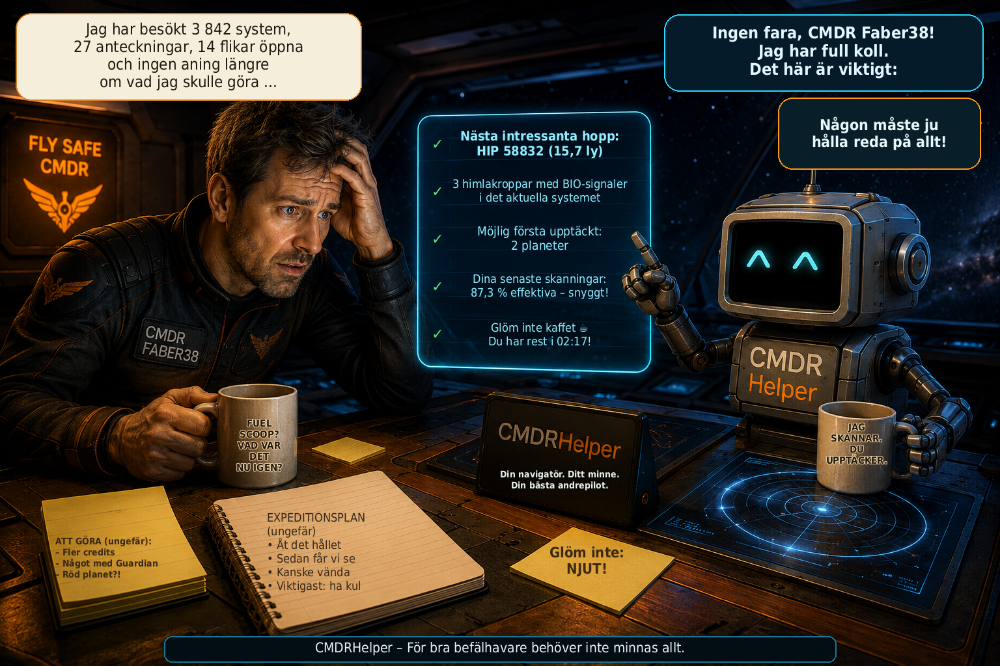

# CMDRHelper

[🇩🇪 Deutsch](README_DE.md) \| [🇬🇧 English](README.md) \| [🇫🇷
Français](README_FR.md) \| [🇮🇹 Italiano](README_IT.md) \| [🇳🇴
Norsk](README_NO.md) \| [🇸🇪 Svenska](README_SV.md) \| [🇫🇮
Suomi](README_FI.md) \| [🇵🇱 Polski](README_PL.md) \| [🇳🇱
Nederlands](README_NL.md) \| [🇪🇸 Español](README_ES.md) \| [🇹🇷
Türkçe](README_TR.md) \| [🇬🇷 Ελληνικά](README_EL.md)



**Personlig följeslagare för Elite Dangerous -- utforskning,
systemanalys och Commander-data i en överblick**

CMDRHelper är ett fristående skrivbordsprogram för **Elite Dangerous**
som analyserar information från spelets lokala Journal-filer och
presenterar den på ett tydligt sätt. Målet är en personlig helper som
vid utforskning av ett system snabbt visar vad som redan är känt, vilka
himlakroppar som är intressanta samt vilka egna upptäckter och
kartläggningar som har gjorts.

Projektet är fortfarande under aktiv utveckling.

## Funktionsöversikt

### Elite Dangerous-Journaler

CMDRHelper läser de lokala Journal-filerna och behandlar bland annat
stjärnsystem, stjärnor, planeter, månar, Belt Cluster, skanningar,
kartläggningar samt biologiska och geologiska signaler. Commanderns egna
data kan fortfarande skiljas från kompletterande extern information.

### Uppdrag

CMDRHelper analyserar uppdragshändelser från Elite Dangerous-Journalerna
och visar aktiva uppdrag på ett tydligt sätt. Uppdragsstatus och
tillhörande Journal-händelser följs.

Även uppdragserbjudanden som kommer in under spelet via NPC-meddelanden
(`ReceiveText`) kan identifieras och tas med i den fortsatta
uppdragstilldelningen. Eftersom Elite Dangerous inte tillhandahåller all
information för varje uppdragstyp i samma Journal-händelse byggs
tilldelningen stegvis upp från tillgängliga Journal-data.

### System- och Explorer-vy

De kända kropparna i ett system visas grafiskt och kan väljas direkt.
CMDRHelper kan bland annat visa:

-   kroppens namn och typ
-   avstånd i systemet
-   skannad av Commandern själv eller endast känd från externa källor
-   redan upptäckt och kartlagd
-   möjlig första upptäckt och möjlig First Mapping
-   kartlagd av Commandern
-   effektiv kartläggning
-   biologiska och geologiska signaler
-   skannings- och kartläggningsvärden

BIO-signaler framhävs tydligt på den berörda kroppen. Tilldelningen sker
systemspecifikt så att BodyID:n från olika stjärnsystem inte förväxlas.

### Detaljvy för kroppar

När man klickar på en kropp öppnas en detaljerad vy. Beroende på
tillgängliga data visas kroppstyp, massa, avstånd, gravitation,
atmosfär, vulkanism, landningsbarhet, terraforming-status, material,
BIO-/GEO-signaler, skanningsvärde, kartläggningsvärde och
upptäcktsstatus.

Information som saknas visas som okänd och presenteras inte som säkra
data.

## Grafisk framställning av kroppar

CMDRHelper har egen grafik för många olika kroppstyper, däribland High
Metal Content Worlds, Metal Rich Bodies, Rocky Bodies, Icy Bodies, Rocky
Ice Worlds, Earth-like Worlds, Water Worlds, Ammonia Worlds, flera
klasser av gasjättar, gasjättar med vatten- eller ammoniakbaserat liv,
heliumrika gasjättar, olika stjärnklasser och Belt Cluster.

Vanliga PNG-bilder används i översikterna. För många kroppar finns
dessutom en **2:1-ekvirektangulär `_texture.png`** för den animerade
detaljvyn.

### Roterande 3D-planeter

Lämpliga 2:1-texturer projiceras på en roterande sfär. CPU-renderaren
arbetar med **PySide6 och NumPy** utan ytterligare beroenden av
OpenGL/PyOpenGL. Den omfattar sfärprojektion, långsam rotation,
belysning, kantförmörkning och atmosfärisk kant.

### Animerade livsformer

För gasjättar med liv finns olika animationer:

**Water Life:** cyan-/turkosfärgade svävande organismer med halo och
rörliga svansar.

**Ammonia Life:** egna violett-/bärnstensfärgade, halvtransparenta
organismer med pulserande kärna, korta trådar och långsammare rörelse.

### Animerade Belt Cluster

Belt Cluster visas inte som sfärer. Detaljvyn genererar ett
procedurmässigt asteroidfält med enskilda asteroider, olika storlekar
och djup, egen rotation, individuell drift, parallaxeffekt, kratrar samt
diskreta damm- och partikeleffekter.

## EDSM som kompletterande datakälla

CMDRHelper kan skilja mellan egna Journal-data och EDSM-information.
Källan markeras på motsvarande sätt som egen Journal, EDSM eller egen
Journal + EDSM. Egna Journal-data är särskilt viktiga eftersom de visar
vad den aktuella Commandern faktiskt själv har skannat eller kartlagt.

CMDRHelper kan automatiskt överföra nya Journal-data till EDSM. Den
aktuella dynamiska EDSM Discard-listan beaktas så att endast de
händelser som EDSM önskar skickas. Överföringsförloppet sparas säkert
för varje Journal-fil. Vid den första aktiveringen överförs redan
befintliga gamla Journaler inte på nytt i sin helhet.

EDSM-statusen visas direkt högst upp i översikten. En grön indikator
visar att överföringen fungerar; fel visas i rött och loggas dessutom i
CMDRHelper-loggen.

## Lokal databas

CMDRHelper använder SQLite. Följande gäller:

-   `cmdrhelper/database.py` är programkod och ingår i releasen.
-   `data/cmdrhelper.db` innehåller personliga Commander-data och
    distribueras **inte**.
-   Vid en ny installation byggs den lokala databasen upp på nytt för
    respektive användare.

På så sätt distribueras inga personliga Commander-data tillsammans med
en release.

## Diagnostik och loggfil

CMDRHelper har en egen roterande loggfil för diagnostik och felsökning.
Viktiga program-, Journal-, databas- och EDSM-händelser loggas.
EDSM-loggningen har reducerats så att Journal-händelser som endast
förkastas av EDSM inte fyller den normala loggen i onödan, medan lyckade
överföringar, varningar och fel fortfarande är synliga.

## Plattformar

CMDRHelper utvecklas med Python och PySide6 och är avsett för **Linux
och Windows**. Utvecklingen sker huvudsakligen under Linux; Windows kan
konfigureras med hjälp av de medföljande batchfilerna.

## Förutsättningar

Python 3 samt paketen från `requirements.txt`:

``` text
PySide6>=6.7,<7
numpy
Pillow>=10.0
```

## Installation under Linux

``` bash
python3 -m venv venv
source venv/bin/activate
python -m pip install --upgrade pip
pip install -r requirements.txt
python main.py
```

Befintliga Linux-startskript kan användas som alternativ.

## Installation under Windows

För Windows är `install.bat` och `start.bat` avsedda.

`install.bat` kontrollerar Python 3, skapar `venv`, uppdaterar pip och
installerar `requirements.txt`. Därefter startas CMDRHelper via
`start.bat`.

## Skapa release

``` bash
./create_release.sh
```

Release-versionen anges direkt i skriptet. Den skapade ZIP-filen
innehåller programkod och assets, men ingen personlig databas, ingen
virtuell Python-miljö och inga Git-, cache- eller editorfiler.

## Version 1.0.8

**Version 1.0.8** lägger till en personlig hopprekommendation för
utforskning, kompletterar internationaliseringen och förbättrar
Utforskarens livefönster samt visningen av Krönikans karta.

### Hopptips och hopprekommendation

-   den nya delen **”Hopptips”** analyserar din egen lokala
    utforskningsdatabas och visar vilka procedurella systemkoder som kan vara
    särskilt intressanta för ett valt utforskningsmål.
-   möjliga mål är bland annat BIO-fynd i allmänhet, kända BIO-släkten och
    -arter, värdefulla utforskningsobjekt, terraformningskandidater,
    Vattenvärldar, Jordlika världar och Ammoniakvärldar.
-   rankningen tar hänsyn till system som tidigare undersökts med en kod,
    träffar, träffsäkerhet, sparade fynd och tillgänglig urvalsstorlek. Ett
    justerbart minsta antal undersökta system förhindrar att alltför små
    datamängder övervärderas.
-   CMDRHelper framhäver koder som bör prioriteras på galaxkartan, till
    exempel kombinationer som `ZL-Z b` eller `NR-C d`.
-   rekommendationen bygger uteslutande på **din egen tidigare
    utforskningshistorik** och fynden som sparats där. Den är en statistisk
    vägledning och **garanterar inget fynd**.

### Internationalisering

-   internationaliseringen har kompletterats ytterligare och kontrollerats
    på nytt mot den tyska referensen.
-   alla **12 språk som stöds i gränssnittet** har nu samma fullständiga
    uppsättning med **560 översättningsnycklar**.
-   nya och tidigare saknade översättningar för **hopptips och
    hopprekommendation** har lagts till på alla språk som stöds.
-   nyckeluppsättning, ordningsföljd och formateringsplatshållare har
    samordnats i alla språkfiler.

### Utforskarens livefönster och inställningar

-   Utforskarens inställningar har nya förklarande verktygstips för
    automatisk visning av fönstren **”Värdefulla himlakroppar”** och
    **”BIO-fynd”**.
-   verktygstipsen förklarar när respektive fönster visas automatiskt utifrån
    det inställda värdetröskelvärdet eller upptäckta BIO- eller GEO-signaler.
-   värdefulla himlakroppar som Commandern redan har kartlagt visas inte
    längre som öppna mål i det lilla livefönstret.
-   fullständigt analyserade BIO-himlakroppar försvinner från BIO-fönstret;
    en GEO-del på samma himlakropp som ännu inte kartlagts med DSS förblir
    synlig.

### Krönika

-   Krönikans kartorientering har korrigerats så att den positiva Z-axeln
    pekar uppåt. Sparade Elite-`StarPos`-koordinater förblir oförändrade.

## Version 1.0

Med **Version 1.0** når CMDRHelper det första fullständiga
utvecklingsstadiet för det planerade grundomfånget.

Viktiga ändringar och utökningar fram till Version 1.0:

### Fullständig framställning av kroppar och stjärnor

-   bildmaterialet för de stödda planet-, stjärn- och
    specialobjektstyperna har kompletterats ytterligare.
-   ytterligare stjärnklasser och särskilda stjärntyper visas med egen
    grafik i stället för att falla tillbaka på den allmänna
    standardvisningen.
-   för lämpliga kroppar finns fortsatt roterande 2:1-ekvirektangulära
    texturer i detaljvyn.
-   särskilda astronomiska objekt kan dessutom visas med lämpliga videor
    i detaljvyn.
-   neutronstjärnor, vita dvärgar, svarta hål och supermassiva svarta
    hål får därigenom en betydligt mer individuell framställning.
-   externt bild- och videomaterial som används dokumenteras med källa
    och credit i avsnittet **"Bild- och videomaterial / Media
    Credits"**.

### Fullständig flerspråkighet

-   översättningarna av användargränssnittet har färdigställts för de
    språk som stöds och synkroniserats mot en gemensam uppsättning
    nycklar.
-   alla **12 gränssnittsspråk** använder samma fullständiga uppsättning
    översättningsnycklar.
-   den automatiska översättningskontrollen kontrollerar saknade, extra
    och dubbla nycklar samt avvikande format-placeholders.
-   tyska fungerar som den fullständigt underhållna referensen för
    användargränssnittet och den fortsatta dokumentationen.

### Ändringar från Version 0.9.9

### Flerspråkighet och översättningskontroll

-   användargränssnittet har övergått till ett centralt flerspråkigt
    system.
-   CMDRHelper stöder nu **12 gränssnittsspråk**: **tyska, engelska,
    franska, italienska, norska (Bokmål), svenska, finska, polska,
    nederländska, spanska, turkiska och grekiska**.
-   språket kan väljas och sparas i inställningarna; språknamnen visas i
    urvalsfältet på respektive eget språk.
-   saknade översättningar använder en definierad fallback-ordning:
    **valt språk → engelska → tyska → översättningsnyckel**.
-   översättningarna finns centralt i språkfilerna under
    `cmdrhelper/i18n/`.
-   det nya utvecklarverktyget `tools/check_i18n.py` kontrollerar
    automatiskt:
    -   `tr("...")`-nycklar som används i programmet,
    -   saknade eller extra översättningsnycklar,
    -   dubbla nycklar,
    -   avvikande format-placeholders som `{system}` eller `{count}`.
-   under Linux körs i18n-kontrollen automatiskt vid start via
    `start.sh`. Upptäckta översättningsproblem rapporteras tydligt men
    blockerar inte programstarten.
-   uppdrags- och Journal-behandling hålls även fortsättningsvis åtskild
    från det valda CMDRHelper-gränssnittsspråket, så att interna Elite
    Dangerous-data inte blir beroende av lokaliserade visningstexter.

### Explorer och systemkarta

-   Parent-/Child-strukturen i systemkartan har omarbetats: stjärnor,
    planeter, månar och Belt Cluster placeras enligt sin
    Journal-hierarki.
-   ny funktion **"Visa alla"** med en kompakt miniatyröversikt över
    hela systemet.
-   kroppar kan klickas i miniatyröversikten; huvudkartan hoppar
    därefter direkt till den valda kroppen.
-   förbättrad navigering i stora systemkartor:
    -   mushjulet flyttar kartan horisontellt.
    -   håll höger musknapp nedtryckt och dra uppåt/nedåt för att flytta
        kartan vertikalt.
-   kropparnas visuella storlek skalas tydligare efter den verkliga
    radien.
-   visning och markering av BIO, GEO, Terraforming, första upptäckt och
    First Mapping har förbättrats ytterligare.
-   ny **värdelista** i Explorer: planeter och månar sorteras radvis
    efter sitt aktuella uppskattade kartläggningsvärde.
-   värdelistan skiljer nu tydligt mellan **First Mapping möjligt**,
    **redan kartlagd** och **kartlagd av Commandern själv**.
-   det kartläggningsvärde som faktiskt har uppnåtts framhävs tydligt i
    värdelistan, medan status- och metadata avsiktligt visas mer
    diskret.
-   ny visning **"Ännu inte inlämnat"** för öppna kartläggnings- och
    BIO-värden över alla system sedan den senaste försäljningen;
    kartläggning och BIO återställs separat.
-   öppna Explorer-värden framhävs i gult i huvudfönstret så att ännu
    osålda data omedelbart känns igen.

### Explorer-livefönster

-   nya fritt placerbara **livefönster för värdefulla kroppar och
    BIO-fynd** som visas automatiskt under utforskningen.
-   livefönstrens position och storlek sparas och återanvänds nästa gång
    de visas.
-   vid byte till ett annat stjärnsystem stängs och töms livefönstren
    automatiskt; de visas först igen när lämpliga data identifieras i
    det nya systemet.
-   fönstret **"Värdefulla kroppar"** tar automatiskt med alla planeter
    och månar vars för närvarande möjliga kartläggningsvärde når den
    tröskel som valts i inställningarna.
-   samma justerbara tröskel styr nu den gula framhävningen i
    värdelistan, livefönstret för värdefulla kroppar och **guldramen i
    systemkartan**.
-   **BIO-livefönstret** visar kompakt under spelet kroppar,
    identifierade släkten eller arter, skanningsförlopp och kända Vista
    Genomics-värden.
-   BIO-fynd använder samma färglogik som i huvudfönstret: grå =
    identifierad via DSS/FSS, vit = första provet, gul = andra provet,
    grön = analysen slutförd.
-   vid delvis bestämda BIO-signaler expanderas en planet automatiskt
    och visar de enskilda fynden på egna rader; fortfarande okända
    signaler förblir synliga.
-   så snart alla BIO-arter på en kropp har analyserats fullständigt
    fälls planeten åter ihop till en kompakt grön sammanfattningsrad.
-   allmänna DSS/FSS-släktnamn ersätts automatiskt av den konkreta
    BIO-arten så snart den blir känd genom `ScanOrganic`.
-   kända enskilda värden visas direkt vid respektive BIO-fynd;
    fullständigt kända kroppar visar dessutom totalvärdet.
-   livefönstren har en diskret rödbrun bakgrund så att de tydligt
    skiljer sig från CMDRHelpers huvudfönster under spelet.

### BIO-analys

-   biologiska data analyseras och visas separat från de normala
    kartläggningsvärdena.
-   egen **BIO-planetlista** med alla kroppar där biologiska signaler
    har identifierats.
-   BIO-släkten från `SAASignalsFound` respektive `FSSBodySignals`
    hämtas även retroaktivt från befintliga Journaler.
-   konkreta BIO-arter och varianter från `ScanOrganic` visas direkt i
    listan.
-   skanningsförloppet för varje BIO-fynd visas med färger:
    -   grå = endast känd genom DSS/FSS
    -   vit = första provet
    -   gul = andra provet
    -   grön = tredje provet / analysen slutförd
-   det kända grundvärdet från Vista Genomics visas redan så snart en
    BIO-art är entydigt identifierad.
-   visning av grundvärdet för fullständigt analyserade BIO-prover.
-   visning av det möjliga **First Logged-totalvärdet ×5**.
-   kända BIO-värden kan kompletteras från befintliga försäljningsdata.
-   arter utan känt värde markeras i analysen.
-   BIO-status skiljer mellan öppen, besökt och fullständigt analyserad.

### Uppdrag

-   behandlingen av `MissionRedirected` har förbättrats.
-   omdirigerade uppdrag kan ta över namn, nytt målsystem respektive ny
    målstation och information om det tidigare målet.
-   uppdrag kan i vissa fall även rekonstrueras om det tidigare inte
    fanns någon fullständig `MissionAccepted`-post.
-   uppdragskolonnernas bredd kan justeras fritt; de valda bredderna
    sparas.
-   visning av **den totala belöningen för alla uppdrag som för
    närvarande är öppna**.

### Bilder och skärmbilder

-   eget skärmbildsområde med galleri och förhandsvisning.
-   automatisk konvertering av nya Elite Dangerous-BMP-skärmbilder.
-   utdata som PNG eller JPG.
-   valfri radering av BMP-filen efter lyckad konvertering.
-   justerbar ljusstyrkekorrigering från 0 till 50 %.
-   enklare användning av Elite-skärmbildsmappen under Steam/Proton.
-   galleriet uppdateras även efter att filer har raderats externt.
-   förbättrad synlighet för alternativen för automatisk konvertering
    och radering.

### Onlinetjänster

-   automatisk EDSM-Journal-överföring är ytterligare integrerad och
    synlig via statusområdet i huvudfönstret.
-   status för överföring, väntan, fel och inaktiverad EDSM.
-   Inara-statusvisning som förberedelse för senare automatisk
    överföring.

### Användning och stabilitet

-   gränssnittets teckensnitt och teckenstorlek kan väljas i
    inställningarna och tillämpas på hela gränssnittet efter en omstart.
-   inställningssidan är rullningsbar så att alla alternativ kan nås
    även vid mindre fönsterstorlekar.
-   synlig **"Avsluta"**-knapp i vänster sidofält.
-   Single Instance-spärren förhindrar att en andra programinstans
    startas samtidigt av misstag.
-   säker miniatyröversikt över systemet utan direkt rendering av den
    redan synliga Explorer-widgeten.
-   olika förbättringar av gränssnitt, Journal-behandling, databas och
    uppdateringsförlopp.

## Projektstatus

CMDRHelper är under utveckling. Användargränssnitt, datamodell och
framställning kan fortfarande ändras. Fler kroppstyper,
Journal-funktioner, Explorer-funktioner, datakällor och beräkningar är
planerade. Linux och Windows testas vidare.

CMDRHelper skapades som ett personligt verktyg och byggs stegvis ut till
en mer omfattande Elite Dangerous-helper.

## Bild- och videomaterial / Media Credits

CMDRHelper använder visualiseringar från **NASA Scientific Visualization
Studio (NASA SVS)** för vissa speciella astronomiska objekt. Respektive
media förblir rättighetsinnehavarnas egendom och krediteras enligt
uppgifterna på NASA SVS-sidorna.

### Neutronstjärna

-   CMDRHelper-fil: `star_neutron.webm`
-   Källa: NASA Scientific Visualization Studio, **Neutron Star
    Animations** (SVS ID 20267)
-   Credit: **NASA's Goddard Space Flight Center Conceptual Image Lab**
-   Animatörer: Walt Feimer (KBR Wyle Services, LLC) och Lisa Poje
    (USRA)
-   Källa: https://svs.gsfc.nasa.gov/20267/

### Svart hål

-   CMDRHelper-fil: `black_hole.mp4` respektive den videofiländelse som
    används i projektet
-   Källa: NASA Scientific Visualization Studio, **Black Hole Accretion
    Disk Visualization** (SVS ID 13326)
-   Credit: **NASA's Goddard Space Flight Center/Jeremy Schnittman**
-   Källa: https://svs.gsfc.nasa.gov/13326/

### Supermassivt svart hål

-   CMDRHelper-fil: `black_hole_supermassive.mp4` respektive den
    videofiländelse som används i projektet
-   Källa: NASA Scientific Visualization Studio (SVS ID 14576)
-   Credit: **NASA's Goddard Space Flight Center/J. Schnittman and B.
    Powell**
-   Källa: https://svs.gsfc.nasa.gov/14576/

### Vit dvärg

-   CMDRHelper-fil: `star_white_dwarf.webm`
-   använt NASA-medium: **White Dwarf establishing shot**
    (`WDStar_4k_60fps_ProRes.webm`)
-   Källa: NASA Scientific Visualization Studio, **Type Ia Supernovae
    Animations** (SVS ID 20344)
-   Credit: **NASA's Goddard Space Flight Center Conceptual Image Lab**
-   Animatör: Adriana Manrique Gutierrez (USRA)
-   Producer: Scott Wiessinger (USRA)
-   Källa: https://svs.gsfc.nasa.gov/20344/

Angivandet av dessa källor och credits innebär inte att CMDRHelper
stöds, certifieras eller ges ut av NASA. För vidare användning av
NASA-medier gäller respektive anvisningar och reproduktionsriktlinjer
från originalkällorna.

## Licens

CMDRHelper är fri programvara och publiceras under **GNU General Public
License Version 3 (GPL-3.0)**.

Källkoden får användas, ändras och distribueras vidare enligt villkoren
i GPL-3.0. Vid distribution av härledda versioner gäller också villkoren
i GPL-3.0.

Copyright © 2026 **Holger Mangold (Faber38)**.

De fullständiga licensvillkoren finns i filen `LICENSE`.

## Information om Elite Dangerous

CMDRHelper är ett oberoende community-/hobbyprojekt och inte en
officiell produkt från Frontier Developments.

**Elite Dangerous** och tillhörande namn och innehåll tillhör sina
respektive rättighetsinnehavare.
