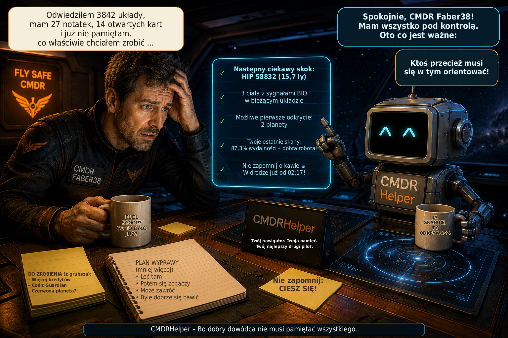

# CMDRHelper

[🇩🇪 Deutsch](README_DE.md) \| [🇬🇧 English](README.md) \| [🇫🇷
Français](README_FR.md) \| [🇮🇹 Italiano](README_IT.md) \| [🇳🇴
Norsk](README_NO.md) \| [🇸🇪 Svenska](README_SV.md) \| [🇫🇮
Suomi](README_FI.md) \| [🇵🇱 Polski](README_PL.md) \| [🇳🇱
Nederlands](README_NL.md) \| [🇪🇸 Español](README_ES.md) \| [🇹🇷
Türkçe](README_TR.md) \| [🇬🇷 Ελληνικά](README_EL.md)



**Osobisty towarzysz dla Elite Dangerous -- eksploracja, analiza
systemów i dane Commandera w jednym miejscu**

CMDRHelper to niezależny program desktopowy dla **Elite Dangerous**,
który analizuje informacje z lokalnych plików Journal gry i przedstawia
je w przejrzysty sposób. Celem jest stworzenie osobistego pomocnika,
który podczas eksploracji systemu szybko pokazuje, co jest już znane,
które ciała niebieskie są interesujące oraz jakie własne odkrycia i
mapowania zostały wykonane.

Projekt nadal znajduje się w aktywnym rozwoju.

## Przegląd funkcji

### Journale Elite Dangerous

CMDRHelper odczytuje lokalne pliki Journal i przetwarza między innymi
systemy gwiezdne, gwiazdy, planety, księżyce, Belt Clusters, skany,
mapowania oraz sygnały biologiczne i geologiczne. Własne dane Commandera
pozostają odróżnialne od uzupełniających informacji zewnętrznych.

### Misje

CMDRHelper analizuje zdarzenia misji z Journali Elite Dangerous i
przejrzyście prezentuje aktywne misje. Status misji oraz powiązane z
nimi zdarzenia Journal są śledzone.

Również oferty misji pojawiające się podczas gry w wiadomościach NPC
(`ReceiveText`) mogą zostać rozpoznane i uwzględnione przy dalszym
przypisywaniu misji. Ponieważ Elite Dangerous nie udostępnia dla każdego
typu misji wszystkich informacji w tym samym zdarzeniu Journal,
przypisanie jest budowane stopniowo na podstawie dostępnych danych
Journal.

### Widok systemu i Explorer

Znane ciała w systemie są przedstawiane graficznie i można je
bezpośrednio wybierać. CMDRHelper może między innymi wyświetlać:

-   nazwę i rodzaj ciała
-   odległość w systemie
-   zeskanowane osobiście lub znane wyłącznie ze źródeł zewnętrznych
-   już odkryte i zmapowane
-   możliwe pierwsze odkrycie i możliwy First Mapping
-   zmapowane przez Commandera
-   efektywne mapowanie
-   sygnały biologiczne i geologiczne
-   wartości skanowania i mapowania

Sygnały BIO są wyraźnie wyróżniane przy odpowiednim ciele. Przypisanie
odbywa się w obrębie systemu, aby identyfikatory BodyID z różnych
systemów gwiezdnych nie zostały pomylone.

### Widok szczegółów ciała

Po kliknięciu ciała otwiera się szczegółowy widok. W zależności od
dostępnych danych wyświetlane są: rodzaj ciała, masa, odległość,
grawitacja, atmosfera, wulkanizm, możliwość lądowania, status
terraformowania, materiały, sygnały BIO/GEO, wartość skanu, wartość
mapowania oraz status odkrycia.

Brakujące informacje są oznaczane jako nieznane i nie są przedstawiane
jako dane pewne.

## Graficzna prezentacja ciał

CMDRHelper posiada własne grafiki dla wielu typów ciał, w tym High Metal
Content Worlds, Metal Rich Bodies, Rocky Bodies, Icy Bodies, Rocky Ice
Worlds, Earth-like Worlds, Water Worlds, Ammonia Worlds, kilku klas
gazowych olbrzymów, gazowych olbrzymów z życiem opartym na wodzie lub
amoniaku, gazowych olbrzymów bogatych w hel, różnych klas gwiazd oraz
Belt Clusters.

Standardowe obrazy PNG służą do widoków przeglądowych. Dla wielu ciał
dostępna jest dodatkowo **tekstura equirectangular 2:1 `_texture.png`**
dla animowanego widoku szczegółowego.

### Obracające się planety 3D

Odpowiednie tekstury 2:1 są rzutowane na obracającą się kulę. Renderer
CPU działa z użyciem **PySide6 i NumPy** bez dodatkowej zależności od
OpenGL/PyOpenGL. Obejmuje projekcję sferyczną, powolny obrót,
oświetlenie, przyciemnienie krawędzi oraz atmosferyczną poświatę
krawędzi.

### Animowane formy życia

Dla gazowych olbrzymów z życiem istnieją różne animacje:

**Water Life:** unoszące się organizmy w kolorach cyjanowym/turkusowym,
z poświatą i poruszającymi się ogonami.

**Ammonia Life:** osobne fioletowo-bursztynowe, półprzezroczyste
organizmy z pulsującym rdzeniem, krótkimi włóknami i wolniejszym ruchem.

### Animowane Belt Clusters

Belt Clusters nie są przedstawiane jako kule. Widok szczegółowy generuje
proceduralne pole asteroid z pojedynczymi asteroidami, różnymi
rozmiarami i głębokościami, własnym obrotem, indywidualnym dryfem,
efektem paralaksy, kraterami oraz subtelnymi efektami pyłu i cząstek.

## EDSM jako uzupełniające źródło danych

CMDRHelper potrafi rozróżniać własne dane Journal od informacji EDSM.
Źródło jest odpowiednio oznaczane jako własny Journal, EDSM albo własny
Journal + EDSM. Własne dane Journal są szczególnie ważne, ponieważ
pokazują, co dany Commander rzeczywiście sam zeskanował lub zmapował.

CMDRHelper może automatycznie przesyłać nowe dane Journal do EDSM.
Uwzględniana jest przy tym aktualna dynamiczna lista EDSM Discard,
dzięki czemu wysyłane są tylko zdarzenia wymagane przez EDSM. Postęp
przesyłania jest bezpiecznie zapisywany dla każdego pliku Journal. Przy
pierwszej aktywacji istniejące wcześniej stare Journale nie są ponownie
przesyłane w całości.

Status EDSM jest wyświetlany bezpośrednio u góry widoku głównego.
Zielony wskaźnik oznacza prawidłowo działające przesyłanie; błędy są
wyświetlane na czerwono i dodatkowo zapisywane w logu CMDRHelper.

## Lokalna baza danych

CMDRHelper korzysta z SQLite. Obowiązują następujące zasady:

-   `cmdrhelper/database.py` jest kodem programu i należy do wydania.
-   `data/cmdrhelper.db` zawiera osobiste dane Commandera i **nie jest**
    dystrybuowany.
-   Przy świeżej instalacji lokalna baza danych jest tworzona od nowa
    dla danego użytkownika.

Dzięki temu żadne osobiste dane Commandera nie są dostarczane wraz z
wydaniem.

## Diagnostyka i plik logu

CMDRHelper prowadzi własny rotacyjny plik logu do diagnostyki i
wyszukiwania błędów. Rejestrowane są ważne zdarzenia programu, Journala,
bazy danych i EDSM. Logowanie EDSM zostało ograniczone tak, aby zwykłe
zdarzenia Journal odrzucane przez EDSM nie zapełniały niepotrzebnie
normalnego logu, podczas gdy udane przesyłania, ostrzeżenia i błędy
pozostają widoczne.

## Platformy

CMDRHelper jest rozwijany w Pythonie i PySide6 i jest przeznaczony dla
**Linuxa i Windows**. Rozwój odbywa się głównie w systemie Linux;
Windows można skonfigurować za pomocą dołączonych plików batch.

## Wymagania

Python 3 oraz pakiety z `requirements.txt`:

``` text
PySide6>=6.7,<7
numpy
Pillow>=10.0
```

## Instalacja w systemie Linux

``` bash
python3 -m venv venv
source venv/bin/activate
python -m pip install --upgrade pip
pip install -r requirements.txt
python main.py
```

Alternatywnie można użyć istniejących skryptów startowych dla Linuxa.

## Instalacja w systemie Windows

Dla Windows przewidziane są `install.bat` i `start.bat`.

`install.bat` sprawdza Python 3, tworzy `venv`, aktualizuje pip i
instaluje `requirements.txt`. Następnie CMDRHelper jest uruchamiany
przez `start.bat`.

## Tworzenie wydania

``` bash
./create_release.sh
```

Wersja wydania jest ustawiana bezpośrednio w skrypcie. Utworzony plik
ZIP zawiera kod programu i zasoby, ale nie zawiera osobistej bazy
danych, wirtualnego środowiska Pythona ani plików Git, cache czy
edytora.

## Wersja 1.5

**Wersja 1.5** jest dużą aktualizacją funkcjonalną. Dodaje nowy planer tras
dla statków i Fleet Carrierów, ściślej łączy postęp trasy z Journalem Elite
Dangerous oraz poprawia niezawodność i wydajność, szczególnie w Windows.

### Planer tras i trasy statków

-   nowy **Planer tras** oblicza trasy statków przez Spansh Galaxy Plotter i
    pokazuje wszystkie systemy pośrednie w CMDRHelper.
-   CMDRHelper rozpoznaje w Journalu statek, FSD, engineering FSD oraz aktywny
    Guardian FSD Booster. Dostępne wartości zbiornika, ładunku, masy i FSD są
    przejmowane automatycznie.
-   automatycznie rozpoznane wartości pozostają edytowalne. Ręczne zmiany są
    zachowywane przy późniejszych aktualizacjach Loadout, ładunku i paliwa,
    dopóki wykryte dane statku nie zostaną ponownie jawnie zastosowane.
-   zmiany Loadout, ładunku i paliwa aktualizują tylko odpowiednie dane trasy.
    Nieznane wartości pozostają widocznie puste i nie są szacowane.
-   przed obliczeniem system początkowy i docelowy są sprawdzane pod kątem
    dokładnego dopasowania w Spansh. Nieznany system daje zrozumiały komunikat
    bez uruchamiania zadania, które nie może się udać.
-   postęp wykorzystuje prawdziwe zdarzenia `FSDJump` z istniejącego przepływu
    Journala. Po udanym skoku następny system jest automatycznie kopiowany do
    schowka Qt i może zostać ponownie skopiowany ręcznie.

### Fleet Carrier i CTSVision

-   osobny tryb **Fleet Carrier / CTSVision** korzysta ze Spansh Fleet Carrier
    Router.
-   obliczone trasy Fleet Carriera zawierają dane skoków i Tritium oraz mogą
    zostać wyeksportowane jako plik CSV zgodny z CTSVision.

### Niezawodność Journala i wydajność

-   tymczasowy błąd dostępu do aktywnego pliku Journal nie zatwierdza już
    zmiany przedwcześnie. Normalny cykl odpytywania ponawia próbę bez
    agresywnego busy-waitingu.
-   uczenie BIO i kartografii nie skanuje już całego archiwum Journali przy
    zwykłych, niepowiązanych zdarzeniach. Pełne analizy są ograniczone do
    właściwych zdarzeń BIO lub sprzedaży oraz przewidzianego importu archiwum.
-   zmniejsza to zbędną pracę przy każdym dopisaniu do Journala i poprawia
    niezawodność oraz szybkość reakcji, szczególnie w Windows.

## Wersja 1.0.8

**Wersja 1.0.8** dodaje osobistą rekomendację skoku dla eksploracji,
uzupełnia internacjonalizację oraz usprawnia okna na żywo Eksploratora i
widok mapy Kroniki.

### Wskazówka i rekomendacja skoku

-   nowa sekcja **„Wskazówka skoku”** analizuje własną lokalną bazę danych
    eksploracji i pokazuje, które proceduralne kody układów mogą być
    szczególnie interesujące dla wybranego celu eksploracji.
-   dostępne cele obejmują między innymi ogólne znaleziska BIO, znane rodzaje
    i gatunki BIO, wartościowe ciała eksploracyjne, kandydatów do
    terraformowania, Światy wodne, Światy podobne do Ziemi i Światy
    amoniakalne.
-   ranking uwzględnia układy zbadane wcześniej z danym kodem, trafienia,
    wskaźnik trafień, zapisane znaleziska i dostępną wielkość próby.
    Regulowana minimalna liczba zbadanych układów zapobiega zawyżaniu oceny
    zbyt małych zbiorów danych.
-   CMDRHelper wyróżnia preferowane kody, których można szukać na mapie
    galaktyki, na przykład kombinacje `ZL-Z b` lub `NR-C d`.
-   rekomendacja opiera się wyłącznie na **własnej dotychczasowej historii
    eksploracji** i zapisanych w niej znaleziskach. Jest wskazówką
    statystyczną i **nie gwarantuje znalezienia celu**.

### Internacjonalizacja

-   internacjonalizacja została dalej uzupełniona i ponownie sprawdzona
    względem niemieckiej wersji referencyjnej.
-   wszystkie **12 obsługiwanych języków interfejsu** ma teraz ten sam pełny
    zestaw **560 kluczy tłumaczeń**.
-   nowe i wcześniej brakujące tłumaczenia **wskazówki i rekomendacji skoku**
    zostały dodane we wszystkich obsługiwanych językach.
-   zestaw i kolejność kluczy oraz symbole zastępcze formatowania zostały
    ujednolicone we wszystkich plikach językowych.

### Okna na żywo i ustawienia Eksploratora

-   ustawienia Eksploratora mają nowe objaśniające tooltipy automatycznego
    wyświetlania okien **„Wartościowe ciała”** i **„Znaleziska BIO”**.
-   tooltipy wyjaśniają, kiedy każde okno pojawia się automatycznie na
    podstawie ustawionego progu wartości lub wykrytych sygnałów BIO albo GEO.
-   wartościowe ciała już zmapowane przez Commandera nie są wyświetlane jako
    otwarte cele w małym oknie na żywo.
-   całkowicie przeanalizowane ciała BIO znikają z okna BIO; część GEO tego
    samego ciała, która nie została jeszcze zmapowana za pomocą DSS,
    pozostaje widoczna.

### Kronika

-   orientacja mapy Kroniki została poprawiona tak, aby dodatnia oś Z była
    skierowana do góry. Zapisane współrzędne Elite `StarPos` pozostają bez
    zmian.

## Wersja 1.0

W **wersji 1.0** CMDRHelper osiąga pierwszy kompletny etap rozwoju
zaplanowanego zakresu podstawowego.

Najważniejsze zmiany i rozszerzenia do wersji 1.0:

### Uzupełniona prezentacja ciał i gwiazd

-   materiały graficzne dla obsługiwanych typów planet, gwiazd i
    obiektów specjalnych zostały dalej uzupełnione.
-   dodatkowe klasy gwiazd i szczególne typy gwiazd są przedstawiane za
    pomocą własnych grafik zamiast korzystania z ogólnej prezentacji
    domyślnej.
-   dla odpowiednich ciał nadal dostępne są obracające się tekstury
    equirectangular 2:1 w widoku szczegółowym.
-   specjalne obiekty astronomiczne mogą być dodatkowo przedstawiane w
    widoku szczegółowym za pomocą odpowiednich filmów.
-   gwiazdy neutronowe, białe karły, czarne dziury i supermasywne czarne
    dziury otrzymują dzięki temu znacznie bardziej indywidualną
    prezentację.
-   wykorzystywane zewnętrzne materiały graficzne i filmowe są
    dokumentowane wraz ze źródłem i informacją o autorstwie w sekcji
    **„Materiały graficzne i wideo / Media Credits"**.

### Ukończona wielojęzyczność

-   tłumaczenia interfejsu użytkownika zostały ukończone dla
    obsługiwanych języków i ujednolicone względem wspólnego zestawu
    kluczy.
-   wszystkie **12 języków interfejsu** korzysta z tego samego pełnego
    zestawu kluczy tłumaczeń.
-   automatyczna kontrola tłumaczeń sprawdza brakujące, dodatkowe i
    zduplikowane klucze oraz różniące się symbole zastępcze
    formatowania.
-   język niemiecki służy jako w pełni utrzymywana wersja referencyjna
    dla interfejsu użytkownika i dalszej dokumentacji.

### Zmiany z wersji 0.9.9

### Wielojęzyczność i kontrola tłumaczeń

-   interfejs użytkownika został przestawiony na centralny system
    wielojęzyczny.
-   CMDRHelper obsługuje teraz **12 języków interfejsu**: **niemiecki,
    angielski, francuski, włoski, norweski (Bokmål), szwedzki, fiński,
    polski, niderlandzki, hiszpański, turecki i grecki**.
-   język można wybrać i zapisać w ustawieniach; nazwy języków są
    wyświetlane na liście wyboru każda we własnym języku.
-   brakujące tłumaczenia korzystają ze zdefiniowanej kolejności
    fallback: **wybrany język → angielski → niemiecki → klucz
    tłumaczenia**.
-   tłumaczenia znajdują się centralnie w plikach językowych w
    `cmdrhelper/i18n/`.
-   nowe narzędzie deweloperskie `tools/check_i18n.py` automatycznie
    sprawdza:
    -   klucze `tr("...")` używane w programie,
    -   brakujące lub dodatkowe klucze tłumaczeń,
    -   zduplikowane klucze,
    -   różniące się symbole zastępcze formatowania, takie jak
        `{system}` lub `{count}`.
-   w systemie Linux kontrola i18n jest automatycznie uruchamiana przy
    starcie za pomocą `start.sh`. Wykryte problemy z tłumaczeniami są
    wyraźnie zgłaszane, ale nie blokują uruchomienia programu.
-   przetwarzanie misji i Journala pozostaje oddzielone od wybranego
    języka interfejsu CMDRHelper, aby wewnętrzne dane Elite Dangerous
    nie zależały od zlokalizowanych tekstów wyświetlanych użytkownikowi.

### Explorer i mapa systemu

-   przebudowano strukturę Parent/Child mapy systemu: gwiazdy, planety,
    księżyce i Belt Clusters są rozmieszczane zgodnie z hierarchią
    Journala.
-   nowa funkcja **„Pokaż wszystko"** z kompaktowym podglądem
    miniaturowym całego systemu.
-   ciała można kliknąć w widoku miniaturowym; główna mapa przechodzi
    następnie bezpośrednio do wybranego ciała.
-   ulepszona nawigacja w dużych mapach systemów:
    -   kółko myszy przesuwa mapę poziomo.
    -   przytrzymanie prawego przycisku myszy i przeciąganie w górę/dół
        przesuwa mapę pionowo.
-   wizualne rozmiary ciał są silniej skalowane na podstawie
    rzeczywistego promienia.
-   dalej ulepszono prezentację i oznaczanie BIO, GEO, Terraforming,
    pierwszego odkrycia i First Mapping.
-   nowa **lista wartości** w Explorerze: planety i księżyce są
    sortowane wierszami według aktualnej szacowanej wartości mapowania.
-   lista wartości wyraźnie rozróżnia teraz **First Mapping możliwy**,
    **już zmapowane** oraz **zmapowane osobiście**.
-   aktualnie osiągnięta wartość mapowania jest celowo wyróżniana na
    liście wartości, natomiast status i metadane są prezentowane
    spokojniej.
-   nowy wskaźnik **„Jeszcze nie oddano"** dla otwartych wartości
    kartograficznych i BIO ze wszystkich systemów od ostatniej
    sprzedaży; kartografia i BIO są zerowane osobno.
-   otwarte wartości Explorera są wyróżniane na żółto w głównym oknie,
    dzięki czemu niesprzedane jeszcze dane są natychmiast widoczne.

### Okna live Explorera

-   nowe swobodnie pozycjonowane **okna live dla wartościowych ciał i
    znalezisk BIO**, które pojawiają się automatycznie podczas
    eksploracji.
-   pozycja i rozmiar okien live są zapisywane i ponownie używane przy
    następnym pojawieniu się.
-   po przejściu do innego systemu gwiezdnego okna live są automatycznie
    zamykane i czyszczone; pojawiają się ponownie dopiero po wykryciu
    odpowiednich danych w nowym systemie.
-   okno **„Wartościowe ciała"** automatycznie uwzględnia wszystkie
    planety i księżyce, których aktualnie możliwa do uzyskania wartość
    mapowania osiąga próg wybrany w ustawieniach.
-   ten sam regulowany próg steruje teraz żółtym wyróżnieniem listy
    wartości, oknem live wartościowych ciał oraz **złotą ramką na mapie
    systemu**.
-   **okno BIO live** kompaktowo pokazuje podczas gry ciała, rozpoznane
    rodzaje lub gatunki, postęp skanowania oraz znane wartości Vista
    Genomics.
-   znaleziska BIO korzystają z tej samej logiki kolorów co w oknie
    głównym: szary = wykryte przez DSS/FSS, biały = pierwsza próbka,
    żółty = druga próbka, zielony = analiza zakończona.
-   przy częściowo określonych sygnałach BIO planeta automatycznie się
    rozwija i pokazuje poszczególne znaleziska w osobnych wierszach;
    nadal nieznane sygnały pozostają widoczne.
-   gdy wszystkie gatunki BIO danego ciała zostaną w pełni
    przeanalizowane, planeta ponownie zwija się do zwartego zielonego
    wiersza podsumowania.
-   ogólne nazwy rodzajów DSS/FSS są automatycznie zastępowane
    konkretnym gatunkiem BIO, gdy tylko zostanie on poznany poprzez
    `ScanOrganic`.
-   znane wartości poszczególnych znalezisk są wyświetlane bezpośrednio
    przy danym znalezisku BIO; w pełni rozpoznane ciała pokazują
    dodatkowo wartość całkowitą.
-   okna live mają subtelne czerwonobrązowe tło, dzięki czemu podczas
    gry wyraźnie odróżniają się od głównego okna CMDRHelper.

### Analiza BIO

-   dane biologiczne są analizowane i wyświetlane oddzielnie od
    standardowych wartości kartograficznych.
-   osobna **lista planet BIO** ze wszystkimi ciałami, na których
    wykryto sygnały biologiczne.
-   rodzaje BIO z `SAASignalsFound` lub `FSSBodySignals` są również
    wstecznie pobierane z istniejących Journali.
-   konkretne gatunki i warianty BIO z `ScanOrganic` są wyświetlane
    bezpośrednio na liście.
-   postęp skanowania każdego znaleziska BIO jest przedstawiany
    kolorami:
    -   szary = znane tylko przez DSS/FSS
    -   biały = pierwsza próbka
    -   żółty = druga próbka
    -   zielony = trzecia próbka / analiza zakończona
-   znana wartość bazowa Vista Genomics jest wyświetlana już wtedy, gdy
    gatunek BIO zostanie jednoznacznie określony.
-   wyświetlanie wartości bazowej w pełni przeanalizowanych próbek BIO.
-   wyświetlanie możliwej **łącznej wartości First Logged ×5**.
-   znane wartości BIO można uzupełniać na podstawie istniejących danych
    sprzedaży.
-   gatunki bez znanej wartości są odpowiednio oznaczane w analizie.
-   status BIO rozróżnia stan otwarty, odwiedzony i w pełni
    przeanalizowany.

### Misje

-   ulepszono przetwarzanie `MissionRedirected`.
-   przekierowane misje mogą przejmować nazwę, nowy system docelowy lub
    nową stację docelową oraz informacje o poprzednim celu.
-   w określonych przypadkach misje mogą być rekonstruowane również
    wtedy, gdy wcześniej nie istniał kompletny wpis `MissionAccepted`.
-   szerokość kolumn misji można dowolnie ustawiać; wybrane szerokości
    są zapisywane.
-   wyświetlanie **łącznej nagrody wszystkich aktualnie otwartych
    misji**.

### Obrazy i zrzuty ekranu

-   osobna sekcja zrzutów ekranu z galerią i podglądem.
-   automatyczna konwersja nowych zrzutów BMP z Elite Dangerous.
-   zapis jako PNG lub JPG.
-   opcjonalne usunięcie pliku BMP po udanej konwersji.
-   regulowana korekcja jasności od 0 do 50%.
-   wygodniejsze korzystanie z folderu zrzutów ekranu Elite w
    Steam/Proton.
-   galeria jest aktualizowana również po zewnętrznym usunięciu plików.
-   poprawiona widoczność opcji automatycznej konwersji i usuwania.

### Usługi online

-   automatyczne przesyłanie Journali do EDSM zostało dalej zintegrowane
    i jest widoczne w obszarze statusu głównego okna.
-   status dla przesyłania, oczekiwania, błędu oraz wyłączonego EDSM.
-   wskaźnik statusu Inara jako przygotowanie do późniejszego
    automatycznego przesyłania.

### Obsługa i stabilność

-   krój i rozmiar czcionki interfejsu można wybrać w ustawieniach i po
    ponownym uruchomieniu zastosować do całego interfejsu.
-   strona ustawień jest przewijalna, dzięki czemu wszystkie opcje
    pozostają dostępne również przy mniejszych rozmiarach okna.
-   widoczny przycisk **„Zakończ"** na lewym pasku bocznym.
-   blokada Single Instance zapobiega przypadkowemu jednoczesnemu
    uruchomieniu drugiej instancji programu.
-   bezpieczny miniaturowy podgląd systemu bez bezpośredniego
    renderowania już widocznego widgetu Explorer.
-   różne ulepszenia interfejsu, przetwarzania Journala, bazy danych i
    procesu aktualizacji.

## Status projektu

CMDRHelper znajduje się w fazie rozwoju. Interfejs użytkownika, model
danych i sposób prezentacji mogą się jeszcze zmienić. Planowane są
kolejne typy ciał, funkcje Journala, funkcje Explorera, źródła danych i
obliczenia. Linux i Windows będą nadal testowane.

CMDRHelper powstał jako osobiste narzędzie i jest stopniowo rozwijany w
bardziej rozbudowanego pomocnika dla Elite Dangerous.

## Materiały graficzne i wideo / Media Credits

CMDRHelper wykorzystuje dla wybranych specjalnych obiektów
astronomicznych wizualizacje **NASA Scientific Visualization Studio
(NASA SVS)**. Poszczególne materiały pozostają własnością ich
właścicieli praw i są oznaczane zgodnie z informacjami o autorstwie
podanymi na stronach NASA SVS.

### Gwiazda neutronowa

-   Plik CMDRHelper: `star_neutron.webm`
-   Źródło: NASA Scientific Visualization Studio, **Neutron Star
    Animations** (SVS ID 20267)
-   Credit: **NASA's Goddard Space Flight Center Conceptual Image Lab**
-   Animatorzy: Walt Feimer (KBR Wyle Services, LLC) i Lisa Poje (USRA)
-   Źródło: https://svs.gsfc.nasa.gov/20267/

### Czarna dziura

-   Plik CMDRHelper: `black_hole.mp4` lub rozszerzenie pliku wideo
    używane w projekcie
-   Źródło: NASA Scientific Visualization Studio, **Black Hole Accretion
    Disk Visualization** (SVS ID 13326)
-   Credit: **NASA's Goddard Space Flight Center/Jeremy Schnittman**
-   Źródło: https://svs.gsfc.nasa.gov/13326/

### Supermasywna czarna dziura

-   Plik CMDRHelper: `black_hole_supermassive.mp4` lub rozszerzenie
    pliku wideo używane w projekcie
-   Źródło: NASA Scientific Visualization Studio (SVS ID 14576)
-   Credit: **NASA's Goddard Space Flight Center/J. Schnittman and B.
    Powell**
-   Źródło: https://svs.gsfc.nasa.gov/14576/

### Biały karzeł

-   Plik CMDRHelper: `star_white_dwarf.webm`
-   użyty materiał NASA: **White Dwarf establishing shot**
    (`WDStar_4k_60fps_ProRes.webm`)
-   Źródło: NASA Scientific Visualization Studio, **Type Ia Supernovae
    Animations** (SVS ID 20344)
-   Credit: **NASA's Goddard Space Flight Center Conceptual Image Lab**
-   Animatorka: Adriana Manrique Gutierrez (USRA)
-   Producer: Scott Wiessinger (USRA)
-   Źródło: https://svs.gsfc.nasa.gov/20344/

Podanie tych źródeł i informacji o autorstwie nie oznacza, że CMDRHelper
jest wspierany, certyfikowany lub wydawany przez NASA. W przypadku
dalszego wykorzystania materiałów NASA obowiązują odpowiednie informacje
i zasady reprodukcji podane w oryginalnych źródłach.

## Licencja

CMDRHelper jest wolnym oprogramowaniem i jest publikowany na warunkach
**GNU General Public License Version 3 (GPL-3.0)**.

Kod źródłowy może być używany, modyfikowany i rozpowszechniany zgodnie z
warunkami GPL-3.0. Przy rozpowszechnianiu wersji pochodnych również
obowiązują warunki GPL-3.0.

Copyright © 2026 **Holger Mangold (Faber38)**.

Pełne warunki licencji znajdują się w pliku `LICENSE`.

## Informacja dotycząca Elite Dangerous

CMDRHelper jest niezależnym projektem społecznościowym/hobbystycznym i
nie jest oficjalnym produktem Frontier Developments.

**Elite Dangerous** oraz powiązane nazwy i treści są własnością
odpowiednich właścicieli praw.
